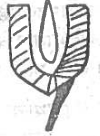
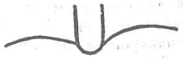
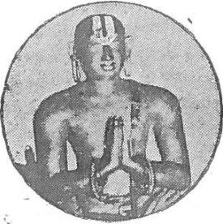
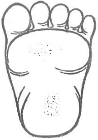
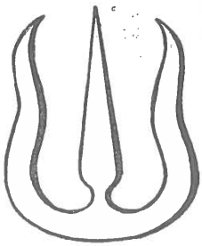
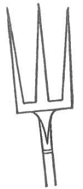
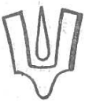
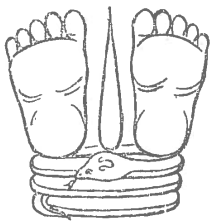
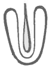

+++
title = "तिरुमलै-तातार्यः - सम्प्रदाय-प्रदीपः"
author = "तिरुमलै-तातार्यः"
+++

Source: [TW](https://archive.org/details/Vaishvadeva/sampradAya-pradIpaH_DTSwamy/page/n1/mode/2up)

।। श्रीः ।।  
सम्प्रदाय-प्रदीपः ॥ 
एटूर्-इम्मडि-तिरुमलै-लक्ष्मीकुमार-कोटि-कन्यकादान-  
श्री-देशिक-ताताचार्य-नन्दन-  
मीमांसार्णव-मीमांसा-केसरि-  
पूर्वोत्तर-तन्त्रप्रदीप--देशिक-दर्शन-धुरन्धर--  
पण्डित-राज--**तिरुमलै-ताताचार्य**--  
न्याय-मीमांसा-शिरोमणि--प्राच्य-विद्येश्वर-विरचितः। 

न्याय-वेदान्त-केसरि-मधुरान्तकं-  
श्री-वीर-राघवाचार्य-स्वामि-साहाय्येन  
तिरुवैयारु--नगर-स्थ--श्री-श्रीनिवास-मुद्रणालये मुद्रितः॥  

जय-कन्या १९५४॥ 
मूल्यम् रु. 1-0-0 ॥  
।। श्रीः ।।  
श्रीमते रामानुजाय नमः॥  

।। श्रीः ।।
श्री श्री-निवास-पर-ब्रह्मणे नमः।
श्रीमते रामानुजाय नमः ।
श्रीमते निगमान्त-महा-देशिकाय नमः ।

सम्प्रदाय-प्रदीपः॥

आद्यं गुरुं कमलया कमलायताक्षम्  
आचार्य-वर्गम् अपरं च मुहुः प्रणम्य।  
यत्-सम्प्रदायम् अन्-अघं प्रति विप्रलम्भ-  
शीलेन दूषणम् अकथ्यत तत्-क्षिपामः॥  
आस्था यद्य्-आस्तिकत्वे यदि रूचिर् अन्-अघोदार-चर्यानुसारे  
तृष्णा श्री-वैष्णव-श्री-महिमनि यदि यद्य्-आदरस् तत्त्ववित्तौ।  
श्रद्धा-सिद्धान्त-शुद्धिं प्रति यदि यदि धीः सर्व-लोकोपकारे  
धीरा निष्पक्ष-पाताः स्व-वहित-मनसः प्राध्वम् ईक्षध्वम् एतत्॥

[[1]]

# ०१ विवेक-काण्डः

## ०१ उपोद्घात-परिच्छेदः

तत्र तावत्  

> दृष्टे ऽपह्नुत्य्-अभावाद् अनुमिति-विषये लाघवस्यानुरोधात्  
शास्त्रेणैवावसेये विहति-विरहिते नास्तिकत्व-प्रहाणात्।  
नाथोपज्ञं प्रवृत्तं बहुभिर् उपचितं यामुनेय-प्रबन्धैस्  
स्नातं सम्यग् यतीन्द्रैर् इदम् अखिलतमः कर्शनं दर्शनं नः॥

इति भगवान् निगमान्त-महा-देशिकः  विशिष्टाद्वैत-वेदान्त-नाम-धेयस्य अस्मत्-सिद्धान्तस्य इतर-सकल-सिद्धान्त-विलक्षणतां प्रतिपादयामास। प्रमाण-शुद्धिः प्रमातृ-शुद्धिः तद्-उभय-मूला प्रमेय-शुद्धिर् इति त्रितयम् इदं यस्माद् अस्मत्-सिद्धान्ते सम्पन्नं तस्माद् अयम् अन्येभ्यः सर्वेभ्यो विशिष्यत इत्य् उक्तं भवति । यद्य् अपि 'त्रातं सम्यग् यतीन्द्रैः' इति श्रीमद्-भाष्य-कारैः अस्मद्-दर्शनस्य सम्यक् परित्राणं कृतम् आचार्य-चरणाः प्रतिपादयन्ति; तथा ऽपि  

> आपाद-चूडम् अन्-अपायिनि दर्शने ऽस्मिन्  
आशासनीयम् अपरं न विपक्ष-हेतोः।  

इतीयं दशा तत्त्व-मुक्ता-कलाप-सर्वार्थ-सिद्धि-शत-दूषणी-प्रभृति-बहुतम-प्रबन्ध-निर्मातृभिर् एतैर् एव महनीयैः सम्पन्नेति वस्तु-स्थितिं प्रपश्यद्भिर् अस्माभिः

> नाथोपज्ञं प्रवृत्तं बहुभिर् उपचितं यामुनादि-प्रबन्धैः।  
सन्त्रातं देशिकेन्द्रैर् इदम् अखिल-तमः-कर्शनं दर्शनं नः। 

इत्य् ऊहित्वा पद्यम् इदम् अनुसन्धेयम् इत्य् अत्र औचित्यं प्रति सर्व एव सुमनसः सम्प्रतिपद्येरन्[[??]]।

[[2]]

> बाह्यादिभिश् चिर-निरुद्ध-निज-प्रकाशे  
पाणिन्धमी भवति वेद-पथे समीचि ।  
श्रीमद्-यतीन्द्र-कृति-रत्न-रुचि-प्रचारैस्  
सञ्चारयन् जयति नः कवि-वादि-सिंहः ॥  

इति शत-दूषणी-व्याख्याने चण्ड-मारुते एक-विंश-वादारम्भे तत्र भवान् महाचार्यः श्री-देशिकस्य श्रीमद्-वेद-मार्ग-प्रतिष्ठापकत्वम् आह ।

अस्मत्-सम्प्रदायः उभय-वेदान्त-श्रिया विराजितः । ईशावास्याद्य्-उपनिषद्-आत्मकतया संस्कृत-रूप एकः । द्राविड-दिव्य-सूक्ति-रूपो ऽपरः । अयं द्राविड-वेदान्तो नष्टः पुनर् नाथ-मुनिना योग-बलेन प्रतिलब्धः । शिष्य-प्रशिष्य-परम्परया प्रवर्तितश् च । अस्य वेदान्तस्य द्रष्टारं श्री-शठ-कोप-मुनिम् 

> माता पिता युवतयस् तनया विभूतिः  
सर्वं यद् एव नियमेन मद्-अन्वयानाम् ।  
आद्यस्य नः कुल-पतेर् वकुलाभिरामं  
श्रीमत् तद्-अङ्घ्रि-युगलं प्रणमामि मूर्ध्ना ॥  

इति श्री-यामुनाचार्यः स्वकीय-स्तोत्रारम्भे प्रणतवान् । भगवद्-भाष्य-कारः पुनः केनापि कारणेन दिव्य-प्रबन्धेषु वा तत्-कर्तृषु दिव्य-सूरिषु वा यं कम् अपि स्व-ग्रन्थेषु यत्र क्वापि सकृद् अपि नोदाजहार । तथापि

> व्याख्यां भाष्य-कृद्-आज्ञयोपनिषदां यो द्रामिडीनां व्यधात्

इत्य् आदिभिर् आप्त-वचनैः तस्य तत्र विशेषतः प्रतिपत्तिर् आसीद् इति प्रस्फुटम् अवगम्यते । एवम् उभय-वेदान्त-सम्प्रदायः श्रीमन्-नाथ-मुनेः प्रभृत्य् अन्ववर्तत । भगवन्-मन्दिरेष्व् अपि यथा वेदानां तथा दिव्य-प्रबन्धानाम् अपि पारायणं संविहितम् आसीत् ।

[[3]]

श्री-देशिकस्य काले औपनिषदस्य अस्मत्-पूर्वाचार्य-प्रतिष्ठापितस्य श्रीमद्-विशिष्टाद्वैत-सिद्धान्तस्येव दिव्य-प्रबन्धानां प्रामाण्यस्य तेषां भगवन्-मन्दिरेषु उपयोगस्य च आक्षेप-कारिणः अतिसंरम्भिणः प्रबला दुर्वादिन आसन् । तान् सर्वान् वाद-गोष्ठीषु विजित्य तत्-प्रामाण्यं तेषां भगवन्-मन्दिरेषु पारायणाद्य्-औचित्यं च देशिकः सुस्थिरं स्थापयामास । तद् इदं श्री-शत-दूषणी-व्याख्यानस्य चण्ड-मारुतस्य कर्त्रा श्री-महाचार्येण स्व-कृतौ श्रीमद्-वेदान्त-देशिक-वैभव-प्रकाशिकायाम् --

> कार्या न भाषाकृति-गीतिर् अत्र  
[^१_४]तत्-कल्पकार्चाश् च न पूजनीयाः।  
इत्य् उक्त-पक्षं नृ-पतेः समक्षं 
यः प्राक्षिपत् तं गुरुवर्यम् ईडे॥79॥  
जित्वा तु तान् भूप-समक्षतः श्री-  रङ्गेश्वरस्याध्ययनोत्सवादीन्।  
आकल्पम् अव्याहतम् आदिशद् यस् 
तं वेद-चूडा-गुरुम् आश्रयामि॥८०॥  

इति प्रत्यपादि। एवं दिव्य-प्रबन्ध-प्रामाण्यादिकम् असहमानानां प्रतिवादिनां प्रशमने एकतः स्थिते, योग्येभ्यः शिष्येभ्यः प्रवचनवत् द्रमिडोपनिषत्-सारः, द्रमिडोपनिषत्-तात्पर्य-रत्ना-वलिः, निगम-परिमलः, मुनि-वाहन-नभोगः, मधुर-कवि-हृदयं, इत्य् एषां ग्रन्थानां निर्माणेनापि दिव्य-सूरि-श्री-सूक्ति-रक्षां श्री-देशिकः अकरोत्। तत्र निगम-परिमलः (लुप्तः) चतुः-सप्तति-सहस्र-ग्रन्थात्मा श्री-कुरुकेश्वर-कृतायाः षट्-सहस्रधा व्याख्यान-रूपः। इदम् उक्त्तं वैभव-प्रकाशिकायां महाचार्येण -- 

[^१_४]: तत्-कल्पकानां भाषा-प्रबन्ध-रूप-दिव्य-प्रबन्ध-कृतां शठकोपादीनाम् अर्चाः प्रतिमाः ।

[[4]]

ग्रन्यैश् चतुस्-सप्ततिभिः सहस्रैश्  
चतुस्-सहस्रार्थ-विशेष-युक्तैः।  
यः षट्-सहस्रस्य चकार वृत्तिं  
तं देशिकं नौमि शतं सहस्रम्॥११९॥  
 
इति । अतः उभय-वेदान्ताचार्यत्वं भगवति निगमान्त-देशिके स्थितम्। मुख्यं चैतद् अत्र। लक्ष्मी-नाथ-समारम्भा श्री-देशिक-पर्यन्ता गुरु-परम्परा एवम् अनुसन्धेया।

1 भगवान् 2 लक्ष्मीः 3 विष्वक्सेनः 4 शठ-कोप-मुनिः 5 नाथ-मुनिः 6 पुण्डरीकाक्षः 7 राम-मिश्रः 8 यामुनाचार्यः 9 महा-पूर्णः 10 रामानुज-मुनिः (श्री-भाष्य-कृत्) कुरुकेश्वरः (षट्-सहस्री-कृत्) विष्णु-चित्तः वरदाचार्यः(अम्माळ्) रामानुजाचार्यः (वादि-हंसाम्बु-वाहः) श्री-देशिकः इति। 

भगवद्-रामानुज-मुनेः (श्री-भाष्य-कारस्य) अन्-अन्तरं भिद्यमाना अन्या ऽपि गुरु-परम्परा अस्ति । इयं सा -- 

10 रामानुज-मुनिः 11गोविन्द-गुरुः(एम्बार्) 12 पराशर-भट्टारकः (कूर-नाथ-सुतः  सहस्र-नाम-भाष्य-कृत् ) 13 वेदान्ति-मुनिः (नञ्जीयर्। श्री-शठ-कोप-गाथा-सहस्रस्य नव-सहस्री-व्याख्यान-कृत्) 14 कलि-वैरि-दासः (लोकाचार्यः। नम्पिल्लै) 15 कृष्ण-गुरुः (षट्-त्रिंशत्-सहस्त्री-कारः) 16 लोकाचार्यः (अष्टा-दश-रहस्य-ग्रन्थ-कारः आचार्य-हृदय-कारस्य भ्राता) 17 श्री-शैल-नाथः 18 वर-वर-मुनिः । इति ।

[[5]]

कलि-वैरि-दासस्य कृष्णनामैव अपरो ऽपि शिष्य आसीत् । सः शठ-कोप-गाथानां चतुर्-विंशति-सहस्री-व्याख्यान-कारः। अन्येषाम् अपि दिव्य-प्रबन्धानां व्याख्याता च । एष्व् आचार्येषु कलि-वैरि-दास-प्रभृतयो ऽर्वाञ्चः दिव्य-प्रबन्धेष्व् एव परमं परिश्रमम् अकुर्वन् । कलि-वैरि-दास-शिष्याभ्यां द्वाभ्यां कृष्णाभ्यां भगवद्-गुणातिशय-प्रतिपादन-संरम्भ-वशेन स्वंकृतयोः श्री-शठ-कोप-सूक्ति-सहस्र-व्याख्ययोः चतुर्-विंशति-सहस्री-षट्-त्रिंशत् सहस्त्रयोः अन्येषु च ग्रन्थेषु तत्त्व-हित-विषया अतिवादाः कृताः । केवलम् अर्थ-वादा इमे, न तेषां यथा श्रुतो ऽर्थो ग्राह्य इत्य् एतत् तयोर् एव ग्रन्थयोः अन्येषां च ग्रन्थानां पूर्वापर-परामर्शं कुर्वतां व्युत्पन्नानां वाक्य-न्याय-विदां विदुषां सुग्रहम् । किन्तु तथा विविच्य अर्थम् उपलब्धुम् अ-क्षमाः केचन श्रद्धा-जडाः आपात-प्रतीतं अक्षरार्थं पारमार्थिकं गृहीत्वा तम् एव स्व-शिष्येभ्य उपदिशन्तो ग्रन्थेषु निबध्नन्तश् च सम्प्रदायाध्वनि महतीं वैयाकुलीम् उत्पादयामासुः । यथा बौद्धादि-वैलक्षण्येन वेद-प्रामाण्यम् अभ्युपेत्यापि तत्र माया-वाद--निर्गुण-ब्रह्म-वादादि-संश्रयणेन अन्ये वेदान्तिनः कु-दृष्टय इत्य् अभिधान-भाजो ऽभवन् तथा दिव्य-प्रबन्ध-प्रामाण्यम् आश्रित्यापि भगवतो दुःखित्वं, लक्ष्म्या अन्-ईश्वरत्वं, भगवत्या गङ्गाया अ-शुद्धत्वं, सेतु-स्नानस्य वर्जनीयत्वं, नित्य-नैमित्तिक-कर्मणाम् अनाचरणीयत्वं, भक्त्यादीनाम् अन्-उपायत्वम् इत्यादि-सर्व-शास्त्र-सम्प्रदाय-विरुद्धम् अभ्युपगच्छन्तस् ते 'संप्रदाय--कु-दृष्टयः' इत्य् अभिधान-योग्यतां भजन्तः,

> बाह्याः कु-दृष्टय इति द्वितये ऽप्य् अपारं  
घोरं तमः समुपयान्ति न हीक्षसे तान्।  
जग्धस्य कानन-मृगैर् मृग-तृष्णिकेप्सोः  
कासार-सत्त्व-निहतस्य च को विशेषः॥

[[6]]

इति कूर-नाथ-प्रदर्शितस्य न्यायस्य अन्याविशेषेण मुख्य-लक्ष्या अभवन्। सत्-सम्प्रदायस्य घोरं विप्लवं एवम् आपतितं अवलोक्य अतिमात्रं विषण्णः श्री-देशिकः सयूथ्य-कलहात् अत्यन्तं भीतो ऽपि वेदान्ताचार्य-बिरुद-वितरण-मुखेन भगवता श्री-रङ्ग-नाथेन श्री-शठ-कोप-नाथ-मुनि-यामुनार्य-यति-पति-प्रमुखैर् आचार्य-तल्लजैः प्रवर्तितस्य लोकोत्तरस्य सर्व-लोक-श्रेयः सम्पत्तेर् एकोपायस्य वैदिक-सिद्धान्तस्य सर्वेभ्य उपप्लवेभ्यः परिरक्षण-भरं आत्मनः शिरसि आरोपितम् अवगच्छन् श्रीमद्-रहस्य-त्रय-सारादि-रहस्य-ग्रन्थजात, चतुः-श्लोकी-भाष्य--स्तोत्र-रत्न-भाष्य--निक्षेप-रक्षादि-बहु-ग्रन्थ-प्रणयनेन उद्भावित-सम्भावित-सकल-शङ्का-समाधान-पुरस्सरं शास्त्र-विहितां सम्प्रदाय-सिद्धां च तत्त्व-हित-गोचरां मर्यादां अ-चञ्चलं पुनः प्रतिष्ठापयामास । ततः प्रतिबुद्धाः अहं-मम-रहिततया प्रसन्न-मनसः परे बहवः पूर्व-गृहीतम् अर्थम् उपेक्ष्य तात्त्विकार्थाधिगम-सन्तुष्टाः कृत-कृत्याः कृतार्थाश् च बभूवुः । 'पेरियवाच्चान् पिल्लै' इत्य् आख्यातः चतुर्-विंशति-सहस्त्री-कारः श्री-कृष्ण-पाद-गुरुः चत्वारिंशद् अधिकैर् वर्षैः वर्षीयान् अपि श्री-देशिकस्य शास्त्रोपदिष्ट-सम्प्रदाय-सिद्ध-सर्वार्थ-निष्कर्षण-विचक्षणतां लोक-विलक्षणां प्रसमीक्षमाणः तस्य सकाशात् प्रपत्ति-विषये सुनिश्चितं ज्ञानम् अधिजिगमिषति स्म । तदीयाम् अभ्यर्थनाम् अनुसृत्य देशिकः न्यास-विंशतिं संक्षिप्तां तद्-व्याख्यां च निरमिमीत । षट्-त्रिंशत्-सहस्री-कारस्य कृष्ण-गुरोः पुत्रः सम्प्रदायान्तरे आदृतानां अष्टादश-रहस्य-ग्रन्थानां कर्ता लोकाचार्यः स्वयं देशिकस्य साक्षात् शिष्यो भूत्वा अस्मात् श्री-भाष्यार्थं जग्राह । अनेन कृतम् एव श्री-देशिक-विषयं द्राविड-तनियन्-पद्यं 'शीरोन्नु तूप्पुल्' इत्य् आदि-देशिक-कृत-द्राविड-प्रबन्धानुसन्धानावसरे अद्यापि सर्वत्र पठ्यते । अस्यानुजः आचार्य-हृदय-नाम्नो ग्रन्थस्य कर्ता तु देशिकं प्रति अत्यन्तम् असूयावान् आसीत् । स एव कवित्वे श्री-देशिकेन स्पर्धमानः अत्युत्तम-स्तोत्र-काव्यस्य श्री-पादुका-सहस्रस्यावतार-हेतुर् आसीत् । एवं विधान् कतिपयान् प्रत्येव 

[[7]]

> आपात-शान्ति-मधुरान् पुनर् अस्मदीयान्  
अन्योन्य्-अवैर-जननी विजहात्व् असूया ।  

इति देशिकः प्रार्थयाञ्चक्रे । एतादृशेषु कतिपयेषु स्थितेष्व् अपि अन्ये सर्वे श्री-देशिकस्य अलोक-सामान्यं वैभवातिशयं यथावद् अवगच्छन्तः स्वोक्ते ऽपि तद् अनभिमते ऽर्थे आदर-रहिताः तस्मिन् नितान्तं बहु-मानवन्त आसन् । अष्टादश-रहस्य-ग्रन्थ-कारस्य लोकाचार्यस्य प्रशिष्यः तेषु ग्रन्थेषु कतिपयानां व्याख्याता च वर-वर-मुनिः तस्मिन् सम्प्रदाये श्री-भाष्य-प्रवचनं प्रति तद्-अर्थाधिगमं प्रति च प्रावण्य-विरहात् तत्र निरूढ-ज्ञान-लिप्सया श्री-देशिक-प्रशिष्यं 'किडाम्वि-नयिनार्' इत्य् आख्यातम् आचार्यम् उपसद्य तद्-अध्ययनम् अकरोत् । 

एवम् आपात-प्रतीतार्थ-भेदावलम्बनेन श्री-देशिकादृत-सम्प्रदाय-विरुद्धस्य सम्प्रदायान्तरस्य प्रादुर्भावे प्रसक्ते ऽपि श्री-देशिक-ग्रन्थैः शिक्षित-मतयः परे स्वोक्तम् अर्थान्तरं स्वकृतान् ग्रन्थांश् च स्वयम् एव उपेक्षितवन्तः । वस्तुतः सम्प्रदाय-भेदो नैवासीत् । सर्वैः श्री-वैष्णवैर् आश्रितः एक एव तु सम्प्रदायः । स च श्री-देशिकेन प्रतिष्ठापितः । आह च श्री-देशिकः 'सम्प्रदाय-परिशुद्धि'नाम्नि रहस्य ग्रन्थे --

> भाष्यकार-शिष्य-परम्परासु योजनाभेद-मात्रम् अस्ति, नार्थ-भेदः । 

इति । एवं स्थिते कस्यचित् कालस्यानन्तरं क्रूरेण कलिना शास्त्र-सिद्ध-सकल-धर्म-मार्ग-विध्वंसन-धुरन्धरेण विशिष्य सकल-कल्याण-हेतु-भूतोत्तमोत्तम-श्री-वैष्णव-सिद्धान्त-सम्प्रदाय-द्रोहम् ईहमानेन इमे मम दूरम् उपकरिष्यन्तीति दृढ-परिगृहीतैः कैश्चिद् आसुर-प्रकृतिभिः, अप्रामाणिकान् शास्त्र-विरुद्धान् श्री-देशिक-निरस्तान् अत एव पूर्वैः स्वयम् एव परित्यक्तान् अपार्थान् एव अभिनिविश्य सिद्धान्ती-कुर्वद्भिः अस्मत्-सम्प्रदायो ऽत्यन्तं भिन्न इति घोषयद्भिः, शास्त्रात् दैवाच् च अ-बिभ्यद्भिः, श्री-देशिक-दूषणोत्सवैः, 

[[8]]

श्री-देशिकेन उभय-वेदान्त-प्रामाण्य-प्रचार-प्रतिष्ठापन-द्वारा कृतम् उपकारं स्मरता आस्तिक-जनेन तत्र तत्र देवालयेषु तद्-बिम्बं प्रतिष्ठाप्य पूजनं तत्-पद्य-पठनं च क्रियमाणम् अत्यन्तम् असहमानैः श्री-देशिक-प्रप्रशिष्यं सन्तं वर-वर-मुनिं तत्-प्रतिद्वन्द्वि-पदे कृत्वा तत्-पूजन- पुरस्कारादिषु समुज्जृम्भित-निस्सीम-सम्भ्रमैः हा हन्त श्री-वैष्णव-गोष्ठ्याम् आन्तर-क्षोभो महान् उत्पादितः । 

इदं सन्निकृष्ट-पूर्व-काल-वृत्तम् । अथाद्यत्वे पाश्चात्य-प्रक्रियावलम्बेन प्रायः सर्वेष्व् एव जनेषु वेदः शास्त्राणि, धर्मः सम्प्रदायः, आचारो भक्तिः, इत्य् एतत् सर्वं प्रति उदासीनेषु प्रतिकूलेषु च संवृत्तेषु पुरातन-वेद-शास्त्र-सम्प्रदायस्य आत्यन्तिके लोपे प्रसक्ते, ततो भीतैः आकुलैः विषण्णैः तत्र किं प्रतिविधानं, तत् कथं कर्तव्यम् इति चिन्ता-सन्तान-समाक्रान्त-स्वान्तैश् च भवितुम् औचित्ये सति प्रत्युत अति क्षुद्रैः अति क्रूरैः अति नृशंसैः अति कुटिलैः बहुधा बहुभिः सुनिरस्तान् अपि अपार्थान् आम्रेडयद्भिः निर्लज्जैः नक्तन्दिवं सर्वास्व् अवस्थासु सदाचार्याणां तत्-सूक्ति-रत्नानां, परम-भागवतानां च उत्कट-दूषण-तत्-परैः पामर-प्रतारण-परायणैश् च भवद्भिः कैश्चित् पदे पदे पूति-गन्धो द्वारि दुर्वचः-पटल-प्रकटनेन सज्जनानां शिरश्-शूलम् उत्पाद्यते । एतद् उक्तान् सर्वान् दुरर्थान् तदा तदा निरस्तवन्तो वयम् इदानीं अ-चिर-प्रकटिते 'रामानुज-दया-पात्र-पद्य-चरित्र' नाम्नि दुर्निबन्धे जड-व्यामोहनाय लिखितानां अ-प्रामाणिकानाम् अनृतमयानां विषयाणां विमर्शनेन तत्त्व-स्थितिं बोधयितुं तद्-अपेक्षि-साधु-जन-प्रार्थनाम् अङ्गीकृत्य प्रवर्तामहे । 

इत्य् उपोद्घात-परिच्छेदः 
प्रथमः । 

[[9]]

## ०२ श्री-देशिक-वैभव-परिच्छेदः

श्री-देशिकः या 

> वित्रासिनी विबुध-वैरि-वरूथिनीनां  
पद्मासनेन परिचार-विधौ प्रयुक्ता

भगवतो दिव्या घण्टा, तद्-अवतार-रूपः । तस्मात् 
तं ये द्विषन्ति तेषाम् अ-सुरांशत्वम् अ-वर्जनीयम् । 

श्री-देशिकः 'वेदान्त-देशिकः' इति 'सर्व-तन्त्र--स्व-तन्त्रः' इति च बिरुद-विशेष-प्रदानेन दिव्य-दम्पतिभ्यां सम्भावितः । तस्मात् तं ये द्विषन्ति तेषां भगवद्-द्रोहित्वम् अपरिहार्यम् । नास्तिकत्वं च । 

श्री-देशिकः 

> विश्वग् व्यापिन्य्-अगाधे यति-नृपति-यशः सम्पद्-एकार्णवे ऽस्मिन्  
श्रद्धा-शुद्धावगाहैः शुभ-मतिभिर् असौ वेङ्कटेशो ऽभिषिक्तः ।  
प्रज्ञा-दौर्जन्य-गर्जत् प्रतिकथ-कवचस् तूल-वातूल-वृत्त्या 

प्रौढ-गम्भीरोदार-सन्निबन्ध-संहत्या भगवद्-रामानुज-सिद्धान्तं सुस्थिरं स्थापयामास । तं ये रामानुजीया द्विषन्ति तेषां 'कृत-घ्ने नास्ति निष्कृतिः' इति बहु कुत्सितं कृत-घ्नत्वम् अन्-अपनोद्यम् । 

अद्यापि यदा यदा माया-वादिभिर् इतरैर् वा अस्मत्-सिद्धान्त आक्षिप्यते तदा तदा श्री-देशिक एकः शरणी-करणीयो भवति । तस्मात् तं ये द्विषन्ति तेषां 'तम् इमं क्रियमाण-घ्नः' इति गर्हितं कृत-घ्नत्वाद् अपि पापतरं क्रियमाण-घ्नत्वम् अप्रतिविधेयम् । 

घोरा इमे दोषा अस्माकं "मा स्म प्रसजन्न्" इति आत्म-हितार्थिभिः सर्वैः श्री-वैष्णवैः अस्मिन् आचार्य-चूडामणौ द्वेष-प्रसक्ति-वर्जने अतिजागरूकैर् भाव्यम् । अत एव हि तस्मिन् 

> अ-द्वेष-मात्रम् अपि वा येषां वेदान्त-देशिके । 
वीटी-चेटो ऽस्म्य् अहं तेषाम् इति वीथीषु घुष्यताम् ॥ 

[[10]]

इत्य् अभिज्ञा अ-द्वेष-मात्रम् अपि प्रशंसन्ति । एवं महतो ऽनर्थस्य परिहाराय भगवति निगमान्त-महा-देशिके द्वेषो न मनाग् अपि कर्तव्य इत्य् उक्तम् । अथ यदि पुरुषार्थेषु उत्तमस्य मोक्षस्याधिगमे ऽभिलाषः तर्हि तस्मिन् भक्तिर् अवश्यं कर्तव्येत्य् एतद् अपि सम्यग् अवधारणीयम् । अन्यथा ऽत्यन्त-दुर्लभत्वात् तस्य । तद्-उक्तं सप्तति-रत्न-मालिकायां प्रतिवादि-भयङ्करार्यैः । 

> गुरौ वादि-हंसाम्बु-दा-चार्य-शिष्ये  
जना भक्ति-हीना यतीन्द्राप्रियाः स्युः ।  
यतीन्द्राप्रिया विष्णु-कारुण्य-दूराः  
कुतो मुक्ति-वार्ता हि तादृग् विधानाम् ॥ 

इति ।

इति देशिक-वैभव-परिच्छेदो द्वितीयः । 

## ०३ पात्र-पद्य-परिच्छेदः

> रामानुज-दया-पात्रं ज्ञान-वैराग्य-भूषणम् ।  
श्रीमद्-वेङ्कट-नाथार्यं वन्दे वेदान्त-देशिकम् ॥

इतीदं श्री-देशिकस्य तत्-कुमार-वरदाचार्यस्य च शिष्य-भूतेन श्री-ब्रह्म-तन्त्र-स्व-तन्त्र-स्वामिना निर्मित तनियन्-पद्यम् । देवालयेषु वा गृहेषु वा यदा यदा दिव्य-प्रबन्धानुसन्धानं प्रसक्तं तदा तदा आदौ अवसाने च दिव्य-प्रबन्ध-विषये श्री-देशिकेन कृतं परमोपकारं स्मरद्भिः सर्वैः श्री-वैष्णवैः तस्मात् कालात् प्रभृति अनुसन्धीयमानम् अभवत् । 

अस्मिन् पद्ये आद्येन पादेन सदाचार्य-कटाक्ष-समृद्धिर् उच्यते । एतत् फलं द्वितीयेन पादेन । ज्ञानं परापर-तत्त्व-विषयं हित-पुरुषार्थ-विषयं च । वैराग्यं भगवद्-व्यतिरिक्तेषु विषयेषु । तेन भगवति भक्तिः फलिता । 

[[11]]

> 'परमात्मनि यो रक्तो विरक्तो ऽपरम् आत्मनि' 

इति ह्य् उच्चते । एवम् आचार्यत्वोपयुक्त-गुण-पौष्कल्यम् उक्तम् । अथ अचार्यत्वं साक्षाद् उच्यते वेदान्त-देशिकम् इति । अन्ये आचार्याः प्रवचन-करणेन हेतुना आचार्य-पदाभिधेयतां लभन्ते । अयं तु न तावतैव अपि तु भगवता श्री-रङ्गनाथेन स्वयं वेदान्त-तत्त्वार्थ-निष्कर्पे अयम् एव प्रगल्भ इति निश्चित्य वेदान्ताचार्य-पदे निवेशितत्वाद् अपीति भावः । सर्वस्यास्य वैशिष्ट्यस्य यन्-मूल-कारणं 

> जायमानं हि पुरुषं यं पश्येन् मधुसूदनः ।  
सात्त्विकः स तु विज्ञेयः स वै मोक्षार्थ-चिन्तकः ॥

इति स्मृत-जायमान-कटाक्ष-रूपं, तत्-सम्पत्तिर् उच्यते श्रीमद्-वेङ्कट-नाथार्यम् इति । एवं गभीरार्थ-गर्भितम् एतत् पद्यं न पद्यान्तर-सामान्येन द्रष्टव्यम् । मन्त्र-शास्त्रोक्त-प्रक्रियया वर्णोद्धार-प्रभृति-सकल-संस्कार-करण-पूर्वकम् आवर्त्यमानम् इदं श्री-देशिक-साक्षात्-कार-सम्पादकतया मन्त्र-विशेष-रूपं भवतीति, तथा केचिद् आवर्त्य तत्-साक्षात्-कारं लेभिर इति च वदन्ति । 

> श्रीमान्-वेङ्कट-नाथार्यः कवि-तार्किक-केसरी ।  
वेदान्ताचार्य-वर्यो मे सनिधत्तां सदा हृदि ॥ 

इत्य् अस्मिन् तनियन्-पद्ये कुमार-वरदाचार्य-कृते यत् कवि-तार्किक-केसरित्व-विशेषणं दत्तं तदप्य् अत्र ज्ञान-पदेन सूचितम् । भगवद्-अनुभव-रूप-दिव्य-प्रबन्धानुसन्धानावसरे देशिकस्य सकलाचार्य-कृपा-पात्रत्वानुसन्धानम् आवश्यकम् इति मन्यमानेन ब्रह्म-तन्त्र-स्व-तन्त्र-स्वामिना --

> 'श्रीश-श्री-शठ-जिद्-यतीश-निगमान्तार्य-प्रभावोज्वलं रामानुजोक्त्य्-आदिमं दिव्य-महिमा 

इदम् अन्यत् तनियन्-पद्यं निरमीयत । 

इति पात्र-पद्य-परिच्छेदस् तृतीयः । 

[[12]]

## ०४ पद्यान्तर-परिच्छेदः

वर-वर-मुनि-शिष्याः स्वाचार्यस्यास्य तनियन्-पद्यं निर्मातुं प्रवृत्ताः दिग्-अन्त-विश्रान्तेन यशसा विद्योतितस्य अचिरातीतस्य भगवतो निगमान्त-महा-देशिकस्य यादृशं तादृशं तत् कर्तुम् इच्छन्तः स्व-गुरु-परम्पराया द्राविड-वेदान्त-प्रधानत्वात् देशिकस्य यत् दिव्य-प्रबन्धानुसन्धानावसरे उपयुज्यमानं तनियन्-पद्यं 'रामानुज-दया-पात्रम्' इति तद् वानुसृत्य 

> श्री-शैलेश-दया-पात्रं धी-भक्त्य्-आदि-गुणार्णवम् ।  
यतीन्द्र-प्रवणं वन्दे रम्य-जामातरं मुनिम् ॥

इतीदं पद्यम् अकुर्वन् । आदौ आचार्य-दया-पात्रत्वं तत्रोक्तम् अत्राप्य् उक्तम् । ज्ञान-वैराग्य-भूषणम् इत्य् एतत् कथञ्चित् 'धी-भक्त्य्-आदि-गुणार्णवम्' इति परिवर्तितम् । श्रीमद्-वेङ्कट-नाथार्यम् इति तत्र तृतीय-पादे नामोक्तम् । अत्र तु रम्य-जामातरं मुनिम् इति चतुर्थ-पादे तत् । 'वन्दे' इत्य् उभयत्र समानं पाद-भेदे सत्यपि । वेदान्त-देशिकम् इति यत् तत्र स्थितं तत्-स्थाने किम् अत्र वक्तव्यम् इति पर्यालोचनायां विवक्षित-वाक्यार्थे साक्षात् अत्यन्तोपयोग-विरहे ऽपि स्वाचार्य-गतं कञ्चन विशेषं स्फोरयिष्यतीत्य् अभिसन्धाय 'यतीन्द्र-प्रवणम्' इत्य् एतद् अयोजि । विशिष्ट-प्रभावेषु पूर्वोत्तरेषु महत्सु आचार्येषु बहुषु सत्स्व् अपि भगवति भाष्य-कारे वर-वर-मुनेर् अभ्यधिका भक्तिः । व्यक्तम् इदम् आर्ति-प्रबन्धादि-परिशीलन-पराणाम् । तस्या भक्तेर् इदं फलं यत् भगवद्-रामानुज-सिद्धान्तावलम्बिषु सर्वेषु तस्य विशिष्टा प्रतिपत्तिर् आसीत् । विशिष्य च तत्-सिद्धान्त-प्रतिष्ठापन-परिपालन-धुरन्धरे श्री-देशिके तस्य महद् गौरवम् । अत एव पिल्लै-लोकाचार्य-कृत-रहस्य ग्रन्थ-व्याख्यानावसरे सम्प्रतिपत्ति-स्थले क्वचित् क्वचित् श्री-देशिक--श्री-सूक्तीर् उदाहरन् विप्रतिपत्ति-प्रतीति-स्थले क्वचिद् अपि देशिक-श्री-सूक्ति-खण्डने नैव प्रवर्तते । स्थितं तु विशदं विवृत्य विरमति । स्वोक्तार्थान् प्रति श्री-देशिकेन यद् उक्तं तत् सर्वं मूल-कारेण स्व-प्राचार्येण पिल्लै-लोकाचार्येणैव अभ्युपगतम् । अत एव ग्रन्थतो वा उपदेशतो वा मनाग् अपि तत्र विप्रतिपत्तिर् न कृतेति जानन् स्वभावतश् च प्रशान्तो वर-वर-मुनिः इतर-निरसने वा स्वयं कस्यचिद् अर्थस्य स्वातन्त्र्येण स्थापने वा नैव प्रावर्तत । 

[[13]]

> महताम् अपि केषाञ्चिद् अतिवादाः पृथग् विधाः ।  
तत् तद्-अर्थ-प्रशंसादि-तत्परत्वाद् अबाधिताः ॥ 

इति विरुद्धवद्-अवभासमानानां उक्तीनां सङ्गमन-प्रकारं श्री-देशिक-दर्शितम् आश्रयन्तः सर्व एव आचार्याणां सर्वेषाम् ऐक-कण्ठ्यं सम्प्रदायस्य भाष्य-कार-प्रवर्तितया एकतां च प्रतिपेदिरे । तथा वर-वर-मुनिर् अपि । एवम् अस्य भगवद्-भाष्य-कार-सिद्धान्ताविलम्बिषु प्रतिपत्त्य्-अतिशयं तत्र सम्प्रदाय-भेद-प्रवर्तन-प्रावण्य-विरहं च व्यञ्जयतीदं यतीन्द्र-प्रवणम् इति विशेषणम् । तद् इदं तनियन्-पद्यं अर्वाचीनैः तेन्कलाजनैः देशिक-पात्र-पद्य-स्थाने अनुसन्धीयते । ततः पूर्वं तु देवालयादिषु दिव्य-प्रबन्धानुसन्धानारम्भावसानयोः तु देशिक-पद्यम् एव सर्वैः श्री-वैष्णवैर् अनुसंहितम् अभूत् । 

इति पद्यान्त-रपरिच्छेदश् चतुर्थः । 

## ०५ कला-भेद-परिच्छेदः

अथ काले कस्मिंश्चिद् याते पूर्वोक्त-रीत्या कलि-परवशी-भूतैः कलहैक-रुचिभिः पामरतया श्री-शठ-कोप-नाथ-मुनि--यामुनार्य-यति-पति-प्रमुखैः प्रवर्तितस्य सिद्धान्त-विशेषस्य गौरवं सर्व-लोक-क्षेमङ्-करतां च यथावद् अवगन्तुम् अक्षमैः पिल्लै-लोकाचार्य-रहस्य-ग्रन्थेषु क्वचित् क्वचित् आपाततः प्रतीताः ये सिद्धान्त-विरुद्धा अर्थास् तेषु अत्यन्ताभिनिविष्टैः, काम-चार-वाद-भक्षानुगुणतया नवीन-सम्प्रदायान्तर-प्रवर्तने सञ्जातोत्कट-रागैः तद्-अननुगुणतया श्री-देशिके तद्-उक्तार्थेषु च जात-प्रबल-द्वेषैः देशिक-सम्प्रदायो ऽन्यः लोकाचार्य-सम्प्रदायो ऽन्य इति निरूपणोद्यतैः यो यो भेदः प्रदर्शयितुं शक्यः तत्-तत्-कल्पने प्रसितैर् बभूवे । 

तथा च अनयोः सम्प्रदाययोर् अष्टादश-भेदाः सन्तीति परिगणना कृता । अनेन क्रमेण पुण्ड्रे ऽपि भेदो ऽकल्प्यत । श्री-देशिक-पद्य-निरोधेन पद्यान्तर-पाठ-संरम्भः प्रादर्श्यत । एवं बहु । 

[[14]]

एवम् एतैर् उपक्रान्तस्य नवीनस्य सम्प्रदायस्य 'तेन्-कला' इति व्यवहारः । 'तेन्' इति दक्षिण-दिग्-वाची शब्दः । तद्-द्वारा द्राविड-भाषा-वाची च । कलेति विद्योच्यते । एवं च द्राविड-भाषा-मय-विद्या-रूपाणां दिव्य-प्रबन्धानां 'तेन्-कला' इति मुख्यम् अभिधानम् । तद्-एक-प्रधानत्वात्  सम्प्रदायो ऽपि तद्-अवलम्बिनो जना अपि तेन शब्देनाभिधीयन्ते । 'वड-कला' इत्य् अनेन शब्देन श्री-देशिक-सम्प्रदायस्य तद्-अवलम्बिनां च व्यवहार उदभूत्। वड-कला उत्तर-कला । संस्कृतमयी वेदान्त-विद्येत्य् अर्थः । तद्-अवलम्बिनश् च उत्तर-कलाः । अत्र कश्चन विशेषः सर्वैर् अत्यन्तम् अवधेयः । अर्वाचीनाः अन्-अभिज्ञाः आग्रहिणः इमे तेन्-कलाः वेदान्, तत्-प्रतिपाद्यान् धर्मान्, कर्म-ज्ञान-भक्ति-योगान्, प्रपत्तिं च कुत्सयन्तः परित्यजन्ति स्म । द्रमिडोपनिषदां पारमार्थिकं भावम् अ-गृह्णन्तो ऽपि तत्र स्वकीयत्वाभिमानं विशेषतः प्रदर्शयन्तः इतर-व्यवच्छेदेन द्रमिड-कला-मात्रसक्ता इत्य् अभिप्रायेण तेन कला पद-वाच्या अभवन् । इतरेषां वड-कला-पद-वाच्यत्वं तु नैवेदृशम् । श्रीमन्-निगमान्त-महा-देशिक-प्रतिष्ठापित-प्रामाण्यान् दिव्य-प्रबन्धान् प्रति न हि तद्-अनुसारिणः सात्त्विकाः केचित् मनसा ऽपि स्वप्ने ऽपि ईषद् अपि अन्-आदर-प्रदर्शने मतिं कुर्युः । उभयोर् अपि कलयोर् अविशिष्ट-प्रतिपत्तय एव इमे । तस्मात् वड-कला एषु अस्ति, न तु इतरेष्व् इव नास्ति इति व्युत्पत्त्या इमे 'वड-कलाः' भवन्ति । न तु 'वड-कलैव एष्व् अस्ति, न तु 'तेन्-कला' इत्य् अनया व्युत्पत्त्या । 

[[15]]

तेन्-कलैव अस्माकं प्रधानम्, नेतरेति स्वयं ते निश्शङ्कं घोषयन्ति । तेन तेषां नामधेयं कलान्तर-व्यवच्छेद-गर्भम् । अन्यत्र तु वड-कला एष्व् अस्तीत्य् एतावन्-मात्रेण तद्-उपपत्तेः तेन्-कलायां एतेषाम् उपेक्षा-विरहाच् च कलान्तर-व्यवच्छेद-गर्भता नास्ति । ब्रह्म-विष्णु-रुद्राणां सृष्टि-स्थिति-संहारा व्यापारा इति विभज्य व्यवहार-सत्त्वे ऽपि एतद्-अनुरोधेन स्थिति-हेतुर् विष्णुर् इत्य् उक्तेर् युक्तत्वे ऽपि 'स्थितेर् एव विष्णुर् हेतुः' इत्य् एतद् यथा नोपपद्यते, संज्ञा-मूर्त्य्-अधिकरण-न्यायेन सृष्टाव् अपि संहारे ऽपि च तस्य कर्तृत्वात् तथा प्रकृत इति बुद्धिमद्भिर् विवेक्तव्यम् । उभय-कला-सम्बन्धे श्रीमन्-नाथ-मुनि-कालात् प्रभृति अविच्छेदेन प्राप्ते अर्वाचीने काले ये वड-कलां पर्यत्यजन् ते 'तेन्-कलाः' इत्य् आख्यां लेभिरे । ये तु तां न तथा पर्यत्यजन् ते तत्-प्रतिसम्बन्धितया 'वड-कलाः' इत्य् आख्यां लेभिर इति । 

ते इमे विभक्ते आख्ये वर-वर-मुनि-पर्यन्त-पूर्वाचार्य-काले नैव अभवताम् । ततो ऽर्वाक्, तत्रापि द्वित्र-शतकानन्तरम् उद्भूते । 

वेद-वेदान्तादि-विद्या-परिश्रम-विरहात् वर्णाश्रमादि-धर्मानुष्ठान-विरहाच् च कालं सर्वं सम्प्रदाय-भेदाभिवर्धने कलह-करणे सम्प्रदायान्तरोपरोधे सात्त्विक-जन-पीडने च विन्ययुञ्जत । श्रीमद्-भाष्ये हि भगवद्-रामानुजेन वर्णाश्रम-धर्म-परिपालनावश्यकता स-संरम्भं निरूपिता; भक्तेर् उपायता च । गद्ये शरणागतिर् अनुष्ठिता । तत् सर्वम् एषाम् अत्यन्तम् अरुचये ऽकल्पत । अतः "आतपच्छन्दनं गद्यं भाष्यं तु पर-रञ्जनम्" इति तयोर् अन्यथा-सिद्धिं फलतः अत्यन्तानादरणीयत्वं च निश्शङ्कं निर्भयं वर्णयाञ्चक्रुः । 

द्राविड-भाषा-मये 'प्रबन्धसार'-नाम्नि ग्रन्थे श्री-देशिकः दिव्य-सूरीणां अवतार-स्थल-मास-नक्षत्र-निर्देश-पूर्वकं तत्-तत्-प्रबन्ध-गाथानां सङ्ख्याम् अपि परिच्छिद्य प्रतिपादयति । तत्र आहत्य सर्व-गाथा-सङ्ख्या चतुः-सहस्री (४०००) । अत्र 'रामानुज-शत-अन्तादि' संज्ञया 'तिरुवरङ्गस्तमुदनार्' इत्य् अनेन कृताः भगवद्-रामानुज-विषयाः अष्टोत्तर-शत-सङ्ख्या-गाथा अप्य् अन्तर्भूताः । 

[[16]]

वर-वर-मुनिः उपदेश-रत्न-माला-नाम्नि स्व-निबन्धे प्रायः देशिकवद् एव दिव्य-सूरीणाम् अवतार-कालादिकं कीर्तयन्न् अपि गाथानां सङ्ख्यया परिच्छेदं न करोति । तेन देशिक-कृते गाथा-गणने तत्-पर्यन्तानां श्री-वैष्णवानां विमतिर् नासीत् इति स्फुटी भवति । भगवद्-रामानुजस्य साक्षाच् छिष्येण बटुक-पूर्णेन स्व-कृते यति-राज-वैभवे रामानुज-शतान्तादेः द्विव्य-प्रबन्धान्तर्भावः तद्-विषय-भूतेन भगवतैवाज्ञप्तः इति सुस्पष्टम् उच्यते -- 

> तत्र श्रीमान् यतीशः कम् अपि शठ-रिपुं संप्रतिष्ठाप्य तेन  
श्री-रङ्गाधीश्वरस्याध्ययनम् अहम् अहर् विंशतिं कारयित्वा ।  
पश्चात् कैश्चित् प्रबधैस् स्व-विषयक-कथं तं प्रबन्धं मिलित्वा  
रङ्गं संश्राव्य चक्रे स तद्-इतर-महा-सूरि-गोदा-प्रविष्ठाम् ॥

इति । 

एवं सम्प्रदाय-क्रमे स्थिते अर्वाचीनाः तेन्-कलाः "रामानुज-शत-अन्तादि'-प्रबन्धं दिव्य-प्रबन्देभ्यो बहिश् चक्रुः । चतुः-सहस्री-सङ्ख्यां प्रकारान्तरेण कथञ्चित् पूरयन्ति स्म । एवं न परं समानुज-विरचितं भाष्यं गद्यं च अपि तु तद्-विषयं निबन्धम् अपि ते अन्-आदरणीयं निरचिन्वन् । इत्थं वस्तु-तत्त्वे निरूप्यमाणे भगवद्-रामानुजस्य एषां न को ऽपि सम्बन्धः । यदि कश्चिद् अवश्यं वक्तव्यः तर्हि सः दोग्धृ-दोग्धव्य-भाव एव, नेतरः इत्य् एतत्सु सुग्रहम् ।

भगवद्-रामानुजं प्रत्येव एवम् आचरितवन्तः इमे देशिकं प्रति अन्यद् अन्यद् आचेरुर् इत्य् एतन् न् विस्मयावहम् । स घण्टावतार इति भगवद्-आराधन-काले घण्टां नोपयुञ्जते । देवालयेषु तत्-पद्य-पठनं यथा-शक्ति उपारुन्धत । तत्र तत्र प्रतिष्ठिताः तत्-प्रतिमाः अपनयति स्म । 

अ-नियन्त्रित-प्रसरण-कल्पना-वैभवेन भगवत्याः श्री-महा-लक्ष्म्याः जीव-कोटि-प्रवेशम् आतस्थिरे । 

> 'कस्य पादोदकेन स शिवः स्व-शिरो-धृतेन' 

[[17]]

इति सुस्पष्टं यामुनाचार्ये भगवच्-चरणारविन्द-प्रभवया गङ्गया शिवस्य परिपूतत्वम् अभिदधाने सकल-श्रुति-स्मृतीतिहास-पुराण-प्रसिद्धं अस्याः पुण्य-नद्या वैभवम् अपह्नुत्य वैपरीत्येन शिव-शिरः-स्पर्श-हेतुकम अपरिशुद्धत्वम् आचचक्षिरे । बहु-पाप-प्रायश्चित्त-तया धर्म-शास्त्रेषु विहितं पञ्च-गव्य-प्राशनम् अकार्यं मेनिरे । 

इत्थम् अतिसंरब्धैः आसुर-सम्पदा सम्पन्नैः महता विपर्यासेन सम्प्रदाये ऽस्मिन् स्थापिते, तत्र तत्र गत्वा बहुभिर् उपायैः बहु-जन-परिग्रहं प्रापिते च अन्-अन्तर-सन्तति-भवाः सर्वे तम् एव समीचीनं सम्प्रदायं मन्यमानाः तत्रैव श्रद्धालवो भवन्तीति सहजम् एतत् । परन्तु यदि तेषु केचित् ऋजु-मतयः अधीत-विद्या-विवेकिनो भवन्ति तेषां तत्-तत्-द्वन्द्व-परामर्शे सति स्व-सम्प्रदाय-गता न्यूनताः न न स्फुरेयुः । ते ऽपि तु प्रायः विषय-विमर्शेषु दूरावगाहने आलस्यात् सङ्केत-भङ्ग-भीरुत्वात् स्व-पूर्व-पुरुषादृत-क्रम-विपर्यास-करणे सहसा धैर्यासम्भवाच् च यथा-पूर्वम् एव वर्तन्ते । एषां हेतूनां विरहे तु तिरस्कृत्य तं सम्प्रदायं देशिक-चरणारविन्द-शरणा भवेयुर् एव । अभवच् च तथा भारद्वाज-श्रीनिवासाचार्यो नाम कश्चित् । स हि प्रथमं तेन्-कला-भूतः पश्चात् श्री-देशिक-ग्रन्थ-निषेवणेन प्रबुद्धः तद्-एक-शरणो बभूवेति तस्यैव वचनेन ज्ञायते । श्री-काशी-चौखाम्बा-मुद्रणालये मुद्रित-प्रकाशितस्य श्री-देशिक-कृता या न्याय-परिशुद्धिः तद्-व्याख्यानस्य कर्ता स प्रौढो विद्वान् भारद्वाज-श्रीनिवासाचार्यः । स तत्र स्वस्य पूर्वदशां प्रति महान्तम् अनुशयं उत्तर-दशां प्रति परमं प्रहर्षं च प्रकाशयन् निस्सङ्कोचं इदम् आह -- 

> इयतः समयान् अहं महान्तं  
मति-भेदं विवशः प्रपद्यमानः ।  
स्वम् अवञ्चयम् अञ्जसा ऽद्य देवान्  
निगमान्तार्य-निबन्धतः प्रबुद्धः ॥ 

इति । 

[[18]]

अति सन्निहिते काले च उलग्-पाक्कं--रामानुजाचार्यो नाम पण्डित-प्रवरः सुकृत-विशेष-परिपाक-वशेन जन्मना प्राप्तं सङ्केत-प्रधानं तं सम्प्रदायम् अवधूय, 'सङ्केत-भीति-रहितस् सतृणेष्व् असक्तः' इति देशिक-सम्भावितं सुसम्प्रदायम् आश्रितः तावता ऽप्य् अ-सन्तुष्य पूर्व-सम्प्रदाय रहस्य ग्रन्थानां अत्यन्तासामञ्जस्यं च बहुना ग्रन्थ-विस्तरेण घोषयामास । 

इति कला-भेद-परिच्छेदः पञ्चमः । 
इति सम्प्रदाय-प्रदीपे विवेक-काण्डः । 

[[19]]

# ०२ प्रतिवचन-काण्डः

अथ प्रतिवचनकाण्डः॥ 

> अ-प्रमाणं न वक्तव्यं न त्यक्तव्यं प्रमाणवत् ।  
राग-द्वेषौ न कृर्तव्यौ संरक्ष्या नियमा इमे ॥ 

अथात्र पूर्व-पक्ष-ग्रन्थोक्तदूषणानां तत्-सङ्ख्यानुसारेणैव समाधानं ब्रूमः ।

1 भगवन्-मन्दिरेषु दिव्य-प्रबन्ध-गाथा-पारायणोपक्रमः नाथ-मूनेः प्राक् पर-काल-कालात् प्रभृतीति विज्ञायते । 

प्रबन्ध-पारायणारम्भे लक्ष्मी-नाथ यो नित्यम् अच्युत, माता पिता, भूतं सरश् च इत्य् एतत्-पद्य-चतुष्टय-पाठः भगवद्-रामानुज-नियमना देवेति च । 

2 भगवान् श्री-रङ्ग-नाथः वर-वर-मुनेः शिष्यो बभूवेति स एव श्री-शैलेश-पद्यस्य कर्तेति च न वर-वर-मुनिः स्वयम् आह । नापि प्रतिवादि-भयङ्कर-महाचार्यादि-कल्पा विश्वसनीय-वाचो महान्त आहुः । केवलम् इयं अर्वाचीनानाम् अभिनिविष्टानां अत एव परलोक-भीति-रहितानां कल्पना । एवम् एवास्य पद्यस्य दिव्य-प्रबन्ध-पारायणारम्भे पठनीयत्वाज्ञावादो ऽपि । प्रमाणं हि सर्वत्र तत्त्व-निर्धारणे शरणम् । किम् अत्र तत् ? पर-प्रत्यायनाय हि ग्रन्थो लिख्यते । तत्र प्रतिज्ञा-मात्र-करणेन किं भविष्यति ? यद् इदानीं बहुषु स्थलेषु तत्-पाठो दृश्यते तद् एव तत्र कथञ्चित् प्रमाणम् इति चेत्, स सात्त्विकान् भीरुन् परिभूय तीक्ष्ण-प्रकृतिभिर् इतरैः कृतो विपर्यास इति न पूर्वस्थि-थित्यै प्रमाणी-भवितुं शक्नोति । पक्ष-पातिनाम् अर्वाचां वचनं न कश्चन श्रद्धत्ते । 

ननु साक्षाद् वर-वर-मुनि-शिष्येण देव-राज-गुरुणा तद् उक्तम्, न त्व् अर्वाचीनेन येन केनचित् । तत् कथम् अ-विश्वसनीयम् इति चेत् कुत्र तेन तद् उक्तम् ? तत्-कृते वर-वर-मुनि-शतके 

[[20]]

> अचार्यत्वं तद्-अधिकम् इति ख्यातम् आमाम्नाय-मुख्यैर्  
एष श्रीमान् भजति भगवान् ईश्वरत्वं विहाय ।  
मन्त्रं दाता वर-वर-मुने मन्त्र-रनं त्वदीयं  
देवः श्रीमान् वर-वर-मुनिर् वर्तते देशिकत्वे ॥ ६३ ॥ 

इत्य् अस्मिन् श्लोक इति चेत्, इदं शतकं वस्तुतः किं तेन कृतम् अथवा वादि-भी-कर-कृतत्वेन प्रकटित-शतकान्तरवत् अर्वाचीन-यत्-किञ्चित्-कर्तृकम् इति न वयं परीक्षितवन्तः स्मः । अद्य तु तेनैव कृतम् इति कृत्वा प्रतिवदामः । अस्मिन् किम् उच्यत इति चक्षुर्-उन्मील्य सम्यग् दृश्यताम् । 

एष श्रियः पतिः ईश्वरत्वं स्वस्य स्वतस् सिद्धं विहाय आम्नाय-मुख्यैः प्रमाण-वचनैः तद्-अधिकं तस्माद् ईश्वरत्वाद् अप्य् अधिकं उत्कृष्टम् इति ख्यातं आचार्यत्वं भजति । किं कुर्वन् ? मन्त्रं दाता - श्रीमद्-अष्टाक्षरादि-मन्त्रम् उपदिशन् । यो यः आचार्यः स सर्वः भगवत एव रूपान्तरम् इति भावः । एवं सामान्यतो व्याप्तिः शिक्षिता । अथ तां प्रकृते योजयन् उत्तरार्धम् आह । हे वर-वर-मुने, श्रीमान् देवः रङ्ग-नाथः, त्वदीयं मन्त्र-रत्नं श्री-शैलेश-दया-पात्रम् इत्य् एतत् पद्य-रूपं त्वद् विषयं मन्त्र-श्रेष्ठं दाता ददत् यः वर-वर-मुनिः एतन्-नामा त्वद् अन्तेवासी तद्-रूपः सन् देशिकत्वे अस्मद्-आचार्य-स्थाने वर्तते । 

इति अस्य श्लोकस्यार्थः । व्युत्पन्नैः पण्डितैर् अत्र अन्यो ऽर्थो वक्तुं नैव शक्यते । वर-वर-मुनेः तन्-नामैव कश्चन शिष्य आसीत् । सः स्वाचार्य-विषयं 'श्री-शैलेश-दया-पात्रम्' इतीदं पद्यम् अकरोत् । आचार्यं वर-वर-मुनिं स्तुवन् देव-राज-गुरुः अस्य पद्यस्य मन्त्र-श्रेष्ठत्वं तन्-निर्मातुः शिष्य-वर-वर-मुनेः देशिकत्वं तद्द-द्वारा साक्षाद् भगवद्-रूपत्वं च कवि-पद्धतिम् आश्रित्य ब्रवीति । इमम् अर्थम् अवगन्तुम् अक्षमा जडा भ्रान्ता वा यदि मिथ्या-कथाः कल्पयन्ति ताः कथं प्राज्ञानां विश्वसनीयाः स्युः ? 

[[21]]

3 कला-भेदो ऽर्वाचीन इति अभिधान-द्वयाभिधेयम् अर्थ-द्वयम् इदम् इति च पूर्वम् एवोक्तम् । आदौ श्री-वैष्णवेषु ये समग्र-प्रज्ञा-शालिन आसन् ते अ-विशेषेण श्री-भाष्यार्थाधिगम-प्रवचन-प्रतिष्ठापनेष्व् एव सम्पूर्णं परिश्रमम् अकुर्वन् । तत्र अ-शक्तास् तु दिव्य-प्रबन्ध-सङ्गिन आसन् । इदं च भगवद्-रामानुज-दिव्याज्ञानुसारात् । स किल एवम् अनुशशास -- 

प्रपन्नस्य आयुः-शेषे कर्तव्यानि पञ्च-कैङ्कर्याणि -- 

> 1 भाष्यम् अधीत्य तत्-प्रवर्तनम् । तत्र योग्यता-विरहे 
2 दिव्य-प्रबन्धानां श्रवणं प्रवर्तनं च । तत्र योग्यता-विरहे 
3 'अभिमतेषु' दिव्य-देशेषु निवेद्यान्न-दीप-माला-संविधानम् । तत्र योग्यता-विरहे । 
4 द्वयार्थानुसन्धानम् । तत्र योग्यता-विरहे 
5 मदीयो ऽयम् इत्य् अभिमन्यमानस्य कस्यचित् श्री-वैष्णवस्याभिमान-विषयतया वर्तनम् । 

इति । तद् इदं श्रीमद्-रहस्य-त्रय-सारे शास्त्रीय-नियमनाधिकारे आचार्य-पादैः स्पष्टम् उक्तम् । षट्-सहस्री-गुरु-परम्परायाम् अप्य् उक्तम् --

> पठित्वा भाष्यं तत्-प्रवचनम् अ-शक्तौ शठ-रिपोः  
गिरि-श्रद्धा-वासः प्रभु-परिचित-स्थान-निवहे ।  
प्रभोः कैङ्कर्यं वा प्रपदन-मनोर् अर्थ-मननं  
प्रपन्नानां वा मे भवतु परिचर्या-परिचयः ॥ 

इति 

अतः शक्तानां प्रथम-कर्तव्यं श्री-भाष्य-वैदुष्य-सम्पादनम् । स्वधीत-श्री-भाष्याः प्रज्ञा-वैभवे सति दिव्य-प्रबन्ध-परिश्रमम् अपि कुर्युर् एव । तावन् मात्रेण तु परिश्रान्ताः अलब्ध-काला वा अ-कृत-दिव्य-प्रबन्ध-परिचया ये आसन् ते ऽपि तेषु समग्र-भक्तयः अध्ययनासौकर्यं प्रति अतीवानुशयवन्तश् च अभवन् । 

[[22]]

एवम् एवाशक्त्या श्री-भाष्याध्ययनादाव् अ-प्रवृत्ता ये दिव्य-प्रबन्धाध्यायिनः ते श्री-भाष्ये न द्वेषं चक्रुः । प्रत्युत भक्तिमन्तो बभूवुः । प्राक्तनीयं सर्व-श्री-वैष्णवसाधारणी वृत्तिः । अर्वाञ्चस् तु कलह-वृत्तयः अ-विवेकित्वात् स्वयं वैदिक-प्रस्थानं सर्वं सर्वथा कुत्सयन्तः छिन्न-वाल-सृगाल-न्यायेन परेष्व् अपि तादृशं दोषम् आरोपयितु कामाः 'दिव्य-प्रबन्ध-विमुखास् ते' इति प्रथयितुम् आरभन्ते । 

ये ज्ञानिनः ते ज्ञानानुगुणं कर्मानुष्ठानं समयं कर्तुं प्रवृत्ताः नदी-तटाकादि-तीरेषु यथावत् सन्ध्यावन्दनाद्य्-आचरणे, गृहेषु औपासन-वैश्वदेवाद्य्-आचरणे च व्यापृताः, प्राप्तेषु कालेषु भगवन्-मन्दिरम् उपगम्य सेवित्वा अधीत-वेदा वेद-गोष्ठ्यां अधीत-दिव्य-प्रबन्धाः तद्-गोष्ठ्यां च प्रवर्तमानायाम् अन्विता भूत्वा शेषं कालं यथोचितं क्षिपन्ति स्म । अतादृशास् तु यथा-शक्ति नित्य-नैमित्तिक-कर्मानुष्ठायिनः श्री-भाष्य-कार-शासनानुरोधेन देवालयेषु यत् किञ्चित् कैङ्कर्यं कुर्वन्तः तद्-एक-परा अभूवन् । एवं चात्रापि ज्ञानाज्ञाने एव विभाग-हेतू । न तु कला-भेदः । 

अन्यत् सर्वम् अत्रोक्तम् -- 

> श्रुति-श्रेणी-चूडा-पद-बहु-मते 'देशिक'-मते  
स्व-पक्ष-स्थान् दोषान् वितथ-मतिर् आरोपयति यः ।  
स्व-हस्तेनोत्क्षिप्तैः स खलु निज-गात्रेषु बहुलं  
गलद्भिर् जम्बालैर् गगन-तलम् आलिम्पति जडः ॥

इत्य् ऊहित-देशिक-श्री-सूक्ति-प्रतिपाद्य-न्याय--गो-चरताम् एतीति नात्र विस्तरः क्रियते । 

4 'वड-कलाख्यास् तु दिव्य-प्रबन्धेषु विमुखा एवासन्' 'वड-कलाख्य-विभागान्तर्गतानां तत्रानादरश् च' इत्य्-आदि वदन्त एव 

[[23]]

इतरेषु कतिपयेषु भगवन्-मन्दिरेषु वड-कलाख्या अमी दिव्य-प्रबन्ध-गोष्ठी-प्रवेश-प्रारम्भ-मुखेन । 

इत्य् अपि वदन्ति । तन्त्र विमुखाश् चेत् किम् इति तद्-गोष्ठी-प्रवेशम् एते इच्छन्ति । न हि वाद्य-काराणां गोष्ठीं प्रवेष्टुम् एते इच्छेयुः । विप्रतिषिद्ध-भाषणम्  एषां प्रकृतिः । 

5 अधिकरणेषु व्यवहारं प्रवृत्तं प्रस्तुवन्ति । श्री-शठ-कोप-मुनि-प्रभृतीन् स्वाचार्यान् निर्दिशन्तो यद् एवं विवदमानाः महान्तं व्ययं कुर्वन्तः सम्प्रदाय-गन्धानभिज्ञैर् यैः कैश्चित् प्रशमनीय-विवादा भवन्ति तत्र लज्जितव्ये प्रमोदमाना इमे सज्जनानाम् अतीव शोचनीयाः । अधिकरणेषु पाश्चात्य-प्रक्रियया साक्षि-प्रमाणी-करणेन व्यवहार-दर्शिषु जय-पक्षः नियमेन परमार्थावलम्बीति पराजय-पक्षः नियमेन अन्यथा भूत इति च न कश्चिद् इदानीं प्रत्येति । प्रत्यक्ष-वध-कारिणो निरपराधा इति मुच्यन्त इति निरपराधास् तपस्विनः अपराधिन इति दण्ड्यन्त इति च वदन्ति । तस्मात् परमार्थे निश्चेतव्ये नाधिकरण-निर्णय-मात्रं प्रमाणं भवितुम् अर्हति । अस्मत्-पक्षानुकूलाश् च बहवो निर्णयाः सन्ति । राज-दण्ड-प्राप्तिम् अपि निर्दिशन्ति । अत्यन्त-शोच्यम् एतत् । श्री-वैष्णवानां राज-दण्ड-पर्यन्तां हिंसां कृत्वा यदि हृष्यन्ति तेषां का गतिर् भविष्यतीति शास्त्र-प्रमाणका निस्सन्दिग्धं जानन्ति । य एषाम् इदानीं हर्षः स सर्वः पश्चात् शत-सहस्र-गुण-दुःखात्मना परिणामम् एष्यतीति चिन्तयन्तो विमनायन्ते । तत्रापि सात्त्विकं तात्त्विकार्थवादिनं भागवतोत्तमं अतिग्राम्य-वृत्त्या उच्चावचं निन्दित्वा तेन कारणेन राज-दण्डं प्राप्य प्रायेण मासं कालं कारा-गृहे उषितवन्तः सम्प्रदाय-श्रद्धया पक्ष-द्वय-साधारण्येन सम्भाव्यमानं राज-दण्डम् अद्य एक-पक्ष-मात्रे स्थितम् इव यद् भाषन्ते तद् अन्-आनात्म-ज्ञतायाः अन्-ऋत-वादादि-व्यसनितायाश् च अत्यन्तम् उचितम् । 

[[24]]

6 भूत-पुर्यां कृशानु मुखेन 'मुञ्चन्तः पञ्च-यज्ञान्' इत्य्-आदि वर्णयन् विश्व-गुणादर्श-कारो वेङ्कटाध्वरी 

> 'तत्रत्याः श्री-वैष्णवाः सर्वे ऽपि तेन्-कलाख्या एवेति सुस्पष्टं प्रतिपादयति' 

इति यद् उक्तं तत् तथा न । भूत-पुरी-पुर्य् अन्तर-साधारण्येन रामानुज-सिद्धान्तावलम्बिनः श्री-वैष्णवाः कविना निर्दिश्यन्ते । न तु भूत-पुरी-मात्र-निवासिनः । 'तत्-पथानुधाविनां मेधाविनाम् अपि' इत्य् एतावन् मात्र-श्रवणात् । 'भूत-पुरी-निवासिनां' इत्य् अकथनात । उत्तरत्र तेन्-कला-निर्देशे ऽपि "एतन्-मतानुवर्तिनां केषाञ्चिद् एषाम्" इत्य् एव श्रवणात् । न चात्र 'एषाम्' इत्य् अनेन तत्-पुर-निवासिन एव गृह्यन्त इति शङ्कितुं शक्यम् । स्थलान्तर-वासि-तेन्-कलानां वेङ्कटाध्वरि-काले पञ्च-यज्ञाद्य्-अनुष्ठानम् आसीद् इत्य् अभ्युपगमापत्तेः । किञ्च 'केषाञ्चिद्-एषां' इत्य् एव श्रवणात् 'तत्रत्याः श्री-वैष्णवाः सर्वे ऽपि' इत्य् अभिधानं अ-व्युत्पत्ति-मूलकम् एवेति । 

7 

> नैषां न्याय्य इह द्विजान्व-यजुषां भाषा-प्रबन्धे श्रमो  
वेदे विश्व-पुम्-अर्थ-साधन-विधौ बद्धादरे जाग्रति ।

इति वेङ्कटाध्वरिणा कृता भाषा-प्रबन्ध-परिश्रम-निन्दा 'तेन्-कला-जनान्' प्रत्येव कृतेति कृत्वा 

> वड-कलाख्य-वैष्णवानां भाषा-प्रबन्धादर-निबन्धना दूषणी-यता नासीद् इति सम्यग् अवगम्यते । वड-कलाख्या अपि तदात्वे यदि द्राविड-वेद-पाठिनः स्युः तर्हि एक-देशि-विषये नैव दूषणम् अमवतीर्णं स्याद् इति बालिशो ऽपि ननु विजानीयात् । सो ऽयं कविः स्वकीये जीवित-काले स्व-चक्षुषा यां स्थितिम् अवैक्षत ताम् एव ग्रन्थतो निबबन्धेति निश्चीयते ।  तस्मिन् काले वड-कलाख्या वैष्णवा द्राविड-वेद-वैदेशिका एवासन्न् इति निश्चयं निरपायम् आकलयति स एष देश-चरित्र-प्रकाशको महा-ग्रन्थः ।

[[25]]

इति हन्त तपस्वी पूर्व-पक्षी लिखति । अ-व्युत्पत्ति-हतत्वात् अभिनिवेशान्धत्वाच् च स्पष्टम् अपि स्थितं ग्रन्थार्थं ग्रहीतुं नेष्टे । तत्र हि कृशानुः 

> तत्-पथानुधाविनां मेधाविनाम् मपि परावमन्तृत्वादयो दोषाः प्रसिद्धाः । तथा हि

इति, सामान्यत एवोपक्रम्य 

> श्री-रामानुज-दर्शनैक-रसिकः, किञ्च, नैषां न्याय्य इह --

इति श्लोक-द्वयं पठित्वा ततः परं "किञ्च, एतन्-मतानुवर्तिनां केषाञ्चिद् एषां चेष्टा नेष्टा वैदिकानाम् । पश्य

इति विशेषतः कांश्चिन् निर्दिश्य तद्-विषये "मुञ्चतः पञ्च-यज्ञान्" इत्य्-आदि वदति । तेन पञ्च-यज्ञ-परित्यागादिकम् एव तेन्-कला-विषयम् । ततः प्राक्तनं भाषा-प्रबन्ध-परिश्रम-दूषणं तु वड-कला-साधारणम् । 'मेधाविनाम् अपि' इत्य् उपक्रम-पर्यालोचनायां तु विशिष्य वड-कला एव बुद्धौ स्थिता इति सुवचम्। "वेदे …… जाग्रति" इत्य् अस्य चायम् अर्थः । एते हि गर्भाष्टमे उपनीता वेदम् अधीत्य धारयन्ति । तेनैव अपेक्षित-कलार्थ-ज्ञान-सम्पत्तौ सत्यां किम् इति वेदान् अधिकृतोपयोगि-भाषा-प्रबन्धादरम् अपि कुर्वन्तीति । एतेन ये वेदे ऽनादरं दर्शयन्ति तेषाम् इह ग्रहणे औचित्यं मन्दम् इति ज्ञेयम् । “वेदानाम् अवहेलनं व्यतिहतावर्णाश्रम-प्रक्रिया" इति ह्य् उत्तरत्र तेषां स्पर्शः क्रियते । ते हि वेद-वेदाङ्गाद्य्-अन्-अध्ययनेन मूढाः सन्तः भाषा-प्रबन्ध-परिश्रमं यदि कुर्वन्ति कुर्वन्तु । इमे तु तद्-अध्ययनेन मेधाविनः सन्तो ऽपि कथं कुर्वन्तीति भावो ऽत्र स्फुटः । तस्माद् ये उभय-वेदान्ताचार्याः तान् एवेह बुद्धौ कृत्वा भाषा-प्रबन्ध-परिश्रम-दूषणं क्रियत इति दृढम् एतत् प्रतिपत्तव्यम् । दूषण-परिहार-प्रकरण-परामर्शेनापि इदम् इत्थम् एवेति निश्चेतुं शक्यम् । तत्रापि खलु वेदाध्ययने कृते सति दिव्य-प्रबन्धाध्ययनं नोचितम् इति यद्य् उच्यते तर्हि स्मृति-पुराणाध्ययनम् अपि नोचितं स्याद् इत्यादि समाधानं सामान्यतो ऽभिधाय पश्चात् 'यश् चैक-देशि-विषय-दूषणोपन्यासः' इत्य् उपक्रम्य विशिष्य तेन्-कला-दूषण-परिहार उच्यते । तद् इह विश्व-गुणादर्श-महा-प्रन्थोदाहरणं साक्षात् स्वाभिमत-विपरीत-साधनतया उदाहर्तुर् अज्ञत्व-साम्राज्याभिषेकार्हन्तीम् एव गमयतीति तत्त्व-स्थितिः। एतेन अन्यद् अप्य् अत्र पूर्व-पक्षिणोक्तं रिक्तं वच इति सुज्ञानम् इत्य् उपेक्षते।

[[26]]

लक्ष्मी-सहस्रे भगवत्याः श्री-महा-लक्ष्म्याः भगवद्वद् एव विभुत्वे प्रामाणिके यत् कैश्चित् अणुत्वम् उक्तं तस्य तन्-महिम्नो ऽत्यन्त-दुर्ग्रहत्वे तात्पर्यम् इति निर्वाहो वेङ्कटाध्वरिणा कृतः । न खण्डनम् । व्याख्याने 'अणुत्व-वादिनः भट्ट-पराशर-प्रभृतयः' इत्य् उक्तम् । भट्ट-पाद-ग्रन्थेषु यत्र क्वापि लक्ष्म्या अणुत्वं नोक्तम् । प्रत्युत श्री-गुण-रत्न-कोशादौ तद्-वैभवम् एवोक्तं प्रतीयते। तस्मात् व्याख्याने ऽपि अ-तद्-गुण-संज्ञान-बहु-व्रीहिर् एव वाच्यः । तद् इदं सज्जनाराधन-नाम्नि ग्रन्थे चिरात् पूर्वम् अस्माभिर् उक्तम् । अथापि पुनर् अत्र लिख्यते असङ्गतम् एव । निर्लज्जत्वात् । यद् वा भट्ट-पराशरः आदिः कूट-स्थः येषां ते भट्ट-पराशरादयः, तेषाम् अपि च । 'युवत्वादौ तुल्ये' इत्य्-आदिषु स्पष्टं विभुत्वे स्व-कूट-स्थेन भट्टारकेण उक्ते ऽपि तद्-विरुद्धतया ये अणुत्वं वदन्ति तेषाम् अपीति व्याख्यान-पङ्क्तेर् अर्थः । अत्र 'स्व-रूपं स्वातन्त्र्यं भगवत इदम्' इत्य्-आदिषु प्रसिद्धस्य कूट-स्थ-सम्प्रदायस्य विरुद्धतया क्रियमाणो ऽयं विभागो ऽनुपपन्नः" इति सिद्धोपाय-शोधनाकार-सूक्तिः स्मारिता व्याख्याने ज्ञेयम् । अनया रीत्या प्राचां विरुद्धतया तेन्-कलाख्यत्व-प्रतिपादनं आशा-मोदक-तृप्ति-मात्रम् । अ-प्रामाणिकार्थ-प्रतिष्ठापन-प्रसितैः समञ्जस-युक्ति-प्रमाण-दौर्लभ्यात् एवम् एव किम् अपि किम् अपि प्रलपनीयम् । नान्या गतिर् अस्ति । विवेकिभिस् तु जागरूकैर् भावितव्यम् । अन्-ऋजवो हि अभिनिविष्टा अ-सत्य-निष्ठा अतिक्रूर-हृदयाः राग-द्वेष-वशं-वदाः स्वयं नष्टाः परान् नाशयन्ति । 

8
> मद्र-राज-धान्यां प्रबल-वावदूक-पदे विराजमानाः हैकोर्ट्-जड्ज्-पदवीम् अप्य् अलङ्कृतवन्तो महा-मतयः बि. वि. श्रीनिवासय्यङ्गार् महाशयाः वड-कलाख्यानां परिबृढाः स्व-देश-मित्राख्यायां द्राविड-भाषामय-दैनिक-पत्रिकायां 22 - 7 - 1988 दिने प्रादुर्भूते अङ्के "रामानुज-दया-पात्र-पद्य-महोत्सवः" इति कृत-शीर्षकम् एकं दीर्घं लेखं विलिख्य प्राचीकशन् । तत्रैषा पङ्क्तिर् विराजते -- 

[[27]]

> वड-कलाख्यास् तु बहोः कालाद् एव द्राविड-वेद-दिव्य-प्रबन्धेषु  
आदर-दरिद्रा वर्तन्त इति भृशं परितापास्पदम् एतत् 
>
> इति । 

इति 

> "एते वड-कलाख्याः सुचिराद् एव द्राविड-वेद-श्रद्धा-विधुराः' 
>
> इत्य् अत्र लिखति प्रबल-साक्ष्य-अन्तरम् अपि प्रदर्श्यते" 

इत्य् अवतारिकां दत्त्वा लिखति । 

> ('तेन्-कलाख्याः चिराद् एव वेद-शास्त्र-विमुखाः वर्तन्ते' 

इति तत्रैव तैः प्रकाशितम् । 

> 'वेदेषु वेदान्तादि-शास्त्रेषु च श्रद्धा-विधुराः तेन्-कलाख्या' 

इत्य् अत्र प्रबल-साक्ष्य्-अन्तरं किलेदम् ।) इहापि उल्मुकेन स्व-शिरः-कण्डूयनम् एव कृतं भवति । 'रामानुज-दया-पात्रम्' इतीदं तनियन्-पद्यं अर्वाचीनम् इति स्थापनं हि साम्प्रतम् उद्दिश्यते । तत्र देशिक-काल एव इदं पद्यम् उत्पन्नम् इति सिद्धान्तम् आश्रित्य तस्य षट्-छताब्दी-महोत्सवं महता समारोहेण प्रवर्तितवतो महाशयान् प्रकृत-विवाद-विषये प्रमाणी-कुर्वतो ऽस्य बुद्धि-वैभवं किम् इति वर्णयेम । ते हि महाशयाः वड-कला एव सन्तः स्वकीयानां दिव्य-प्रबन्धेषु आदर-विरहं प्रति शोचन्तः स्वस्य तेषु परमम् आदरं प्रदर्शितवन्तो भवन्ति । देशिक-प्रभृतिभिः परिपालितेषु दिव्य-प्रबन्धेषु पश्चात्तनैः सर्वैः महत्य्-आदरे प्रदर्शनीये तद्-अप्रदर्शनं प्रति शोकम् आविष्कुर्वद्भिश् च 

> हन्तेदाननीं बहवो वेदाध्ययनं न कुर्वन्ति, सुचिराद् एव सन्ध्या-वन्दनम् अपि त्यक्तवन्तः

इति शोचद्भिर् इव पूर्वं तत्र परम आदर असीद् इत्य् एव स्वाभिप्राय आविष्कृतो भवति । तद् इहापि पर-पक्ष-साधनम् एव तामस-बुद्धित्वात् स्व-पक्ष-साधकतया उदाहृतम् इति वेदितव्यम् ।

[[28]]

दिव्य-प्रबन्ध-प्रामाण्य-प्रतिष्ठापनादि-कारिणे भगवते निगमान्त-देशिकाय ये तत्-पद्य-पठन-प्रतिरोधादिभिर् दुश्चेष्टितैर् अन्-अवरतं द्रुह्यन्ति तेषां पापिष्ठतमानां श्री-पराङ्कुश--पर-कालाद्य्-उत्सव-करणे अन्-अधिकारित्वात् तेषां तत्-करण-प्रवृत्तिः यथा-शक्ति प्रतिरोद्धव्यैव धर्मत इति न तत्र काचन वाच्यता । 

9 स्वयं यद् वेद-विद्-वेषं बिभ्रति तत्-स्थाने परेषु दिव्य-प्रबन्ध-विद्-वेषम् आरोपयितुं वृथा प्रयस्यन्ति । न हि तत्र प्रमाण-लेशः प्रदर्शयितुं शक्यः । प्रत्युत 

> श्री-भाष्यं, श्रीमद्-गीता-भाष्यं, भगवद्-विषयः, श्रीमद्-रहस्य-त्रय-सारः

इत्य् अस्य ग्रन्थ-चतुष्टयस्य अ-विच्छिन्न-गुरु-परम्परया अध्ययन-सम्प्रदायो ऽनुवर्तमानः वड-कला-सम्प्रदाये उपनिषद्--ब्रह्म-सूत्रादि--तुल्यम् आदरं तत्र प्रदर्शितं प्रस्फुटं प्रकाशयति । वड-कलैक-देवालयेषु, गृहेषु च विवाहाचार्य-जन्म-नक्षत्र-माता-पितृ-श्राद्धादि-कालेषु वेद-पारायणादिवत् दिव्य-प्रबन्ध-पारायपाम् अपि अविच्छेदेन नियमेन क्रियमाणं तत्र प्रमाणं भवति । शिष्याचार्य-परम्परया अधीत-दिव्य-प्रबन्धाश् च सुबहवः सन्त्य् एव । 

> निमीलयतु लोचने न हि तिरस्कृतो भास्करः । 

> आर्जवम् ईषद् अपि नास्त्य् अमीषां हृदये

इति निस्सङ्कोचं लिख्यते । अज-शिशु-वृक-संवादो ऽत्र स्मृति-पथम् अधिरोहति । 

10 श्री-शठ-कोप-सूक्ति-सहस्रस्य "अष्टा-दश-सहस्री" इति प्रसिद्धं व्याख्यानं कृतवन्तं महा-पर-काल-स्वामिनं प्रति सत्य-लेशेनाप्य् अमिश्रिता शुद्ध-मिथ्या-कथा काचिद् इह लिख्यते, 

> विदुषाम् अपि मोहम् आवहन्तो वितथैति ह्य् अ-सहस्र-वर्णनेन।  
.... खलाः किलामी विजयन्ते कपटालया जगन्ति ॥

इति वेङ्कटाध्वरि-वचनस्य मुख्य-विषयताम् आत्मन्य् एव ख्यापयतेव । अत्र तत्त्वं जिज्ञासमानैः मैसूर्-श्री-ब्रह्म-तन्त्र--स्व-तन्त्र--पर-कालास्थान--श्री- कार्य-कर्त्रा श्री-कस्तूरि--श्रीनिवास-रङ्गाचार्येण प्रकटितं "रामानुज-दया-पात्र-पद्य-तत्त्व-निरूपणं", श्री-नृसिंह-प्रियायां हिन्दीमय्यां प्रकाशितः तद्-अनुवादश् च द्रष्टव्ये । 

[[29]]

अथ तद्-व्याख्यानं प्रस्तुत्य 
 
> तद्-उपक्रमे तेन निबद्धं पद्यम् इदम् अवधेयम् । 

> व्याख्यानं शठ-कोप-दिव्य-वचसां यद् दाक्षिणात्यैः कृतं  
श्री-भाष्यादि-विरुद्धम् एव तद् इति ख्यातं यतः प्रायशः ।  
स्वारस्यं परिगृह्य तद्-गतम् अतस् तुष्ट्यै सतां धीमतां  
त्यक्त्वा ऽन्यत् पर-काल-संज्ञ-यतिना तत्-सङ्रहो लिख्यते ॥

श्लोकस्यास्य तावद् अयं भावः -- सहस्र-गीतेः तेन्-कला-ऽऽचार्यैर् विरचितं व्याख्यानम् अतीव रस-घनं विराजते ; परन्तु तत्र सन्त्य् अर्थ-विरोधाः । तथा नाम विरुद्धान् अंशान् विसृज्य रस-घनान् अंशान् परिगृह्य मदीयां व्याख्यां पूरयामि -- 

इति ।

इति लिखति । अ-व्युत्पन्नस्य तात्त्विको ऽर्थो न स्फुरति अ-तात्त्विकस् तु स्फुरति । तस्यैव पक्ष-पातित्वे सुतरां तत् तथा भवति । 

> यद् दाक्षिणात्यैः कृतं व्याख्यानं तत् प्रायशः श्री-भाष्यादि-विरुद्धम् एवेति ख्यातम्

इति श्री-भाष्यादि-विरोध-भूयस्त्वं पूर्वार्धे उक्तम् । रसवत्त्वं नैव सूचितम् अपि । अयं तु भाव-वर्णने प्रवृत्तः 

> तेन्-कलाचार्यैः कृतं व्याख्यानं रस-घनं विराजते

इति प्रथमं न केवलं रसं अपि तु रस-घनत्वं तेन विराजनं चोक्त्वा पश्चात् अर्ध-हृदयेन 'परन्तु सन्त्य् अर्थ-विरोधाः' इति लिखति 'श्री-भाष्यादि' इति 'प्रायशः' इति च मूले स्थितं गज-निमीलिकयोपेक्षमाणः । एवं ग्रन्थानां स्थितम् अर्थं परित्यज्य अस्थितम् अर्थं कल्पयित्वा स्व-पक्ष-स्थापने कृतोद्यमाः सति सौकर्ये पर-शिरश्-छेदम् अपि निश्शङ्कं कुर्युर् इति ज्ञेयं विवेकिभिः । 

अयं तु श्लोकार्थः -- 

> तद्-व्याख्यानं भूयिष्ठं श्री-भाष्यादि-विरुद्ध-सर्वम् एवेति ख्यातं यतः, अतः यत् तथा विरुद्धतया अस्वरसं, तत् सर्वं त्यक्त्वा तत्-सङ्ग्रहः व्याख्यान-सङ्ग्रहः संक्षिप्तं व्याख्यानम् 

इत्य् अर्थः लिख्यते ।

[[30]]

यद् एवं श्री-भाष्यादि-विरोध-भूयस्त्वं तत्रोच्यते, यच् च व्याख्यानान्तर-करणे मया उद्यमः क्रियते न तेन एतन् मन्तव्यं यन् मम तत्र द्वेषो ऽस्तीति, तेनास्थाने ऽपि खण्डन-सम्भ्रमः प्रदर्शयिष्यत इति । "स्वारस्यं परिगृह्य तद्-गतम्" । श्री-भाष्याद्य्-अ-विरुद्धतया युक्ति-युक्ततया च यत् तत्र स्व-रसं भवति तत् सर्वम् अन्-उपेक्ष्य परिग्रहीष्याम्य् एवेति । एवम् अभिनव-व्याख्यानस्य किं फलम् । तद् उच्यते -- "तुष्ट्यै सतां धीमताम्" इति । पूर्व-व्याख्याने धीमतां सतां तुष्टिर् नास्ति । ये हि अ-धीमन्तः ते श्री-भाष्यादि-विरोध-ग्रहणासामर्थ्यात् श्रद्धा-जाड्येन तुष्येयुः । ये च अ-सन्तः ते ऽपि विरोध-ग्रहणे सत्यपि सङ्केत-बन्धेन वा ममत्वाभिमानेन वा तुष्येयुः । ये पुनः विरोधांश् च गृह्णन्ति ऋजुत्वाच् च तत्-प्रच्छादनं नेच्छन्ति तेषां तत्रासन्तोषो भवति । तेषां तोषायेदम् अभिनवं व्याख्यानम् इति । 

एतेन संस्कृत-वेदान्तम् उपेक्ष्य ये दिव्य-प्रबन्ध-मात्र-निरता भवन्ति तेषां निबन्धनानि भगवद्-भाष्य-कारादि-सिद्धान्त-विरुद्धार्थ-शत-दन्तुराणि भवन्तीति दिव्य-प्रबन्धाधिकारो ऽपि मन्द एवेति सूचितं भवति । 

11-12 अत्र, निर्दिष्ट-पूर्वे 'रामानुज-दया-पात्र-पद्य-तत्त्व-निरूपणे' अ-प्रकम्प्यतया स्थापितं भूतार्थं प्रतिपादयामः । अयं अष्टादश-सहस्त्री-कारो महा-पर-काल-स्वामी 1655[^१_३१] वर्षे अवतीर्णः 1676 प्रभृति 1737 पर्यन्तं आस्थानम् अलञ्चकार । सः स्व-व्याख्याने प्रतिशतकम् अन्ते 

> मुनि-वाहन--मुनि-करुणालब्ध--द्रविड-श्रुत्य्-अर्थ-निष्ठा-गरिष्ठ-चन्द्राद्रि-वेङ्कट-देशिक-करुणैक-भाजनेन पर-काल-यतिना

इति स्वाचार्यं चन्द्राद्रि-वेङ्कट-देशिकं निर्दिशति । स वेङ्कट-देशिकः रामानुज-दया-पात्र-श्लोक-व्याख्याता । 

[^१_३१]: अत्र वर्ष-सङ्ख्या सर्वा क्रैस्तु-शकीया । 

[[31]]

अयं महा-पर-काल-स्वामी श्री-पर-काल--मठा-स्थाने एक-विंशः । तत्र पञ्च-दशः ज्ञानाब्धि-ब्रह्म-तन्त्र-पर-काल-स्वामी । तस्य शिष्यः वात्स्याहो-बिलाचार्यः । तेन च इदं पात्र-पद्यं व्याख्यातम् । स्व-व्याख्यारम्भे च 

> 'द्वितीय-ब्रह्म-तन्त्र--स्व-तन्त्र--गुरुभिः विस्तरेण व्याव्यातस्य 'रामानुज-दया-पात्रम्' इत्य्-आदि-श्लोकस्य सङ्ग्रहेण मया व्याख्या क्रियते'

इत्य् अयम् अर्थो ज्ञापितः । एवं अष्टादश-सहस्री-कारात् प्राचीन-बहुभिर् व्याख्यातत्वात् इदं पद्यं तेन स्वामिना कृतम् इति वादः केवलं मिथ्या पर-लोकाद् अ-बिभ्यताम् एव शोभत इति मन्तव्यम् ।

अन्यद् अपि अत्यन्तावधेयं तत्र निदर्शितम् । कण्ठीरव--नर-सिंह--राज-वोडयार् नाम कश्चन महा-राजः मैसूर्-राज्ये 1704 प्रभृति 1714 पर्यन्तं शासनम् अमकरोत् । तस्मिन् समये मेल-कोट इत्य् अधुना ऽभिधीयमाने यदु-गिरि-क्षेत्रे तनियन्-पद्य-पाठ-विषये कला-द्वयावलम्बिनां विवादो ऽजायत । तत्र स महा-राजः स्व-निर्णयं (1709) विरोधि-वत्सरे एवं घोषयामास --

> विरोधि-वत्सर-ज्येष्ठ-कृष्ण-त्रयोदश्यां श्रीमद्-यदु-गिरि--क्षेत्र-स्थाय चामय्याय विलेख्य प्रेषितम् इदं निरूपम् । यथा यदु-गिरि-सन्निधौ तथा इतर-सन्निधिष्व् अपि प्रबन्धानुसन्धान-समये राज-वोडेय-प्रभोर् आरभ्य अस्मत्-पितृ-पाद-दिन-पर्यन्तं 'रामानुज-दया-पात्रम्' इति तनियन्-श्लोकः अनुसन्धानेन यथा ऽनुवृत्तः तथा इदानीम् अपि तयैव रीत्या 'रामानुज-दया-पात्रम्' इत्य्-आदि-तनियन्-श्लोकः अनुसन्धानेनानुवर्तनीयः । अस्य निरूपस्य मातृकां गणक-कोशे लेखयित्वा रामानुजाचार्य-सन्निधाव् इदम् आसञ्जनीयम् । 
श्रीः (राज-मुद्रा) 

इति । इदं निर्णय-पत्रं मैसूर्-राज्य-निर्वाहकैः 1940 वर्षे मुद्रित-प्रकाशितम् आस्ते । अस्मिन् निर्णय-पत्रे निर्दिष्टस्य राज-वोडेयर्-महा-राजस्य राज्य-शासन-कालः 1578 वत्सराद् आरभ्य 1617 वत्सर-पर्यन्तः । 

[[32]]
 
अस्मिन्न् एव काले इदं तनियन् पद्यं श्री-यदु-गिरि-क्षेत्रे भगवन् मन्दिरेषु अनुसन्धीयमानम् आसीद् इति सन्देह-गन्ध-रहितं ज्ञायमानत्वात् 1676 वत्सराद् आरभ्य आस्थानम् आस्थितेन महा-पर-काल-स्वामिना तद्-विरचितम् इति अनुन्मत्तो न वक्तुम् अर्हतीति इदं तावद् आस्ताम् । अन्यत् तु इदम् इह वक्तव्यम् । राज-वोडयार्-कालाद् आरभ्य स्व-पितृ-काल-पर्यन्तम् अस्य पद्यस्य अनुसन्धानम् आसीत् इति यत् श्री-कण्ठीरव-नर-सिंह-राजो वदति तेन तद्-अवधि तद्-अनुसन्धानेन कश्चिद् आक्षेप आसीद् इति निश्चेतुं शक्यम् । अथ तदानीं जात आक्षेपः कीदृश इति विमर्शे महा-राज-कृत-निर्णय-पर्यालोचनया तस्य निर्धारणं सुकरम् । पूर्ववत् रामानुज-दया-पात्र-पद्यानुसन्धानं कर्तव्यम् इति निर्णयस्य दर्शनात् तन् न कर्तव्यम् इत्य् अयम् आक्षेपस् तदा कृत इति सुग्रहम् । एवम् आक्षेप-कारिणः तेन्-कला-पुरुषा एवेत्य् एतत् अनुक्ति-सिद्धम् । 

अथ चिरात् प्रवर्तमाने तद्-अनुसन्धाने कथम् अष्टादश-शतकोपक्रमे तस्य आक्षेपः समजनीति चिन्तनीयम् । श्री-शैलेश-दया-पात्र-पद्यानुसन्धानं न कर्तव्यम् इति वड-कला-पुरुषा आक्षिपन्न् इत्य् अत्र न किम् अपि प्रमाणम् उपलभ्यते । तेन कलहारम्भ-कारिणः अन्य एव । एवं विषयाणां विवेचने इदम् अत्र अवश्यं वक्तव्यं भवति । कला-भेदम् अन्तरा सर्वैः श्री-वैष्णवैः देशिक-पद्यम् एव चिराद् अनुसन्धीयमानम् अभवत् । अथ काल-क्रमाद् भेद-बुद्धौ किञ्चिज् जातायां तेन्-कलाः तावन्तं कालं स्वैर् अप्य् अनुसंहितं देशिक-पद्यं परित्यज्य वर-वर-मुनि-पद्यम् अनुसन्धातुम् आरभन्त । सात्त्विकतया कलहम् अन्-इच्छन्तो वड-कलाः तत्र मनाग् अपि प्रतिरोधम् अन्-आचरन्तः स्वयं पूर्ववद् एव देशिक-पद्यानुसन्धानं कुर्वन्त आसन् । एवं कस्मिंश्चित् काले याते क्रमेण प्ररूढ-विषम-बुद्धयः तेन्-कलाः वर-वर-मुनि-पद्य-पाठानुमति-मात्रेणातृप्ताः 'मृदुर् हि परिभूयते' इति न्यायेन वड-कलान् अभिभूय देशिक-पद्य-पाठ-निरोधाय समनह्यन् । इदं सात्त्विकानाम् अपि तेषाम् अ-सह्यम् आसीत् । तेन व्यवहारो महा-राज-समीपम् अगच्छत् । देशिक-पद्यानुसन्धानम् कर्तव्यम् इति तेन्-कलानां पक्षः । चिरानुवृत्तं तत् अ-विच्छिन्नं कर्तव्यम् इति इतरेषाम् । अत्र यथा-पूर्वं कर्तव्यम् इति महा-राजो निर्णयं ददौ । वर-वर-मुनि-पद्य-पाठस्य वड-कला-पुरुषैर् अन्-आक्षिप्तत्वात् तत्र व्यवहारो वा निर्णयो वा नासीत् । तस्मात् तस्यापि अनुसन्धानम् अन्ववर्ततेति उभय-पद्य-पाठः सम्प्रति यदु-गिरि-भगवन्-मन्दिरे दृश्यते इति । 

[[33]]

एवं अष्टादश-शतकारम्भे यदु-गिरौ स्वकीय-पात्र-पद्यस्य प्रवेशं स्थैर्यं च जातं ज्ञातवन्तः देशान्तर-वासिनः तेन्-कला अपि स्व-स्व-क्षेत्र-वर्ति-भगवद्-आलयेषु तत्-सम्पत्तौ तीव्रम् उद्यमं कर्तुम् आरभ्य अद्याप्य् अनुपरता महान्तं क्षोभं कुर्वन्तः देवालयान् सर्वान् प्रायो युद्ध-खलत्वेन पर्यणमयन् । 

एवं वस्तु-स्थितौ सत्यां यद् वैपरीत्येन सर्वम् अभिधाय आत्म-वञ्चनां लोक-वञ्चनां च कर्तुं अ-विश्रान्तं विना ऽऽलस्यं अतिसम्भ्रमेण बहु प्रलप्यते तद् एवालं निरूपकाणां 

> मिथ्या श्री-वैष्णवा अभी अलभ्यं परकीयं गौरवम् आत्मन इच्छन्तश् चेष्टन्ते

इति प्रत्ययम् अधातुम् । पति-व्रतानां, अभिजातानां, पण्डितानां च किल सर्वदा परिवादान् कुर्वन्तो विकत्थमानाश् च, कुलटा इति, दुर्जना इति, अ-पण्डिता इति च स्व-स्व-रूपं जगति प्रख्यापयन्ति । तथा प्रकृते ऽपि । 

नाथ-मुनेर् अन्-अन्तरं दिव्य-प्रबन्ध-वैभव-प्रतिष्ठापनेन तेषां भगवन्-मन्दिरेषु पारायण-व्यवस्थापनेन च श्री-देशिकस्य यावद् गौरवं तावद् गौरवं न हि अन्यस्य यस्य कस्याप्य् आचार्यस्य दृश्यते । वर-वर-मुनिः सात्त्विको भागवत इति तावता यं सत्-कारम् अर्हति तं तस्मिन् कर्तुं न को ऽपि श्री-वैष्णवो मन्दायेत । परन्तु दिव्य-प्रबन्ध-पारायणावसरे उदासीनं कञ्चित् तपस्विनं केवलं स्वकीयत्वाभिमानेन देशिक-प्रतिभटतया ऽवस्थाप्य तत्-पद्यं पठित्वा तावता ऽप्य् अ-तृप्तैः कृत-घ्नैः महोपकारिणो देशिकस्य तनियम्-पद्य-पाठेन चिरात् क्रियमाणस्य सत्-कारस्य प्रतिरोधो विधीयमानः धार्मिकाणां स-हृदयानां दुःसहो भवति । 

[[34]]

वर-वर-मुनिः क्वापि श्री-देशिकोक्ति-खण्डनं न करोति । प्रत्युत अभियुक्तत्वेन तम् अन्-एकत्र निर्दिशति । तत् प्रशिष्यस्य शिष्यश् च बभूव । स तेन तं प्रति वड-कलानां नास्ति स्वल्पम् अपि द्वेष-कारणम् । कृष्ण-पाद-पिळ्ळै लोकाचार्याद् युक्ति-तात्पर्यस्य शास्त्राविरोधेन देशिकेन दर्शितत्वात् खण्डनं कृतम् इति भ्रान्तैस् तामसैस् तेन्-कला-पुरुषैः देशिके प्रबलो द्वेषः क्रियते । अयम् एव कुटिल-प्रकृतिः उच्चावचं अ-सकृद् देशिकं निन्दितवान् । मध्ये मध्ये अनुशयाभिनय-प्रकटनं च करोति । तथापि देशिक-द्वेष एवास्य देहोपादान-कारणम् इति इह जन्मनि तस्यापनयो ऽशक्यः । अन्तर् बहिश् च आचार्य-शिखा-मणौ एवम् उत्कटं द्वेषं बिभ्राणो ऽप्य् अयं अर्थार्जनोपायतया देशिक-दिव्य-सूक्तीर् उपजीवन् कालं क्षिपति । तावता च कतिपये अनेन वितते जाले पतिता भवन्ति । ईदृशम् एतत् स्व-रूपम् अ-गत्या सर्व-जन-वेद्यतया प्रकाशयत्सु अभिज्ञेषु अन्यत् किम् अपि कर्तुम् अ-शक्नुवन् अयं 'यूगम् एव देशिक-द्वेषिणः' इति वक्तुं प्रवर्तते । यथा महा-गज-प्रतारको जम्बुकः कश्चित् कलभान् ब्रूयात् यूयं महा-गज-द्वेषिण इति तादृग् इदं भवति । 

'श्रीमान् वेङ्कटनाथार्थः' इति तनियन्-पद्यस्य इह प्रस्तावः केवलं मौर्ख्यात् सुप्रसिद्धः। 

[[35]]

13 श्री-काञ्च्यां ताताचार्य-वंशः सुप्रसिद्धः श्रीमन्-नाथ-मुनिर् अस्य कूट-स्थः । श्री-यामुनाचार्य--श्री-शैल-पूर्ण-कुरुकेश्वरा अस्मिन्न् एव वंशे जाताः । सर्वैर् आचार्य-गुणैः सम्पन्नाः प्रायः सर्वेषाम् एव देशिक-सम्प्रदाय-स्थ--श्री-वैष्णवानां राज्ञां च बहूनां आचार्यकं कुर्वाणा बहवो महान्त इह व्यलसन् । श्री-काञ्ची-देवाधिराज-दिव्यालय-कार्य-निर्वाह-कैङ्कर्य-भरः सर्वः एतैर् एव ऊढ आसीत् । परन्तु देशे तत्र तत्र विप्रकीर्णैः शिष्यैः स्व-स्व-ग्रामं प्रत्यागम्य पञ्च-संस्कारोपदेशादि-करणेन वयम् अनुग्राह्या इति सानुरोधं स-निर्बन्धं प्रार्थिताः तत्र तत्र सञ्चरन्तः सन्तः भगवन्-मन्दिर-कार्य-निर्वाहम् आप्तैर् अन्यैः कारयन्ति स्म । विश्वास-दार्ढ्यात् प्रतिनिधिभिः क्रियमाणे तस्मिन् निर्वाहे स्वयम् अ-प्रविशन्तः प्रायः उदासीन-कल्पा अभवन् । तथा विधेषु प्रतिनिधिषु आत्तान् जीयर् नाम कश्चित् । तस्य तेन्-कलात्वे ऽपि आदौ उत्कट-वैषम्य-दृष्टेर् अभावात् ताताचार्य-वंश्याः तस्मिन् अपि पूर्णं विश्वासं न्यधुः । तथापि सः इतरैः सन्धुक्षितः क्रमेण भगवन्-मन्दिरे स्वकीयान् पुण्ड्रान् तत्र तत्र निवेशयितुं प्रबन्ध-पारायण-काले स्वकीय-तनियन्-पद्यं अनुसन्धातुं चारभत । अत्र अतीव विमनायितैः स्व-सम्प्रदाय-स्थैः निवेदित-वृत्तान्ता अपि ताताचार्याः दाक्षिण्य-भूम्ना उपेक्षाशीला एवासन् । 

तस्मिन् समये तुरुष्काभियोग-भयेन अरण्योपगूढम्, 'उडयार् पालय' नाम प्रदेशं नीत्वा गुप्तं रक्षितः श्री-देवाधिराजस्य स्व-दिव्य-महिषी-सहितस्य उत्सव-दिव्य-मङ्गल-विग्रहः ततः प्रत्यानेतव्य आसीत् । प्रत्यर्पणं प्रार्थितः तत्-प्रदेश-प्रभुर् यवनः न तत् सम्मन्यते स्म । सर्वस्मिन्न् अपि प्रयत्ने विफली-भूते ताताचार्या अन्ये च भक्ताः अत्यन्तं विषण्णा इति कर्तव्यता-मूढा आसन् । तदात्वे स आत्तान् जीयर् 

> श्री-शैलेश-दया-पात्र-पद्यानुसन्धानाधिकारो ऽस्मभ्यं प्रतिज्ञायताम् । यथा कथचिद् अहं भगवन्तं प्रत्यानेष्यामि

इति स-शपथं प्रतिशुश्राव । गत्य्-अन्तर-विरहात् ताताचार्याः तत्र सम्मतिं ददुः । इदं 1711 वत्सरे वृत्तम् । प्राग् एवोप्त-कलह-बीजाः तेन्-कलाः एवं दृढे ऽधिकारे लब्धे सुतरां पराक्रमितुम् आरभन्त । यदा यदु-गिरौ कलहो ऽभवत् स एवायं कालः । तत्र वृत्तम् एव निदर्शनं कृत्वा इमे क्रमेण चिरानुवृत्त-रामानुज-दया-पात्र-पद्यानुसन्धान-निरोधे बद्ध-कच्छाः समपद्यन्त । असुर-राक्षस-चर्या-चारिष्व् एतेषु, दाक्षिण्य-स्वभावतया अ-किञ्चित् कारिषु अन्ये वड-कलाः सुमहद् वैमनस्यम् आपेदिरे । तेषु कस्यचनायं श्लोकः कर्ण-परम्परया श्रूयते -- 

[[36]]

> अन्नार्थी तातयाचार्यः अर्थार्थी च बृहद्-यतिः ।  
आत्तान्-जीयर् च पद्यार्थी शेषाः सेवार्थिनो वयम् ॥ 

इति । देशिक-पद्यानुसन्धान-प्रतिरोध-व्यसनिनो ऽमी महताम् अन्-अल्पां हिंसाम् अप्य् अ-कुर्वन्न् इति निश्चितं ज्ञायते । अत्रापि विषये वृद्धानां मुखात् कश्चन् श्लोकः श्रुतः । 

> अशनिर् अशनि-पल्ली-वंश-जे ब्रह्मघातिन्य्  
अभिपततु सुतीक्ष्णस् तूर्णम् आचार्य-नाम्नि ।  
य इह निगम-चूडा-देशि-केन्द्रस्य पद्यं  
न्यरुणद् अनघ-हृद्यं हन्त निर्बंध्य साधून् ॥ 

इति । एवं किल साक्षात् कृत तदानीन्तन दुरवस्थः कश्चिन् महात्मा अशोचत् । एवं यदु-गिराव् इव काञ्च्याम् अपि अष्टादश-शतकारम्भ एव साधिकार-तेन्-कला-पात्र-पद्य-प्रवेशो भगवन्-मन्दिरे । ततः पूर्वं तु देशिक-पद्यानुसन्धानम् एव चिरानुवृत्तम् । अस्य प्रतिरोधश् च तत्र विषय-वेदिनो धार्मिकस्य महा-राजस्य स्थितत्वाद् अ-शक्य आसीत् । इह तु तादृशस्य कस्यचिद् विरहात् या काचन स्थितिर् वर्तते । कीदृशी इयं स्थितिर् इति तु पश्चात् कदाचिद् विस्तरं करिष्यामः । इह हि देशिक-पद्यानुसन्धानम् एव प्राचीनम् इत्य् एतन् निरूपणम् एवोद्दिष्टम् । 

14 इतः 376 वर्षेभ्यः पूर्वं सिंहासनम् आरूढस्य राज-वोडयार्-महा-राजस्य काल एव देशिक-पद्यं यदु-गिरौ अनुसन्धीयमानम् आसीद् इति वस्तु-तत्त्वस्य निरूपितत्वात् 200 वत्सरेभ्यः पूर्वं तत् निर्मितम् इति वादो मायाविनां अ-पुनर् उदयं अगाधे गर्ते निखातः भगवता रामेण विराध इव । अत इह आग्रहिणा अन्-ऋजुना उच्यमानं सर्वं प्रलाप-मात्रम् । 

[[37]]

यद् उच्यते नाथ-मुनेर् आरभ्य वर-वर-मुनि-पर्यन्तानाम् आचार्याणाम् एकम् एव तनियन्- पद्यम् इति तेन किं फलति ? किम् इह अनुमानात् देशिकस्य पद्यान्तराभावः साधयितुम् इष्यते ? उत तत्-सामान्यात् सम्भावनामात्रं क्रियते ? नाद्यः । श्री-शठ-कोप-सूरेर् आचार्यस्य सहस्र-गाथार्थे बहु-पद्य-दर्शनात् । न चैकस्यैव तत्र तनियन्त्वम्, इतरत् सामान्य-स्तुति-मात्रम् सार्वत्रिक-व्यवहार-विरोधात् । 'तिरुविरुत्ता'र्थे च पुनः पद्यान्तर-दर्शनात् । न द्वितीयः । शठ-कोप-सूरेर् इव देशिकस्यापि वैभवातिशयेन अन्-एक-पद्यवत् त्व् अस्यात्यन्तम् औचित्याद् इत्य् अलं अनभिज्ञं प्रति शास्त्र-प्रक्रिया-प्रसञ्जनेन । 

15 श्री-देशिक-पद्य-प्राचीनत्वे अप्रकम्प्ये स्थिते वर-वर-मुनि-पद्य-काराः किम् इति पद्यान्तरच्छायां विहाय रामानुज-दया-पात्रम् इत्य् एतत् पद्य-च्छायाम् एवान्वसरन्न् इति विमर्शो ऽत्र कर्तव्यः, नान्यः, तस्मिंश् च कृते यद् अत्र जड-मतिना परान् प्रत्युच्यते तत् सर्वं स्व-शिरस्येव पतितं ज्ञास्यते । कलह-काराः परेषां शिरसि प्रहरन्त इव उच्चैः शब्दायेरन्, न तूपांशु मुणमुणायेरन् । 

16 आडम्बर-सारः अज्ञ-सार्वभौमः केवलं पामर-व्यामोहनाय उक्तम् उक्तं पुनर् वदति । प्रतिज्ञातं प्रतिज्ञातं पुनः प्रतिजानीते । अ-सङ्गतम् एव बहु प्रस्तौति । अर्थ-शून्या एव वाचो विमुञ्चति । "श्रीमान् वेङ्कट-नाथार्य" इत्य् अस्मिन् पद्ये विद्यमाने किम् इति रामानुज-दया-पात्र-पद्यम् अकुर्वन् इति विमर्शस्य को नाम सम्प्रति प्रसङ्गः ? श्रीमान् वेङ्कट-पद्यम् अनुसन्धाय यदि वड-कला भगवन्-मन्दिरेषु दिव्य-प्रबन्ध-पारायणं कुर्युः किम् अयं एतदीयाश् च तत्र प्रतिरोधं नाचरिष्यन्ति ? 

[[38]]

अत्र तत्त्वम् इदम् । यथा यथा शक्यं तथा तथा देशिक-पात्र-पद्यस्य कुत्सनं कर्तव्यम् इत्य् अस्यासुर-प्रकृतेर् नैसर्गिकं दुर्निवारं कौतूहलम् । तद्-अर्थं श्रीमान्-वेङ्कट-पद्य-प्रशंसाम् अपि कर्तुम् उत्सहते । यदि श्रीमान्-वेङ्कट-पद्यम् एकम् एव भगवतो निगमान्त-महा-देशिकस्य तनियन् अभविष्यत् यदि च तिं तद् एव दिव्य-प्रबन्ध-पारायणोपक्रमे अनुसन्धीयमानम् अभविष्यत् तदा ऽपि इदम् एव पद्यं रामानुज-दया-पात्र-पद्य-दशाम् एव एषां हस्ते प्राप्स्यत् । 

17 

> समाश्रयण-परम्परायां ग्रन्थ-काल-क्षेप-परम्परायां च तनियन्-पद्यानुसन्धान-प्रकरणेषु अमी रामानुज-दया-पात्र-पद्यं मनसा ऽपि न स्मरन्ति

इति लिखति । समाश्रयण-गुरु-परम्परायां देशिकस्यानन्तर्भावे सति श्रीमान् वेङ्कट-पद्यम् अपि नानुसन्धीयते । प्रसङ्गाभावात् । किं तेन । भगवद्-विषय-काल-क्षेपावसरे रामानुज-दया-पात्रम् इत्य् आरभ्य तनियन्-अनुसन्धानम् अस्त्य् एव । नेति मति-विभ्रम एव । 

> प्रामाणिकाः शिष्टाश् च सर्वे ऽपि वड-कलाख्याः सर्वत्र श्रीमान् वेङ्कट-नाथ-पद्यम् एव ह्य् आद्रियन्ते

इति लिख्यते । भगवन्-मन्दिरे वा गृहे वा दिव्य-प्रबन्ध-पारायणोपक्रमे कः शिष्टः प्रामाणिकः श्रीमान् वेङ्कट-पद्यं पठतीति निर्देशस् तावत् कर्तव्यः । अन्-ऋत-वादस्य किम् अवधिर् एव नास्ति ? 

> श्री-शैलेश-दया-पात्र-पद्यं प्रतिद्वन्द्वि-भावेनैव रामानुज-दया-पात्रं निर्मितम् इति वस्तु-तत्त्वस्याभ्युपगम एव शरणम् अनपायम्

इति यद् उक्तं तत् 'श्री-शैलेश'--'रामानुज' इत्य् अनयोर् अन्योन्य-स्थान-विनिमयं कृत्वा पठितव्यम् । कोटि-कृत्वो ऽपि आम्रेडितं अन्-ऋतं अन्-ऋतम् एव । न कदाचिद् अपि सत्यं भवेत् । 

18 

> वृत्ति-ग्रन्थे तु जैमिन्य्-उपरचिततया षोडशाध्याय्य्-उपात्ता  
सङ्कर्षः काश-कृत्स्न-प्रभव इति कथं तत्त्व-रत्नाकरोक्तिः ।  
अत्र ब्रमः सद्-उक्तौ न वयम् इह सुधा बाधितुं किञ्चिद् अर्हाः  
निर्वाहस् तूपचारात् क्वचिद् इह [इति] घटते ह्य् एक-तात्पर्य-योगः ॥ 

[[39]]

इति अधिकरण-सारावल्यां देशिकः प्राचीनोक्तिषु विरोध-प्रतिभाने सति कथं निर्वाहः कार्य इत्य् अत्र अनुसर्तव्यां दिशं दर्शयति । 

> ब्रह्म-तन्त्र-चतुराय योगिने  
वेद-मौलि-युगलं ह्य् उपादिशत् 

इति महाचार्य-श्री-सूक्तिः कुरुकेश्वर-कृत-षट्-सहस्त्री-पर्यन्त-भगवद्-विषय-ग्रन्थ-विषया । श्री-देशिक-सन्निधाव् अन्-अधीत्य तत्-पुत्र-सन्निधौ अध्ययनोक्तिः निगम-परिमल-विषयेति को विरोधः ? गुरु-परम्परा-ग्रन्थ एव एवं विषय-विभाग उक्तः ।

19 'पुनर् अपि सुष्ठु विशदयाम एतत्' इति प्रतिज्ञाय तृतीय-ब्रह्म-तन्त्र-स्वामि-लिखिततया किञ्चिद् अमिधाय अन्ते 

> तद् इदं लज्जा-भय-लेशम् अन्तरा कल्पितम् ऐतिह्यम् इत्य् अत्र कस्यापि विवेकिनो हृदयं नैव विसंवदेत ।

इति लिख्यते । हन्त ! कियद् रमणीयं, कियन् निपुर्ण, कियत् समञ्जसं विशदी-करणम् ! 

> ऐतिह्य-वर्णने वयम् एव अधिकारिणः, वयम् एव तत्र लब्ध-पताकाः । तस्माद् अस्माभिर् एव निर्लज्जेर् निर्भयैश् च भूयते । इतरैः प्रामाणिकैः कथं तथा भवितुं शक्यम् इति विस्मयत इव । अ-सत्यत्व-सत्यत्व-प्रत्ययाभ्याम् अत्र महान् विशेष इति तु घोषणम् अद्य कर्तव्यं मन्यामहे । 'वितथैतिह्य-सहस्र-वर्णनेन' इति हि पताका दत्ता । अन्येषां तु अ-सत्यत्व-प्रत्यये सति नैव तन्-निबन्धने प्रवृत्तिः स्याद् इति लज्जाया वा भयस्य वा नास्त्य् अवकाशः । 

रामानुज-दया-पात्र-पद्यस्य आलयेषु अनुसन्धान-प्रतिबन्धो यद्य् अस्ति तेन तस्य ब्रह्म-तन्त्र-स्वामि-कृतत्वे का क्षतिः । यस्माद् इदानीं श्रीमद्-रामायणम् अनुस्मृति-कोशौ दहन्ति तेन किं तयोर् वाल्मीकिम् अनुकृतत्वं नास्तीति स्वस्थ-बुद्धिना केनापि साधयितुं प्रयत्येत । 

[[40]]

आळ्वारादीनां दूषणं कृतम् उच्यते । शठ-कोप-सूरिः भक्तो वा प्रपन्नो वा इति विमर्शम् उपक्षिप्य अपशूद्राधिकरण-न्याय-सञ्चार-पूर्वकं उपनिषद्-विहितायां भक्तौ तस्यानधिकारात् प्रपन्न एव सः इति सिद्धान्तः षट्-त्रिंशत्-सहस्री-ग्रन्थे कृतः सर्व-लोक-विदितः । किम् इदं नम्माळ्वार्-सूरेः दूषणं उत भूषणम् ? इतो ऽधिकं दूषणं परैः किं कर्तुं शक्यम् ? 'जन्म-वृत्तादिभिर् विहीनः' इति मुनि-वाहन-सूरि-विषये व्याख्यात्रा उक्त चावधेयम् । 

20 पुनर् इन्द्र-जालान्तरम् इह प्रतन्यते । द्राविड-ग्रन्थ-सम्बन्धि--ताल-पत्र--कोशेषु उपक्रमे पात्र-पद्यं क्वापि न दृश्यते । अत इदं न प्राचीनम् इति । क्वापि न दृश्यत इत्य् एतत् प्राच्य-त्वद्-ऊषणान् उपयुक्तम् । इदं पद्यं महा-पर-काल-स्वामिना कृतम् इति ह्य् उच्यते । तस्य आस्थान-कालः 1676 वत्सरात् प्रभृति 1787 पर्यन्तः । अत इदं पद्यं अद्य अवरतः सप्त-दशाधिक-शत-द्वय-वर्षैः प्राचीनम् । तत्र नास्ति संशयः । तस्मात् कालात् प्रभृति वड-कलानां अस्मिन् पद्ये अभिनिवेशो ऽस्तीति चाभिधीयते । अद्य विद्यमानाः प्रायः सर्वे ताल-पत्र-कोशाः अस्मिन्न् एव काले लिखिताः । एतेन प्रचारे स्थितम् एव पद्यं कोशेषु न लिखितम् आसीद् इति निस्सन्दिग्धं प्रतीयते । एवं सति कोशेषु तस्यादर्शनं कस्मै निर्णयाय उपयुज्यते ? अध्ययन-काले ऽनुसन्धेयस्यापि कोशेषु लेखन-निर्बन्धो नासीत्, यथा श्री-भाष्यादि-कोशेषु शान्ति-पाठादीनाम्, इत्य् एतद् एव हि ततः सिद्ध्यति । तस्मात् कोशेष्व् अ-दर्शनम् आलम्ब्य विजृम्भणं अ-ज्ञत्व-विलसितस्य अपरः कश्चित् प्रकार इति ज्ञेयम् । 

[[41]]

अपि च स्वकीयं अपर-मति-गाढम् अज्ञानम् इह पूर्व-पक्षी प्रकाशयति । न हि रहस्य-ग्रन्था द्राविड-ग्रन्थाः । मणि-प्रवाल-रूपतया द्राविड-पद-सत्त्वे ऽपि स्मृति-वचनानाम् इव दिव्य-प्रबन्ध-गाथानाम् उदाहरणे ऽपि च श्री-भाष्याद्य्-उक्त-तत्त्वार्थ-विशदी-करणार्थत्वेन श्रीमद्-अष्टाक्षरादि-विवरण-परत्वेन च संस्कृत-प्रधानत्वात् । मुनि-वाहन-भोगस् तु एको ऽत्रापवादः । सो ऽपि तादृशानां भूयिष्ठानां मध्ये घटकत्वात् तथैव भाव्यते । मूल-भूत-गाथा-दशकस्य श्रीमद्-अष्टाक्षर-रूपतयैव तत्राध्यवसितत्वाच् च । अत एव तद्-विवरणस्य मुनि-वाहन-भोगस्य रहस्य-ग्रन्थत्वम् । न हि दिव्य-प्रबन्ध-व्याख्यानानां सर्वेषां रहस्य-ग्रन्थत्वम् इष्यते । तद् एषु द्राविड-ग्रन्थत्वं कृत्वा तत्-सम्बन्धि-कोशेषु पात्र-पद्यादर्शनेन न्यूनताभिधानं उपनिषद्-भाष्योपक्रमे भक्तामृत-श्लोकादर्शन-कृत-न्यूनताभिधानम् उपनिषद् इति वेदितव्यम् । 

वस्तुतस् तु बहुषु ताल-पत्र-कोशेषु श्रीमान् वेङ्कट-पद्येन सह च विना च पात्र-पद्यं लिखितं दृश्यत एव । तिरुपति-क्षेत्र-स्थ--श्री-वेङ्कटेश्वर--प्राच्य-विद्या-विमर्श-शाला-सम्बन्धिनि पुस्तकालये स्थिताः कोशा अवेक्षणीयाः । तत्र 815 सङ्ख्यावति कोशे 124 पत्ते प्रधान-शतकारम्भे 

> श्रीमान् वेङ्कट ... सदा हृदि, रामानुज-दया-पात्रं... वन्दे वेदान्त-देशिकम्

इत्य् उभयं दृश्यते । 132 पत्रे 

> रामानुज-दया-पात्रं... वन्दे वेदान्त-देशिकम् 

इत्य् एतद् एकम् एव । 3047 सङ्ख्यावति कोशे 18 पत्रे तत्त्व-सन्देशोपक्रमे 21 पत्रे रहस्य-सन्देशोपक्रमे च 

> श्रीमान् वेङ्कट ... हृदि, रामानुज-दया-पात्रं.... देशिकम्, शीरोन्रुतूप्पुल् ... वाऴ्वु

इति त्रयम् अपि लिखितम् । परं त्व् इमे रहस्य-ग्रन्थ-कोशाः । प्रकृतोपयोगितया द्रष्टव्यास् तु दिव्य-प्रबन्ध-कोशा एव । 1408, 2531, इति सङ्ख्यातयोः श्री-वेङ्कटेश्वर-विमर्श-शाला-सम्बन्धि-पुस्तकालय-स्थयोः 'मुदलायिर' (प्रथम-सहस्र)-कोशयोः रामानुज-दया-पात्र-पद्यं अन्यानि च 'लक्ष्मी-नाथ-समारम्भाम्' इत्य् आदीनि पद्यानि दृश्यन्ते । 3672 सङ्ख्यावति कोशे केशवार्य-कृपा-पात्रम्, रामानुज-दया-पात्रम् उभयम् अप्य् अस्ति । 

[[42]]

अपरो विशेषो ऽत्रास्ति । 'मुदलायिर' (प्रथम-सहस्र)-कोश एव अन्यः कश्चिद् अस्ति । तत्र आन्ध्री-लिपिः । तस्य सङ्ख्या 653 अत्र उपक्रमः -- 

> श्रीमते रामनुजाय नमः । गुरुमुखम् अन्-धीत्य' 

इति । उपसंहारश् च --

> मधुर-कवि-चरणाव् एव शरणम् । अस्मद्-गुरुभ्यो नमः । श्रीमद्-रघु-नाथ-गुरवे नमः । वादि-भी-कर-गुरवे नमः । तोताद्रि-रामानुज-गुरवे नमः । 

इति । अस्य लेखकः लेखने कृत-हस्तः । पार्श्व-द्वये शङ्ख-चक्राभ्यां सह तत्-तद्-दिव्य-सूरि-रूपम् अपि तत्र तत्र पत्र-मध्ये लिखति । अयं तेन्-कला-गृहाद् आहृतः कोश इत्य् अत्र नास्ति संशयस्यावकाशः । तादृशे ऽस्मिन् श्री-शैलेश-पात्र-पद्यं वा लक्ष्मी-नाथ-समारम्भाम् इत्य्-आदिकं वा किम् अपि न दृश्यते । अन्ते बहूनां नमस्कारे क्रियमाणे वर-वर-मुनेः स नास्ति । अपरः कोशः 'तिरुवाय्-मॊऴि-व्याख्यानम्' इत्य् आख्यातो वर्तते । तत्रापि 'श्रीमते रामानुजाय नमः' इत्य् एतावन्-मात्रम् आदौ दृश्यते ततः साक्षाद् व्याख्यानारम्भ एव । तस्मात् ताल-पत्र-कोशेषु तनियन्-पद्य-लेखन-निर्बन्धः तेन्-कला-सम्प्रदाये ऽपि नास्तीति प्रतीतेः अन्-अभिज्ञेन अस्थान एव सम्भ्रमः पदर्श्यत इति ज्ञेयम् । 

> वेदान्त-देशिक-वैभव-प्रकाशिकाया मणि-प्रवालमयो भागः ताल-पत्र-लिखितः मद्र-राजकीय-प्राच्य-लिखित-पुस्तकालये वर्तते । तस्य सङ्ख्या R. No 104. H. 38–14 इत्य् एवं रूपा । तत्र रामानुज-दया-पात्र-पद्यं न दृश्यते

इति विलिख्याट्ट-हासः क्रियते । तस्मिन् ताल-पत्र-कोशे तनियन्-श्लोक-भागस्य यद् रूपं तत् परिपूर्णतया तथैव कुतो नोच्यते ? पात्र-पद्ये न दृश्यत इत्य् एतावन्-मात्रं कथम् उच्यते ? शुद्धा वञ्चना ह्य् एषा । वैभव-प्रकाशिका-ग्रन्थः अचिरातीत-प्रमाथि-संवत्सराद् अपि प्राक्तने प्रमाथि-संवत्सरे (1879 ) मुद्रितः । 

[[43]]

स इतः पञ्च-सप्त-त्रि-वत्सरेभ्यः पूर्वं प्रकाशितः । स प्राचीनानेक-मातृका-परामर्शेन सम्पादित इति सम्पादका वदन्ति । तत्र 130 पुढे कुमार-वरदाचार्य-कृतयोः श्रीमान् वेङ्कट, कवि-तार्किक-सिंहाय, इत्य् एनयोर् मध्ये ब्रह्म-तन्त्र--स्व-तन्त्र--स्वामि-कृतं 'रामानुज-दया-पात्रम्' इत्य् एतत् पिल्लै-लोकाचार्य-कृतं 'शीरोन्रूतूय्पुल्' इत्य् एतच् च पद्यं दृश्यते । निर्दिष्ट-पूर्वे मद्र-राजकीय-पुस्तकालय-स्थे ताल-पत्र-कोशे कुमार-वरदाचार्यीय-पद्य-द्वय-मध्ये न केवलं 'रामानुज-दया-पात्रम्' इत्य् एतद् एव अपि तु 'शीरोन्रुतूप्पुल्' इत्य् एतद् अपि न दृश्यते । न चैतयोर् अ-दर्शन-मात्रम् एव किन्तु मुद्रित-वैभव-प्रकाशिका-पुस्तके 74 पुढे पराजित-डिण्डिम-कवि-कृतत्वेन पठितः 'घोटी-धाटी-कठोर' इत्य्-आदिः श्लोकः तयोः स्थाने लिखितो दृश्यते । न चास्य श्लोकस्यात्र स्तोका ऽपि सङ्गतिर् अस्ति । तेन तत्र पद्यान्तर-स्थितिः स्फुटम् एवावगम्यते । अस्य लिखित-कोशस्य या मातृका तत्र परमार्थ-पद्ययोः कीट-खादनेनान्यथा वा लोपे जाते तत्-स्थान-पूरणाय महान् श्लोको ऽयं लेखकेन लिखितो भवेत् । पूर्व-पक्षि--स-जातीयेन वा केनचित् बुद्धि-पूर्वम् एव एकं तत् पत्रम् अपनीय विपर्यस्य प्रतिनिहितं भवेत्, तस्य कोशस्य पुस्तकालय-प्राप्तेः पूर्वं वा पश्चाद् एव वा कथम् अपि । किं हि न क्रियेत साहसिकैः । यथा-दृष्टं सर्वम् अन्-उक्त्वा निजाभिमत-दुस्सिद्धान्तानुकूल-मात्रं विदुषाम् अपि मोहावहम् उच्चैः पदे पदे घोषयतां किं नाम साहसं लोके अ-करणीयम् अस्ति । 

21 अत्रापि स्वयं बलवद्व्यामुग्धः परान् अपि व्यामोहयितुम् उद्युङ्क्ते । मुद्रण-यन्त्र-प्रादुर्भावात् प्राक् नैव जज्ञे देशिक-पात्र-पद्यम् इति अत्र प्रतिज्ञायते । महा-पर-काल-स्वामिना कृतम् इति पूर्वं प्रतिज्ञायते । तस्य च स्वामिनः कालस्य ज्ञातत्वात् पद्यस्यापि तद्-रीत्या स एव कालः । पुनर् अनेन प्रतिज्ञान्तरेण किं कृतं भवति । मुद्रण-यन्त्र-प्रादुर्भावः किं स्वामिनः प्राचीनः उत सम-कालिकः उत अर्वाचीनः । आद्ये तत्-प्रादुर्भावानन्तरत्वे ऽपि स्वाम्य्-अवतारात् प्राग् एव अन्येन केनापि तत्-करण-सम्भवात् स्वामि-कृतत्व-प्रतिज्ञा-हानिः । द्वितीये प्रतिज्ञान्तर-वैयर्थ्यम् । अन्त्ये पुनः स्वामि-कृतत्व-प्रतिज्ञा-हानिः । एवं ताल-पत्र-मुद्रा--यन्त्रालयादि-प्रस्तावः सर्वः बुद्धि-प्रसादात्यन्ताभाव-कृतः मृदु-धियां व्यामोह-मात्र-फलकः प्रस्तोतुर् वाचाम्-अ-गोचर-बालिश्य-व्यञ्जकः विदुषां नितान्तम् उद्वेजकः ।

[[44]]

अत्रापि किञ्चित् स्व-पक्ष-प्रतिकूलम् एव लिखन् आत्मनि अत्यन्तं शोचनीये परान् प्रति शोकम् आविष्करोति । तूप्पुल्-वेङ्कटाचार्येण मुद्रिते पञ्च-व्याख्यान-सहिते श्रीमद्-रहस्य-त्रय-सार-कोशे आरम्भे पात्र-पद्यं न दृश्यत इत्य् उक्त्वा, सद्यः 'श्रीमान् वेङ्कट-पद्यं वा किं दृश्यत' इति स्वयम् उत्तिष्ठतः प्रश्नस्य समाधानं ब्रुवन्न् इव 'श्रीमान् वेङ्कट-नाथार्य-पद्यम् एव विलसति' इत्य् अभिधाय तत्र स्वकीयां छल-वृत्तितां छादयन् 

> तच् च पद्यं मुद्रण-कारैर् न मुद्रितम् । अपि तु सारास्वादिनी-नामक-प्रधान-व्याख्या-प्रणेत्रा महात्मना स्व-हस्तेन लिखितं तत् पद्यम् इति स्पष्टं प्रतीयते ।

इत्य् अनुबध्नाति । 

> व्याख्याता स्व-व्याख्यानारम्भे श्रीमान् वेङ्कटनाथार्य-पद्यम् अनुसन्धत्ते । न तु मूलारम्भे तत्-पाठो दृश्यते

इत्य् एवोक्तं भवति । एवम् एव तिरुच्चेरै-क्षेत्र-मुद्रणे ऽपि काञ्ची-मुद्रणे ऽपि च श्रीमान् वेङ्कट-पद्यम् अपि मूलारम्भे न दृश्यते, न परं पात्र-पद्यम् एव । एवं च प्रामाणिकैः कृतेषु एषु मुद्रणेषु श्रीमान् वेङ्कट-पद्यस्यादर्शनात् इदं पद्यं तस्मात् कालाद् अन्-अनन्तरम् एवोत्पन्नं न ततः पूर्वम् आसीद् इति वा प्रतिज्ञायताम् । श्री-भाष्य-कार-तनियन्-पद्यस्य श्री-भाष्यादिष्व् इव ग्रन्थेषु तनियन्-पद्यस्य लेखने वा मुद्रणे वा नास्ति निर्बन्ध इति ग्रन्थ-मुखे ऽदर्शन-मात्रेण पात्र-पद्यस्य प्राचीनत्वं न विहन्यत इति तद्-अर्वाचीनत्व-प्रतिज्ञाभङ्गो वा ऽभ्युपगम्यताम् । न तृतीया गतिर् अस्ति । 

[[45]]

22 वस्तुतो रहस्य-ग्रन्थेषु पात्र-पद्यानुसन्धानस्य नास्त्य् अवसर इत्य् उक्तं पूर्वम् । तेन तस्य कोशेष्व् अ-मुद्रणं न वाच्यत्वाय कल्पते । रहस्य-ग्रन्थाध्ययनावसरे अनुसन्धीयमान-श्रीमान् वेङ्कट-पद्य-मुद्रणे ऽपि नास्ति निर्बन्ध इत्य् उक्तम् । यदि केचित् सम्पादकास् तन्-मुद्रयन्ति तत् तेषां श्री-देशिके भक्ति-प्रकर्ष-वशात् । अत एव हि केचित् तत्-पद्य-मात्रेणातुष्यन्तः पात्र-पद्यं इति प्रति 'शीरोन्रुतूप्पुल्' इति द्राविड-पद्यं च मुद्रयन्ति । यथा इतः चतुः-पञ्चाशद्-वत्सरेभ्यः पूर्वं (शार्वरी-वत्सरे) मद्र-रिप्पन्-मुद्रणालये मुद्रिते सप्त-दश-रहस्य-कोशे इदं तनियन्-त्रयम् अप्य् आदौ दृश्यते । 

23 मुद्रा-यन्त्राण्य् अपि शकटासुर-न्यायेन आविश्य रामानुज-दया-पात्र-पद्यस्य क्वापि मुद्रणं यथा न भवेत् तथा प्रबलारभटीकरणौपयिकीं माया-शक्तिं सम्पादयितुं तपश्चर्या कुतो न चर्यते ? 

> मुद्रा-यन्त्रं तावत् न किम् अपि पद्यं वाक्यं पदम् अक्षरं वा निरोद्धुं प्रभवति

इतीदं सत्यं वयम् अतिमात्रं शोचामः । अन्यथा हि ईदृश-बालिश-भाषित-श्रवण-दौर्भाग्यं विदुषां कर्णयोः कदापि परिणतं न भवेत् । 

जय-पराजयौ घुष्येते । श्री-राघवावतारात् पूर्वं दण्डकारण्य-वासिनाम् ऋषीणां तन्-मांसानि भक्षितवतां अन्येषां च यौ जय-पराजयौ तादृशाव् इमाव् इति शास्त्राणि येषां प्रमाणं तैर् ज्ञायत एव । 

अनुपदं वर्धमानेन कलिना ध्वस्त-प्रायेषु वैदिकेषु सर्वेषु धर्मेषु, घोरेषु दुराचारेषु च सर्वत्र भूयिष्ठं लब्ध-प्रचारेषु, 

> कलौ पञ्च-सहस्रान्ते विष्णुस् त्यक्ष्यति मेदिनीम् 

इत्य् उक्त-रीत्या त्यक्तवति च भगवति जगतीम् इमां जय एवाधर्म-लक्षणं पराजय एव धर्म-लक्षणम् इति न न विदन्ति विद्वांसः । किम् अनेन सर्वेण । पात्र-पद्यस्यार्वाचीनत्व-साधनोपयुक्तं हि किम् अपि वाच्यम् । 

24-25 अत्यन्तम् अ-सङ्गतम् एव बह्व् अत्र लिख्यते । 

[[46]]

> देशिकानां प्रभावातिशयान् तेन्-कलाख्या एव ग्रन्थ-मुखतो ऽपि प्राकाशयन् । वड-कलाख्यास् तु देशिक-सम्बन्धं मध्य-काल एव स्वात्मन्य् अध्यारोपितवन्त इत्य् अस्यार्थस्य साक्षिणस् सन्ति विविधाः । तेषु चान्यतमं साक्षिणम् इह निरूपयामः ।

इति प्रतिज्ञाय 

"चण्ड-मारुतं-दोड्डयाचार्यस् तावत् तेन्-कलाचार्य एव ।" 

"स तु देशिक-भक्त एव ।"

वेदान्त-देशिक-वैभव-प्रकाशिका न तत्-प्रणीता। अपशब्द-भूयिष्ठत्वात् ।

अस्मत्-कूट-स्थः प्रतिवादि-भयङ्कराचार्यः सप्तति-रत्न-मालिकाकार इति वदन्ति । तन् न । तस्या अपि अपशब्दवत्त्वात् । 

इति स-संरम्भं निरूपयति । देशिक-वैभवं तेन्-कलाचार्या एव ग्रन्थ-मुखेन प्राकाशयन् इति प्रतिज्ञा ऽत्र प्रथमं कृता । तस्याः स्थापनाय 

> देशिक-वैभव-प्रकाशकतया ऽद्य प्रसिद्धौ द्वौ ग्रन्थौ -- चण्ड-मारुत-दोडुयाचार्य-कृता वैभव-प्रकाशिका च प्रतिवादि-भयङ्कराचार्य-कृता सप्तति-रत्न-मालिका च । इमाव् उभाव् अपि कर्तारौ तेन्-कलाचार्यौ

इत्य् उपपादनं कर्तव्यम् । इदं तु वस्तुतो देशिक-स्तुति-पर्यवसायित्वान् नेष्टम् । अतः अपशब्द-प्राचुर्यात् इमौ ग्रन्थौ ताभ्याम् आचार्याभ्यां न कृतौ इति आन्तरस्य, आजन्म-सिद्धस्य, अप्रति-विधेयस्य, अ-परिच्छेद्यस्य, अनुक्षणम् अभिवर्धमानतया तदा तदा परिवहतः आचार्य-द्वेषस्यानुरूपं भाषते । परं तु इदम् एवं भाष्यमाणं तेन्-कलाचार्यः को ऽपि देशिक-वैभवं ग्रन्थतो न प्राकाशयत् इति विपरीत-साधकम् एव भवतीति कु-मतिर् अयं ज्ञातुं न क्षमः । एवं तावत् द्व्यंशायां प्रतिज्ञायां एको ऽंशः सुष्ठु स्थापितः । अथ वड-कलाख्या-मध्ये देशिक-सम्बन्धं प्राप्ता इत्य् अस्यांशस्य कथं सिद्धिः । तम् अशं प्रति किम् उक्तम् ? को मध्य-पदार्थः ? कदा आरम्भः कथं तद् ज्ञायते ? शिशुर् अपि कश्चिद् अन्यः किम् एवम् अर्थ-शून्यं भाषेत ? 

[[47]]

शत-दूषण्यां शठ-कोप-सूरि-दूषणं देशिकेन कृतम् इति अयम् एव पूर्व-पक्षी बहु-कृत्वो दूषितवान् । अस्याः शत-दूषण्याः अतिभक्ति-भरितो दोड्डयाचार्यः 

> तुरग-वदन-तेजो-बृंहिताश्चर्य-शक्तिः  
कवि-कथक-मृगेन्द्रः सर्व-तन्त्र--स्व-तन्त्रः । 
जयति गुरुर् अ-बाधां वेद-चूडार्य-संज्ञाम्  
अन्-इतर-जन-लभ्यां लम्भितो रङ्ग-भर्त्रा ॥ 

इति देशिकोत्तमं स्तुवन् चण्ड-मारुत-नाम्नीं प्रौढ-विस्तृतां व्याख्यां विधाय चण्ड-मारुत-दोड्डुयाचार्य इति प्रसिद्धो बभूव । एवं सति देशिक-भक्त्या दोड्डयाचार्यः वड-कला-सम्प्रदाय-प्रविष्टो बभूवेति किं वाच्यम्, वैपरीत्येन देशिकः तेन्-कला-सम्प्रदाय-स्थ इति । स हि अप्पय्य-दीक्षितेन सह वादे प्रसक्ते बहु-दिनानन्तरं अतिविषण्णः स्वाराध्य-भगवत्-सन्निधौ प्रपत्तिं कृत्वा शयितः स्वप्ने प्रादुर्भूतेन भगवता सानुकम्पं 'वेदान्ताचार्य-कृतां शत-दूषणीम् अधीष्व, जेष्यसि' इत्य् अनुगृहीतः सम्प्रदायान्तराभिमानेन तद्-अवधि-देशिकं प्रति स्थितम् औदासीन्यं परित्यज्य सानुशयः तं प्रत्यत्यन्तं प्रवणः सन् शत-दूषणीं सेवित्वा वादिनं विजित्य तदा प्रभृति तद्-भक्ताग्रगण्यो ऽभूत् । सिद्धान्त-परिपालनं प्रति किम् अप्य् अ-कृत्वा केवल-सङ्केत-मात्रेण आचार्यतया परिगृहीतान् श्री-भाष्यादि-परिश्रम-विरहेण अन्-उचितातिवाद-प्रवणतया चासाम्प्रदायिकार्थ-वादिनश् चान्यान् प्रति 

> अ-परिचित-सम्प्रदायैर्  
अविदित-यति-राज-सूक्ति-तात्पर्यैः ।  
अ-शमित--कु-दृष्टि-गर्वैर्  
अलम् अलम् अन्यैर् अनागमान्तार्यैः ॥ 

[[48]]

इत्य् अभ्यधिकाम् अवज्ञां प्रकाशयन् वैभव-प्रकाशिकां च निर्ममे । तस्मात् भारद्वाज-श्रीनिवासाचार्यवत् साङ्केतिकान् सम्प्रदायान्तराचारान् सर्वान् दूरतः परित्यज्य दोड्डयाचार्यः देशिक-ग्रन्थ-शिक्षितान् एवावलम्ब्य परिपूर्ण-वड-कलाचार्यों बभूवेति वस्तु-स्थितिः । आधुनिकाः पुनर् अपि तेन्-कला बभूवुर् इति चेत् तेषां तद् दौर्भाग्यम् । तत्र वक्तव्यानि अ-वक्तव्यानि च बहूनि कारणानि स्युः । इदानीन्तन-तेन्-कला-जन-पूर्व-पुरुष-पूज्यत्वेन देशिकस्य तेन्-कलात्व-साधनं लङ्का-राक्षस-सन्तति-भवैः स्व-पूर्व-पुरुष-विभीषण-पूज्यत्वेन रामस्य राक्षसत्व-साधन-कल्पम् इति ज्ञेयम् । 

प्रतिवादि-भयङ्कराचार्यश् च कुमार-वरदाचार्य-कटाक्षाधीन-सर्व-वैभव इति तस्य वड-कलाचार्यत्वम् अ-प्रकम्प्यम् । तस्य च वर-वर-मुनेश् च न को ऽपि सम्बन्ध इत्य् अन्यैः सुनिरूपितम् एव । इदानीन्तनास् तद्-वंश-जाः तेन्-कला इति चेत् पूर्ववद् एव बहुभिः कारणैर् जातो ऽयं विपर्यास इति वाच्यम् । तद्-वंश-जा एते नैव भवन्ति । स-गोत्रत्व-मात्रेण आरोपित-तद्-वंश-सम्बन्धा इति वा । 

यत् तु अपशब्दा इति कांश्चित् प्रदर्श्य ग्रन्थस्य प्रसिद्ध-कर्तृ-कृतत्व-बाधने यत्नः क्रियते स स्व-सम्प्रतिपन्ने ऽपि सर्वत्र सुकरः । 

अपशब्द-शतं माघे भारवौ तु शत-त्रयम् । 
कालिदासे नगण्यन्ते 

इति चाहुः । पिल्लै-लोकाचार्य-रहस्य-ग्रन्थेषु अपशब्दान् अन्वयादि-दोषा अ-परिमिता अन्यैर् दर्शिता एव । कूर-नाथ-पञ्च-स्तव्यां अ-पाणिनीयानि रूपाणि कति न सन्ति ? श्री-कृष्ण-पादाचार्य-द्वय-कृतयोः चतुर्-विंशति-सहस्री--षट्-त्रिंशत्-सहस्री--ग्रन्थयोः प्रायेण पद-पदार्थ-वाक्य-वाक्यार्थ-दोषाः प्रमाण-ग्रन्थ-विरोधाश् च दर्शयितुं शक्यन्ते । तस्माद् अयं मार्गः अत्यन्तं सापाय इति गृह्यताम् । 

[[49]]

न च निर्दिष्टाः प्रयोगाः सर्वथा अ-साधव एवं । सहस्रम् इति सङ्ख्या-परं, न तु सङ्ख्येय-परम् । सहस्रं सहस्र-सङ्ख्या एषां पद्यानाम् अस्तीत्य् अर्थे अर्श-आद्य्-अच्-प्रत्यये सहस्राणि सहस्र-सङ्ख्याकानि पद्यानीति युज्यत एव बहु-वचनम् । एवं क्लिष्टो ऽप्य् अयं प्रयोगो न सर्वथा प्रयोजन-शून्यः । यद्य् अप्य् एकम् एव सहस्रं श्लोकानाम् इह वर्तते तथाप्य् एकैकस्य बह्व्-अर्थ-गर्भतया बहूनि सहस्राणीत्य् एव मन्तुम् उचितम् इत्य् अभिप्रायात् । 

चतुः-सप्ततिभिर् इत्य् अपि समञ्जसम् एव । चत्वारि च सप्ततिश् चेति द्वन्द्वात् । दृश्यते चैवं प्रयोगः पश्चात् सुन्दर-यति-कृत--गुरु-परम्परा--ग्रन्थोदाहृते 

> संसेवितः संयमि-सप्त-शत्या  
पीठैश् चतुस्-सप्ततिभिः समेतः ।  
अन्यैर् अन्-अनन्तैर् अपि विष्णु-भक्तैर्  
आस्ते ऽधिरङ्गं यति-सार्वभौमः ॥ 

इत्य् अस्मिन् श्लोके । "सप्तत्या तैश् चतुर्भिः" इति यति-राज-वैभवे व्यस्तस्य च प्रयोगः । तेन विग्रहः सुग्रहः । एकं सहस्रम् । द्वे सहस्रे । त्रीणि सहस्राणि । एवं चत्वारि च सप्ततिश् च सहस्राणि । इति सुशोभनो ऽयं प्रयोगः । सप्ततिः सप्तती सप्ततयः । इत्य् एक-वचनवत् द्वि-वचन--बहु-वचने अपि भवत एव । केनोक्तं नेति । 

> सप्तति-पदस्य वा सहस्र-पदस्य वा बहु-वचनान्तता न शास्त्र-सम्मता

इति गम्भीरं निर्भयं निर्लज्जं च अन्-आनाघ्रात यत् किञ्चिच् छास्त्र-गन्धो ऽपि शास्त्रं प्रमाणयन् घोषयति । केन शास्त्रेण तव बहु-वचनं निषिध्यत इति हि वक्तव्यम् । 'विंशत्य्-आद्याः सदैकत्वे' इति निघण्टोर् अर्थः अभिज्ञेभ्यो ऽधिगन्तव्यः । द्वे विंशती चत्वारिंशत् ; तिस्रो विंशतयः षष्टिः ; इत्य्-आदि हि साध्व् एव । यदि सहस्र-पदान् न बहु-वचनं तर्हि दशमे पर्वणि स्वेनैव प्रयुक्तस्य 'अष्टादश-सहस्रिका' इति पदस्य कथं विग्रह इति हि बत पर्यालोचने नास्ति बुद्धि-प्रसरः दिव्य-प्रबन्धेषु आहत्य कति गाथा इति प्रश्ने 'चत्वारि सहस्राणि' इत्य् एतद् विना किम् अन्यद् उत्तरं दीयेतेत्य् आस्तां तावत् अ-व्युत्पन्नस्याति विमर्दनम् ।

[[51]]

प्रौढिम-पदे ऽपि साधुत्व-द्रढिमा दुर्निवारः । वामनेन कविभिः प्रयुक्तम् इदम् उपलभ्य 'अत्र इमनिच् दुर्लभः' इत्य् उक्तं जानद्भिर् एव हि एवं प्रयुज्यते । अतः योग-विभागादिना वा उदरम्भरिः इत्य्-आदिवद् व्याकरणान्तरानुसारितया वा साधुत्वम् अत्र समर्थनीयम् इत्य् एषाम् अभिप्रायः ।

26 शब्द-जालेन वृथा ग्रन्थ-शरीरं वर्ध्यते । अणुम् अपि सारांशम् अन्तरा पुनर् उक्तिमय-बहु-भाषणं केवलं पाप-फलम् इति यदि बुध्येत लोकस्य क्षेमो भवेत् । पात्र-पद्य-करणात् पूर्वं श्रीमान् वेङ्कट-पद्यम् अनुसंहितम् आसीत् । तत्-करणानन्तरं तद्-अनुसन्धाने कर्तव्ये प्रसक्ते 

> श्रीमान् वेङ्कट-पद्य-स्थाने वा इदम् अनुसन्धेयम् ? समुच्चयेन वा ? तत् क्वचित् इदं क्वचिद् इति व्यवस्थया वा ? 

इति विमर्शो ऽवश्यम् उत्तिष्ठेद् एव । कृतस्य च पद्यस्य आचार्यानुमतिं प्राप्यैवानुसन्धेयत्वात् तत्-सन्निधौ तन्-निवेदनावसरे अनुसन्धान-विषयं स्व-संशयम् अपि निवेद्य व्यवस्थया ऽनुसन्धेयम् इति तन्-नियमनम् अलभ्यतेति एवं निबद्धे वृत्तान्ते न खलु सुधियां किञ्चिद् आक्षेप्तव्यम् अस्ति । ग्रन्थ-कर्तरि वृत्ते पश्चाद् अन्-एकैः अन्-एक-स्तुति-पद्य-करणे ततो ऽप्य् अर्वाचीनैः कुत्र किम् उपादेयं इत्य् अत्र विनिगमनाविरहात् समुच्चित्य तानि पठ्यन्तां नाम । प्रकृते तु जीवति गुरौ तद्-विषये च एकस्मिन् पद्ये ऽनुसन्धीयमाने स्थिते कृतस्य पद्यान्तरस्य तन्-नियमनानुसारेण काचन व्यवस्था सम्पन्नेति वैषम्यं महत् ।

'अपहास्यं ननु ' इत्य् अभिधान-मात्रेण तत्त्वार्थ-निरासो यदि भवति स कुत्र दुष्करः ? पूर्व-पक्ष्य्-अभिमतं सर्वम् अत्यन्तम् अपहास्यम् इति समये सुविशदं दर्शयिष्यामः ।

[[51]]

27 व्यवस्थाम् अर्वाचीना नानुपालयन्तीति न । सर्वथा परिपालयन्त्य् एवेति निरूपितम् । अथ यत् श्रीमान् वेङ्कट-पद्ये अ-स्वारस्यं पश्यन् ब्रह्म-तन्त्र-स्व-तन्त्र-स्वामी पद्यान्तर-करणे प्रावर्ततेत्य् उक्तम् इव कृत्वा बहु जल्प्यते तद् अप्य् अस्थाने । औचित्यं तत्र निबन्धनम् उक्तं, न त्व् अ-स्वारस्यम् । अनयोर् यदि भेदो न गृहीतः वृद्धोपसेवनेन सो ऽधिगन्तव्यः । भगवद्-विषयाध्ययनावसरे भगवद्-अनुभवौपयिकाचार्य-परम्परा-कटाक्ष-पात्रत्वानुसन्धानम् उचितम् इत्य् अभिप्रायेण तत्-प्रतिपादक-पद्यान्तर-करणम् उच्यत इति विवेक्तव्यम् ।

विषयम् अ-गृह्णतैवात्र वर्णाडम्बर-मात्रं रचनाया वैशिष्ट्य-हेतुर् इति मन्यमानेन यत् किम् अप्य् उच्यते तद् उपेक्षामहे, अलं बधिर-कर्ण-जापेनेति ।

> बालिश-कविना केनापि कृतम् इति सम्यग् अवधारणार्हम् इदं पद्यम्

इति द्वेषाभिष्यन्द-वमनं करोति । ननु भोः अ-बालिश-कविना कृतस्य श्री-शैलेश-पद्यस्य तद्-अपेक्षया कस्मिन्न् अंशे को विशेष इति स्थित्वा पर्यालोच्य उच्यताम् । वर्ष-शतेनापि, साक्षाद् रङ्ग-नाथेनापि, स दुर्वच इत्य् आस्ताम् एतत् । दोषास् त बहवः सन्ति । परन्तु प्रतीकार-विधया ऽपि तद्-उद्घाटनम् अस्मभ्यं न रोचते । तद् इदानीम् उदास्यते । निर्बन्धे जाते पश्चाद् अन्-इच्छया ऽपि तान् उदाहरिष्यामः ।

> प्रादुर् भाव-कालात् प्रभृति आसेतु-शीताचलं भूयिष्ठां प्रतिष्ठां प्राप्त श्री-शैलेश-दिव्य-पद्यम्

इत्य् आह । अत्र ब्रूमः । ए, बि, सि, डि इत्य् अक्षराणि आ उत्तर-ध्रुवात् आ च दक्षिण-ध्रुवात् 

> आच प्राच्य-प्रतीच्य-क्षिति-धर-युगलादर्क-सोमावतंसात्

आसमुद्र-तलात् आच दिवः सुप्रतिष्ठितानि । देश-व्याप्त्या यदि विशेषः तर्हि तान्य् एव सर्वोत्तमानि ।

> सर्वतः कर-वीरादीन् सूते सागर-मेखला ।  
मृत-सञ्जीविनी यत्र मृग्यमाण-दशां गता॥  

[[52]]

28 अथ पारमार्थिकी स्थितिं चोद्य-रूपेणोपक्षिप्य पूर्व-पक्षी-कुर्वन् समाधानाभासं लिखति । देशिकः प्राचीनः । अतः तदीयं पात्र-पद्यं च प्राचीनम् । वर-वर-मुनिर् अर्वाचीनः । अत एतदीयं पात्र-पद्यं पूर्व-पद्यानुकारेण रचितं ततो ऽर्वाचीनम् एवेति कुतो न भवतीति चोद्यम् । अत्रोत्तरम् आह --

> यदि रामानुज-दया-पात्र-पद्यम् एकम् एव वेदान्त-देशिकानां तनियन् पद्यत्वेन विराजेत, यदि च श्रीमान् वेङ्कट-नाथार्य-पद्यं नैव स्यात् तर्हि रामानुज-दया-पात्र-पद्यम् अवलोक्य तत्-प्रतिद्वन्द्वि-भावेनैव श्री-शैलेश-दया-पात्र-पद्यं प्रणीतम् इति कथनीयम् एव । तद् वयम् अपि निराबाधम् अङ्गीकुर्याम ।

इति । अत्र प्राज्ञैर् विमर्शनीयम् । श्रीमान् वेङ्कट-पद्य-विरहे पात्र-पद्यस्य महा-पर-काल-स्वामि-कृतत्वाभिधानम् उपेक्ष्य प्राचीनत्वाभ्युपगमः कार्य एवेत्य् अयम् अत्र वदति । तेन तत्र न काचिद् अन्-उपपत्तिर् अस्तीति सिध्यति । अथ पर्यालोचनीयं श्रीमान् वेङ्कट-पद्य-सत्त्वं तथा ऽभ्युपगमस्य कं प्रतिबन्धं कथम् आचारतीति । शास्त्र-रीत्या हेतु-साध्य-प्रक्रियया किम् अपि वक्तुम् अत्र न शक्यते । तद् अयं न जानाति । देशिकस्य जीवित-काल एव तनियन् द्वयम् उत्पन्नम् । तयोर् एकं दिव्य-प्रबन्धानुसन्धान-समय-मात्रे उपयुक्तम् । इतरद् इतरत्र सर्वत्र । तत्र वर-वर-मुनि-शिष्याः दिव्य-प्रबन्ध-प्रधानत्वात् तत्-सम्बन्धि-पद्यानुसारेण 'श्री-शैलेश-दया-पात्रम्' इत्य् एव अस्य तनियन्-पद्यं चक्रुर् इति वस्तु-स्थितौ न खलु किम् अप्य् अन्-उपपन्नं भवति । तस्माद् अयम् एव सिद्धान्तः ।

श्रीमान् वेङ्कट-पद्यानुकारेण कैश्चित् प्रकाशितं

> श्रीमान् श्री-रङ्ग-नाथार्यो वेदान्त-द्वय-केसरी ।  
मुनिः कान्तोपयन्ता मे सन्निधत्तां सदा हृदि ॥

[[53]]

इति वर-वर-मुनि-विषयं पद्यं दृष्ट्वा इदं पद्यं कृत्रिमम् इति, स्पर्धया कल्पितम्" इति च वयम् एव प्रतिपाद्य तत्-प्रचारं न्यषेधामेति वदन् स्वस्य प्रामाणिकत्वं प्रथयितुम् इच्छति । का नामात्र स्पर्धा ? अस्मिन् श्लोके लब्ध-प्रचारे यथा ऽयं श्लोकः श्रीमान् वेङ्कट-पद्यानुकारेण कृतः तथैव श्री-शेलेश-श्लोकः रामानुज-दया-पात्र-श्लोकानुकारेण कृत इति स्फुटम् एव सर्वैर् गृह्येतेति भीति-भारेण तन्-निवारणम् इति कस्येदं दुर्ग्रहम् ?

29 पात्र-पद्यं परित्यज्यात्र पद्यान्तर-विमर्शे प्रवर्तते ।

> नमो रामानुजार्याय वेदान्तार्थ-प्रदायिने ।  
आत्रेय-पद्म-नाभार्य-सुताय गुण-शालिने ॥  

इत्य् अस्मदीयैर् अनुसन्धीयमानं निगमान्त-महा-देशिक-मातुलस्य तद्-आचार्यस्य वादि-हंसाम्बु-वाहार्यस्य स्तुति-पद्यम् । अस्य स्थाने तेन्-कलाः

> नमः श्री-शैल-नाथाय कुन्ती-नगर-जन्मने ।  
प्रसाद-लब्ध-परम् अप्राप्य कैङ्कर्य-शालिने ॥ 

इतीदम् अनुसन्दधते । अत्रापि पौर्वापर्यं पूर्ववद् एव स्थितम् । पूर्व-पक्षी तु बहु-भाषित्वा ऽपि अन्ततः पूर्व-युक्तिम् एवाश्रित्य विपर्यासं कल्पयितुम् ईहते । वादि-हंसाम्बु-वाहस्य श्री-देशिक-कृतम् एव

> यस्माद् अस्माभिर् एतद् यति-पति-कथित-प्राक्तन-प्रक्रियोद्यत्-  
कर्म-ब्रह्मावमर्श-प्रभव-बहु-फलं सार्थम् अग्राहि शास्त्रम् ।  
तं विष्वग्-भेद-विद्या-स्थिति-पद-विषय-स्थेय-भूतं प्रभूतं  
वन्देयात्रेय-रामानुज-गुरुम् अन्-अघं वादि-हंसाम्बु-वाहम् ॥  

इति गम्भीरं पद्यान्तरम् अस्ति । ग्रन्थाध्ययन-काले सर्वत्र इदम् एव पद्यम् अनुसन्धीयते । तथा सति प्रयोजनान्तर-शून्यस्यास्य नमो रामानुजार्यायेति अनुष्टुप्-पद्यस्य प्रबन्ध-पारायणोपसंहार-काले परैः 'नमः श्री-शैल-नाथाय' इत्य् अस्मिन् पद्ये ऽनुसन्धीयमाने तद्वद् एवानुसन्धान-सौकर्याय प्रणयनम् इति ।

[[54]]

अत्र सिद्धान्तिभिर् अपि पूर्ववद् एव समाधेयम् । पद्यान्तर-सत्त्वे ऽपि वक्ष्यमाण-कारणेन कृतं 'नमो रामानुजार्याय' इतीदं पद्यान्तरं पूर्व-कालाद् अनुवृत्तम् अनुसृत्यैव विषम-प्रकृतिभिः पश्चात् नमः श्री-शैल-नाथायेत्य् एतत् पद्यं कृतम् इति परमार्थः इति ।

केन कारणेन पद्यान्तर-करणम् इति तु सम्प्रति वक्तव्यम् । पद्यार्थ-पर्यालोचनेनैव तत् सुज्ञानम् । स्व-विषये यथा आचार्य-कटाक्ष-गर्भ-पद्यान्तर-प्रवृत्तिः तथा स्वाचार्य-विषये ऽपि तद्-आवश्यकतां मन्यमानो देशिक इदं प्रणिनायेति ।

नमो रामानुजार्यायेति नाम-ग्रहणम् । वेदान्तार्थ-प्रदायिन इत्य् उपकार-स्मृतिः । वेदान्तानां दिव्य-प्रबन्ध-रूपेण परिणतो यो ऽर्थः तं यथावद् उपदिष्टवत इत्य् अर्थः । अभिजनवद्-आचार्य-सम्पत्तिः उच्यते 'आत्रेय--पद्म-नाभार्य-सुताय' इति । जन्मना विद्यया च तत्-सुतायेति भावः । 'कृपया निस्पृहो वदेद्' इत्य् उक्ताचार्य-गुण-पौष्कल्यानुसन्धानं 'गुण-शालिने' इति ।

30 अथ दिव्य-प्रबन्ध-पारायणारम्भे पात्र-पद्य-पठनानन्तरं पठ्यमानं श्लोक-चतुष्टयं प्रति यथा-शीलम् अ-समञ्जसं बह्व् आह । लक्ष्मी-नाथ-समारम्भां, यो नित्यम् अच्युत, माता पिता युवतयः, भूतं सरश् च इतीमे ते चत्वारः श्लोकाः । अत्र आद्य-द्वयं कूरेश-कृतम् । तृतीयं यामुनाचार्य-कृतम् । अन्तिमं तु कुरुकेश्वर-कृतम् इति प्रबन्धानुसन्धान-दीपिका । भट्ट-कृतम् इत्य् अन्ये । एते श्लोकाः तेन्-कलानाम् एव स्व-भूताः इतरेषां तत्-सम्बन्धो नास्तीति साधनीयम् इत्य् अस्य मनो-रथः । युक्तिः पुनः का ? इयम् । यो नित्यम् अच्युत इति द्वितीयः श्लोकः श्री-भाष्य-कार-विषयः । अन्-अन्तरः माता पिता युवतय इत्य् अयं श्री-शठ-कोप-सूरि-विषयः । ग्रन्थ-काल-क्षेपावसरे सर्वत्र इमौ श्लोकौ तनियन्-पद्यत्वेन तेन्-कला-जनैः पठ्येते, न वड-कला-जनैः । एतैः 'प्रणामं लक्ष्मण-मुनिः', 'यस्य सारस्वत-स्रोतः' इत्य् अन्याव् एव द्वौ श्लोकौ पठ्येते । एवं लोकान्तर-पाठात् इमौ वड-कलानां न स्वकीयाव् इति । इयं मध्यमयोः श्लोकयोः तदीयत्वे अन्येषां तव स्वत्त्व-विरहे च सुक्तिः । प्रथम-चरमयोस् तु 

> लक्ष्मी-नाथ, भूतं सरश् च पद्ययोर् अमी वैदेशिका इति साधने नैव पृथक् प्रयत्नावश्यकता 

इत्य् अस्योक्तिर् एव तथात्व-स्थापने अलम् ।

[[55]]

बत अ-विवेक-दौर्जन्ययोः काष्ठा । ननु पूर्वाचार्यैः कृतान् श्लोकान् प्रति 'इमे अस्मदीयाः न युष्मदीयाः' इति प्रतिश्रवणेन किं कृतं भवति ? न हि अयं सूर्यो मदीयः न त्वदीय इत्य् उक्तेः कश्चिद् अर्थो विद्यते । 

> ग्रन्थ-काल-क्षेपावसरे ऽपि वयं ताव् उपयुञ्ज्महे, न भवन्तः । अतो ऽस्माकं अधिकः सम्बन्धः

इति चेत् वयम् अपि भगवद्-विषय-काल-क्षेपावसरे उपयुञ्ज्मह एवेत्य् उक्त-पूर्वम् । कश्चित् कृत्स्नम् अहः आतप एव वर्तते । कश्चित् तु गृहान्तः स्थितः कदाचिद् एव सूर्यं सेवते । किं तावता आतप-स्थस्यैव सूर्यः, नेतरस्य ? वयं तयोः प्रथमोपयोक्तारः अस्मद्-अनुकारिणो भवन्त इति चेत् कदा भवतां तद्-उपयोगारम्भः किं वर-वर-मुनि-कालाद् अर्वाक् उत ततः पूर्वम् एव । आद्ये किं प्रमाणम् ? न किम् अपीति चेत् साधु । तद् एव वक्तुं शक्यम् । नान्यत् । अन्त्ये देशिक-तत्-कुमार-वरदाचार्य-काल एव तेषाम् अनुसन्धानम् आसीद् इति सिद्धेः उभय-साधारण्यम् एवेति एकतर-पक्षे प्रथमोपयोगोक्तिः प्रलापः । तद् इह महता संरम्भेण वृथैव वाग्-विसर्गः कृतः । अथ वा सर्वत्र एवम् एव, किं विशिष्यात्रेति ।

31 अत्रापि विद्वेष-सन्निपात-ज्वरोपाधिकानि प्रलपितान्य् एव कानिचिद् ईक्ष्यन्ते । प्रबन्ध-पारायणोपसंहारे अनुसन्धीयमानं

> सर्व-देश-दशा-कालेश्व् अ-व्याहत-पराक्रमा।  
रामानुजार्य-दिव्याज्ञा वर्धताम् अभिवर्धताम् ॥  

रामानुजार्य-दिव्याज्ञा प्रतिवासरम् उज्ज्वला ।  
दिग्-अन्त-व्यापिनी-भूयात् सा हि लोक-हितैषिणी ॥  

इति पद्य-द्वयम्

[[56]]

> श्रीमन् श्री-रङ्ग-श्रियम् अनुपद्रवाम् अनुदिनं संवर्धय श्रीमन् श्री-रङ्ग-श्रियम् अनुपद्रवाम् अनुदिनं संवर्धय

इत्य् आवृत्तम् इदं वाक्यं चाधिकृत्य वड-कलानां एतद्-अनुसन्धाने सर्वथा औचित्यं नास्तीत्य् आह । श्रीमन् श्री-रङ्गेत्य् आदिकं केवलं वाक्यम् । इदं पद्यम् इति भ्राम्यन्न् अयं महतां दूषणे प्रवर्तते, ग्रन्थ-लेखन-व्यसनी भवति, अन्यान् अन्यान् सिद्धान्तान् स्थापयितुम् ईहत इति किम् अतः परं विस्मयावहं किम् अप्य् अज्ञ-चेष्टितं लोके सम्भाव्येत ।

अथ को हेतुः येन वड-कलानाम् एतद्-अनुसन्धाने औचित्यं नास्ति ? तत्राह । इह प्रस्तुता रामानुजार्य-दिव्याज्ञा भगवद्-आलयेषु तत्-कृत-विविध-व्यवस्था-परिष्कार-विषया । 
सा 'वर्धताम् अभिवर्धताम्' इत्य् आशंसा-विषयी भवति । देवालयेषु च वड-कलानां श्रद्धा भक्तिः सम्बन्धश् च नास्ति । एवं च एतद्-विषय-रामानुजार्य-दिव्याज्ञाया मङ्गलाशासनं कथम् एषाम् उचितं भवतीति ।

उन्मत्त-भाषितम् इदं गणना-पदं कृत्वा प्रतिवक्तुं लज्जामहे । तथा ऽपि आप्तानां तत्त्वं जिज्ञासमानानां कृते परमार्थ-बोधनम् आवश्यकं भवति ।

> श्रुतिः स्मृतिर् ममैवाज्ञा यस् ताम् उल्लङ्घ्य वर्तते ।  
आज्ञा-च्छेदी मम द्रोही मद्-भक्तो ऽपि न वैष्णवः ॥ 

इति भगवद्-उक्तेः 

> ते त्व् अघं भुञ्जते पापा ये पचन्त्य् आत्म-कारणात् 

इत्य् अत्र श्रीमद्-गीता-भाष्ये

> ये तु परम-पुरुषेणेन्द्राद्य्-आत्मना स्वाराधनाय दत्तान् आत्मार्थतयोपादाय विपच्याश्नन्ति ते पापात्मानो ऽघम् एव भुञ्जते । अघ-परिणामित्वाद् अघम् इत्य् उच्यते आत्मावलोकन-विमुखा नरकायैव पचन्ते ।

[[57]]

इति भगवद्-रामानुजोक्तेश् च अवश्यानुष्ठेयानि यानि वैदिकानि कर्माणि तानि परित्यक्तवतां अत एव पातित्य-जुषां देवालय-प्रवेशे ऽपि नाम को ऽधिकारः, दूरे तिष्ठतु श्री-सूक्ति-पारायणाद्य्-अधिकारः । एवं च

> वर्णाश्रमाचारवता पुरुषेण परः पुमान् ।  
विष्णुर् आराध्यते पन्था नान्यस् तत् तोष-कारकः । 

इति प्रमाण-बलात् अत्यन्तं शास्त्र-पर-तन्त्रस्य भगवद्-रामानुजस्य दिव्याज्ञा-परिपालन-परा वड-कला एव । तैर् वेद-पारायणेन, तद्-उदितैर् मन्त्रैर् आराधन-प्रतिष्ठा-प्रायश्चित्तादि-करणेन, जाज्वल्यमान--ब्रह्म-वर्चस--श्रोत्रिय--कर-स्पर्श--मङ्गलाशासनादिभिश् च भगवत्-सान्निध्ये समग्रे सम्पन्ने तत्र पात्रे समितैः, कर्म-भ्रष्टैः दुर्विनीतैः केवलं रथ्यासु क्षुद्र-चतुष्-पाद्भिर् इव दन्ता-दन्ति हस्ता-हस्ति केशा-केशि च कुर्वद्भिः क्रियमाणो घोषो घोषण-कृतां आत्म-हानये भगवद्-आलयानाम् अपरिशुध्यै च कल्पते, न तु फलान्तराय कस्मैचिद् इति बाहूत्क्षेपं रोदितव्ये सति प्रत्युत आहो पुरुषिका क्रियत इति हा हन्त कलेर् इयं करा-लता कया वाचा वर्ण्यताम् ।

इदम् अत्र सुधीभिर् विभाव्यम् -- आचार्याणां तनियन्-अनुसन्धान-क्रमः श्री-देशिक-कालावधि-कथम् आसीद् इति पर्यालोचनं कर्तव्यम् । श्री-शठ-कोप-सूरेः नाथ-मुनेश् च श्री-यामुनाचार्य-कृते 'माता पिता युवतयः ' 'नमो अचिन्त्याद्भुताक्लिष्ट' इतीमे द्वे पद्ये क्रमेण तनियन्त्वेन इदानीन्तनैः कैश्चिद् अनुसन्धीयेते । इमे द्वे अपि पद्ये यामुनाचार्येण तनियन्त्वेनैव कृते इत्य् अवधार्य वक्तुं न शक्यम् । तदीय-स्तोत्र-रत्नान्तर्गतत्वात् । एवम् अपि सौकर्यात् कर्तरि बहु-मानातिशयाच् च इमे पद्ये तथात्वेन यामुनाचार्य-शिष्य-कोटि-प्रविष्टैः परिगृहीते इति मन्तुं युक्तम् । यामुनाचार्यात् पूर्वं तु शठ-कोप-सूरि-विषये नाथ-मुनि-प्रभृतिभिः, नाथ-मुनि-विषये तच्-छिष्यैश् च किं पद्यम् अनुसंहितम् आसीत् । 

[[58]]

एवं यामुनाचार्यस्य भगवता भाष्य-कृता श्रीमद्-गीता-भाष्यारम्भे अनुगृहीतं 'यत्-पदाम्भोरुह-ध्याने'ति पद्यं तनियन् कृतम् । साक्षात् यामुनाचार्य-शिष्यैस् तु तद्-विषये किं पद्यम् अनुसंहितम् ? एवं राम-मिश्र-पुण्डरीकाक्षयोर् विषये केन किं पद्यं कृतम् इति न जानीमः । एतत्-पर्यालोचने, 

> पद्य-करणे प्राङ्-नियमो नादृतः । सामान्यतः 'अस्मद्-गुरुभ्यो नमः' इति, विशिष्य 'श्रीमते शठ-कोपाय नमः' इति चोक्त्वा प्रणामान् कृत्वा उपदेशः श्रुतः" 

इत्य् एवं निर्धारयितव्यं भवति । इत्थम् उत्थितान्य् एव वाक्य-तनियन्-नामानि नमो ऽन्तानि वाक्यानि अद्याप्य् अनुसन्धाने वर्तन्त इति सुवचम् । एवं यथा-सम्भवं श्लोकानां वाक्यानां च पाठ इत्य् अ-नियमो देशिक-कालात् पूर्वं प्रतीयते । भगवान् निगमान्त-महा-देशिकस् तु भगवता श्री-रङ्ग-नाथेन स्वस्य वेदान्ताचार्य-बिरुद-प्रदेन सिद्धान्त-सम्बन्धि--सर्व-विषय--व्यवस्थापनम् आत्मना कर्तव्यम् आदिष्टं मन्यमानः अन्येषु सर्वेषु विषयेष्व् इव अत्रापि व्यवस्थां चकार -- 

> श्रीमान् वेङ्कट, यस्माद् अस्माभिर् एतत्, वन्दे ऽहं वरदाय तं, श्री-विष्णु-चित्त-पद--पङ्क-ज, विख्यातो यति-सार्व-भौम, 

ततः 'प्रणामं लक्ष्मण-मुनिः' इत्य् आरभ्य 'कम् अप्य् आद्यं गुरुं वन्दे' इत्य् अन्तम् इत्य् एवं तनियन्-पद्यानुसन्धानं कार्यम् इति । भगवद्-विषय-श्रवण-काले तु ततः परं रामानुज-दया-पात्रं, लक्ष्मी-नाथ-समारम्भां, यो नित्यम् अच्युत, माता पिता युवतयः, भूतं सरश् च इत्य् एतान्य् अप्य् अनुसन्धेयानीति च ।

अत्र लक्ष्मी-नाथेत्य् आदीनां चतुर्णां श्लोकानां दिव्य-प्रबन्ध-पारायणोपक्रमे पाठः भगवद्-भाष्य-कारेणादिष्टः । अन्ते 

> सर्व-देश-दशा-कालेषु , रामानुजार्य-दिव्याज्ञा, श्रीमन् श्री-रङ्ग-श्रियम् अन्-उपद्रवाम् अनुदिनं संवर्धय,

इत्य् एषां च । इदं श्रीमन्न् इत्य्-आदि-वाक्यं भगवता भाष्य-कृता स्वयं विरचय्य अनुसन्धेयतया ऽऽदिश्यत । अस्य आवृत्त्या पठनं पुनः देशिकेनादिष्टम् । एवं श्री-देशिकेन स्वयं परिष्कारस्य कृतत्वात् स्वातिशयस्य सर्वस्य स्वाचार्य-करुणा-कटाक्षाधीनत्वं स्मरता कृत-ज्ञता--पारवश्येन 'नमो रामानुजार्याय' इत्य् एतद् अप्य् अन्ते पठनीयतया ऽऽज्ञाप्यत । ततः परं देशिक-भक्ति-भरितैः ब्रह्म-तन्त्र--स्व-तन्त्र--स्वामि-प्रभृतिभिः 'रामानुज-दया-पात्रम्' इत्य् अस्याप्य् अनुसन्धाने प्रार्थिते देशिकेनान्यैश् च तद् अनुमेने । ततः परं द्राविड-गाथानां च कासाञ्चित्।

[[59]]

एवं देशिकाधिष्ठितायां श्री-वैष्णव-शाखायां तनियन्-नियमे निष्पन्ने ऽपि शाखान्तरे पूर्ववद् अ-नियम एवासीत् । ग्रन्थारम्भेष्व् अपि मङ्गलं वा आचार्य-वन्दनं वा न न्यबध्यत । स चानियमः वर-वर-मुनि-वार्धकावधि अन्ववर्तत । तथा हि । 

> रङ्गी वत्सरम् एकम् एवम् अशृणोद् व्यक्तं यथोक्तं क्रमात्

इति बहु-दिव्य-देश-यात्रानन्तरं श्री-रङ्गम् अधिवसन् वर-वर-मुनिः तत्र भगवद्-विषय-विवरणं सर्व-हृदयङ्गमं वत्सरम् एकम् अकरोत् । तद्-अन्-अन्तरं तत्र श्री-शैलेश-दाया-पात्र-पद्यं प्रादुर् अभवद् इत्य् उच्यते । तद्-अवधि तच्-छिष्यैः किं नाम तनियन्-पद्यम् अनुसंहितम् आसीत् ? न हि पूर्वं पद्यान्तरं किञ्चिद् आसीद् इति ज्ञायते ऽभ्युपगम्यते वा । एवं वर-वर-मुनेर् जीवित-काले सुचिरम् अस्य पद्यस्योत्पत्तिर् नाभूत् । तच्-छिष्याश् च तत्-सन्निधौ विद्या-ग्रहण-काले एतद् अनुसन्धानं नाकुर्वन् इति स्फुटं ज्ञायते । एतत्-पद्योत्पत्य्-अन्-अनन्तरम् अपि अस्योपयोगं प्रति वर-वर-मुनिनैव किञ्चिद् उक्तम् इति न क्वचिच् छ्रूयते । नापि दिव्य-प्रबन्ध-पारायणोपक्रमोपसंहारयोर् इदम् इदं वक्तव्यम् इति तेन व्यवस्था कृतेति श्रूयते । तत्र प्रष्टव्यं -- पूर्व-पक्षि-गोष्ठ्यां दिव्य-प्रबन्ध-पारायणोपक्रमोपसंहारयोर् इदानीं यः प्रकारो वर्तते स कदा केन शिक्षित इति । देशिक-काल-निष्पन्न एवायं प्रकारः ऊहित्वा ऽस्माभिः स्वीकृत इत्य् एव प्रामाणिकैर् वक्तव्यम् । न चैवं तात्त्विकार्थाभ्युपगमे काचन हानिर् भवति । न चात्र लज्जास्पदं किम् अप्य् अस्ति । वर-वर-मुनौ प्रावण्यातिशयेन वयम् एवं ऊहं कृतवन्त इति निस्सङ्कोचं वक्तुं शक्यत्वात् ।

[[60]]

रामानुज-दया-पात्रम् इत्य् अस्यानुकारेण श्री-शैलेश-पद्य-निर्माणम् इति भवितुम् अर्हत्य् एवेत्य् अभ्युपगतम् एव । किन्तु श्रीमान् वेङ्कट-नाथ-पद्यस्य स्थितत्वेन तेन सह पद्यान्तरस्य स्थितत्वं दुर्वचम् इति कृत्वा तस्यार्वाचीनत्वम् आस्थीयते । अत्रेदं बोध्यम् । रामानुज-पद्यं यदि पूर्वम् एव नाभविष्यत् पश्चाद् अपि नाभविष्यत् । श्रीमान् वेङ्कट-पद्यस्यैवानुसन्धातुं शक्यत्वात् । यत् तु उपांशु-उच्चारण-सौकर्याय पद्यान्तर-करणम् इत्य्-आदि तद् अत्यन्त-मुग्ध-जल्पितम् । कलहाय सन्नद्धानां पर-ध्वन्य्-अभिभवोचितोद्घोषण-प्रवृत्तेर् एव स्वाभाविकत्वात् । न च द्वितीयादिषु पादेषु प्रस्फुटे भेदे प्रथम-पाद-मात्रे अर्धस्यानुच्चारणेन अर्धस्य साम्य-सम्पादनेन च आत्मा रक्षितो भविष्यतीति भीतानाम् आश्वासो भवेत्। अ-विवेक-साम्राज्य-विजृम्भितेयं अत्यन्तम् उपहास्या कल्पना । तस्मात् देशिक-पात्र-पद्यम् एव प्राचीनम् । तत् परिहृत्य तत्-स्थाने पठनायैव श्री-शैलेश-पद्यं विरचितम् इति नेदम् अपह्नोतुं शक्यम् ।

अथ देशिकस्य स्वयं व्यवस्था-कारित्वात् स्वकीय-कृत-ज्ञत्वानुरूपं नमो रामानुजार्यायेति स्वाचार्य-पद्यानुसन्धानादेशनं तेन कृतम् इति युक्तम् एतत् । एतद्-अनुकारेण नमः श्री-शैल-नाथायेति पठितम् इति च। अस्य तु प्राचीनत्वे अस्य पाठ एव निर्निबन्धनः । वर-वर-मुनिर् यदि व्यवस्थापकः स स्वाचार्य-पद्यानुसन्धानम् आदिशद् इति युक्तम् । स तु न तथेत्य् उक्तम् । तद्-अन्तेवासिषु कश्चित् व्यवस्थापक इति चेत् तेन स्वाचार्य--वर-वर-मुनि--पद्य-पाठ-मात्रेण विरतेन भाव्यम् । न तु तद्-आचार्य-पद्य-पाठे ऽपि प्रवर्तितव्यम् । अन्-अवस्थापत्तेः । अत इदम् अपि अनुकार-सिद्धत्वे लिङ्गम् ।

अथ या द्राविड-गाथाः ताः पश्येम । यतीन्द्र-प्रवण-प्रभाव-नाम्नि (1907 वत्सरे मद्र-नगर-मुद्रिते ) ग्रन्थे (90. पु) 

> पञ्च-वयस्कं बालं (श्री-शैलेश-पद्य-वक्तृत्वेन प्रतिपादितम्) प्रति 'वाऴितिरुनामं ब्रूहि' इत्य् उक्तवत्सु तत्रत्येषु सः "वाऴि तिरुवाय्-मौलि-प्पिल्लै" "शेय्यतामरै" "अडियार्गळ् वाऴ" इति अवोचत्

इत्य् आसां गाथीनां प्रादुर्भाव-प्रकार उच्यते । श्री-शैलेश-पद्ये बालेनोक्ते तावता विस्मय-विवशैः परम-तृप्तैर् हि भाव्यम् । उपरि "वाऴितिरुनामं ब्रहि" इति प्रश्नस्य का नाम प्रसक्तिः ? एतेन स्फुटम् एव हि ज्ञायते देशिक 'वाऴितिरुनाम' संस्कारः बुद्धौ दृढ-प्ररूढः एवं ग्रन्थ-कारं लेखयतीति । एवं चायम् एव ग्रन्थ-कारः प्रकृते विवादे तत्त्व-निर्णयं प्रति उत्तमः साक्षीति वेदितव्यम् ।

[[61]]

वालितिरुनाम-गाथाः स्व-कूट-स्थेन प्रतिवादि-भयङ्करार्येण कृता इति क्वचित् लिखति । शिष्यैः कैश्चित् इति सामान्यतो ऽन्यत्र । अप्पिळ्ळै नाम्नेति परत्र । पात्र-पद्य-वक्त्रा बालेन इति यतीन्द्र-प्रवण-प्रभाव-ग्रन्थः । इत्य् एवं मिथो व्याहताः कल्पनाः दृश्यन्ते, याः अनुकारेण अर्वाचीन-कल्पितत्वे दुरपलपाः साक्षिण्यो भवन्ति ।

अन्यद् अपीदम् अत्याश्चर्यं किञ्चित् परामर्शनीयम् । आसु द्रमिड-गाथासु चरमायां चरमः पादः 'इन्नमोरुनूर्राण्डिरुम्' इत्य् उभयत्र समानो दृश्यते । 

> अपरम् अपि शतं वत्सरान् भवान् इह विलसतु

इति तद्-अर्थः । श्री-देशिकः शतं वर्षाण्य् अजीवत् । तं प्रति तस्य वार्धके कतिपय-वर्ष-न्यूनतायाम् अपि 

> एकं शतं वत्सरान् अत्र स्थित्वा भवान् लोकानुग्रहम् अकरोत् । तथैव अपरम् अपि शतं वत्सरान् तिष्ठतु

इत्य् आशासनं युज्यते । वर-वर-मुनिः साग्र-सप्ततिं वर्षाण्य् अजीवत् । तस्मिन्न् इदं नान्वेति । तस्य वार्धके क्रियमाणम् आशासनं 

> अपराम् अपि षष्टिं सप्ततिं वा वर्षाणि भवान् विजयताम्

इत्य् एव स्व-रसतो भवितुम् अर्हति । तस्मात् 'शतं वर्षाणि' इति इह स्थितं केवलम् अनुकारेणागतम् इत्य् एव वक्तव्यं, न गत्य्-अन्तरम् अस्तीति देशिक-पात्र-पद्य-घटित एव प्रबन्ध-पारायणोपक्रमोपसंहार-क्रमः प्राचीनः नेतर इति ।

[[62]]

32 

> वड-कलाख्या वैष्णवाः केवलं कर्मठा एव स्थित्वा दिव्य-सूरिषु दिव्य-प्रबन्धेषु दिव्य-देशेषु च विमुखा दूषकाश् चासन् । बहोः कालाद् अन्-अन्तरम् एव कलहार्थम् एवामी देवालयान् प्राविशन्

इत्य् आह ।

> ये मे मतम् इदं नित्यम् अनुतिष्ठन्ति मानवाः ।  
श्रद्धावन्तो ऽन्-असूयन्तो मुच्यन्ते ते ऽपि कर्मभिः ॥ 

इति भगवत्-प्रशंसा-विषय-भूतानां निर्मलान्तः-करणानां कर्म-योगिनां अ-कृत्य-करणे कृत्याकरणे च न प्रसङ्ग-लेशो ऽपि ।

> ये त्व् एतद् अभ्यसूयन्तो नानुतिष्ठन्ति मे मतम् ।  
सर्व-ज्ञान-विमूढांस् तान् विद्धि नष्टानचेतसः ॥ 

इति भगवद्-गर्हाविषय-भूतानां कर्म-भ्रष्टानाम् उत्तरोत्तरं मनो-मालिन्योपचयात् सर्व-विधानि पापानि सम्भावितानि ।

> दम्भो दर्पो ऽतिमानश् च क्रोधः पारुष्यम् एव च ।  
अज्ञानं चाभिजातस्य पार्थ सम्पदम् आसुरीम् ॥  

इत्य् उक्तां आसुरीं सम्पदं तेषां सम्पन्नां प्रत्यक्षम् ईक्षामहे च । तद् इह बहुषु विषयेषु विशिष्य तस्य तस्य दूषणस्य समाधानं न वक्तव्यम् । यो यो दोषः परेषु पूर्व-पक्षिणा उच्यते स सर्वः परेषु अल्पशो ऽपि नास्ति । तत्-पक्षे तु समग्र इत्य् अवगन्तव्यम् । तेन्-कलाचारवन्त एव स्थिताः कतिपये देवालयाः पश्चात् परैर् आक्रान्ता इति वदति । तत्र तत्त्वम् इदं सर्वदा बुद्धौ धार्यम् । वर-वर-मुनि-कालावधि--प्रमाण-वाक्याचार्य--श्री-सूक्त्य्-आदीनां तत्र तत्र योजनाभेद-मात्रम् आसीत् । न तु सिद्धान्ते वा आचारे वा कर्मानुष्ठाने वा । तेन देवालयेष्व् अपि तद्-अवधि अ-भिन्ना एक-रूपैव प्रक्रिया अभवत् । तद्-अन्-अन्तर-कालिकाः केचित् तेन्-कला-व्यवहारम् आत्मनः कुर्वन्तः भेदान् परेषु द्वेषं च वर्धयन्तः सात्विकान् विश्वस्तांश् चाभिभूय शक्यैः सर्वैः प्रकारैर् देवालयान् आक्रम्य स्व-कल्पित-नूतन-सम्प्रदाय-चिह्नानि तेषु निवेश्य प्राक्तनीं प्रक्रियां विपरिलोप्य स्वाभिमत-प्रक्रियया तन्-निर्वाहं कर्तुम् आरभन्त । अयम् एषां स्व-भावः, जन्मनः प्रभृति अ-विश्रान्तं हठात् येन केनापि सह कलह-करणेन कटु-भाषणेन विकत्थनेन पामर-वञ्चनेन च कृत्स्नं कालं यापयतो ऽस्य पूर्व-पक्षिणो दर्शनेन सर्वैर् अन्-आयासम् अवगन्तुं शक्यः ।

[[63]]

एवम् एषु आक्रान्तवत्सु स्व-भावत एव शान्ताः परे कलहाद् बिभ्यतः प्रायेणोदासीना एवाभवन् । अन्-आक्रान्तेषु केषुचिद् आलयेषु प्राचीना प्रक्रिया अप्रतिहता ऽन्ववर्तत । काले गच्छति केचन महान्तः कांश्चन देवालयान् प्रत्याहर्तुं प्रावर्तन्तेति सत्यम् एतत् । बहुत्र चोर-हृतं हृतम् एव भवति । क्वचित् पुनः प्रत्याहरण-यत्नः कृतः कदाचित् फलति । तथा प्रकृते ऽपि द्रष्टव्यम् ।

33 दिव्य-सूरीणाम् अवतार-स्थलानि सर्वाणि अधुना तेन्-कला-सम्प्रदायानुसारीण्य् एवेति तपस्वी परिगणयति । ततः किं सिध्यति ? धर्म-क्षेत्रं कुरु-क्षेत्रं प्रसिद्धम् । तद् इदानीं निर्दिश्य तत्र या प्रक्रिया सम्प्रति दृश्यते सैव प्राचीना शास्त्र-सिद्धा प्रामाणिकी सर्वोत्कृष्टा श्रेयस्करी इति यदि कश्चिद् आतिष्ठेत तत्र किम् अस्माभिः प्रतिपत्तव्यम् ?

आग्रहिणः अर्वाञ्चः तेन्-कलाः अद्यतन-मतान्तरालम्बिन इव साङ्केतिक्याः स्व-प्रक्रियायाः सर्वत्र प्रचारे तथा तीव्रम् उद्यमम् अकुर्वन् यथा कायान्न-स्थल-शुध्य्-आदि-स्वैराचार-श्रवण-हृष्टाः पामराः सर्वे तद्-वश्या अभवन् । वड-कलाः पुनः उपसन्नान् अपि सहसा शिष्यत्वेनापरिगृह्य चिर-परीक्षानन्तरं स्वीचक्रुः । एवम् अभियोगातिशयेन, वर्णाश्रमाचार-निर्बन्ध-विरहेण, सर्व-सौकर्य-भूम्ना च भूयिष्ठानां तत्र आकर्षणं सम्पन्नम् । तेन देवालयाक्रमणम् अपि सुकरम् अभूत् ।

[[64]]

परं तु तत्र तत्र श्री-देशिकालयो विद्यमानः प्राचीनं स्व-रूपं प्रदर्शयन्न् एवास्ति । यथा ऽऽळ्वार् तिरुनगर्याम् । तत्र हि देशिकः काल-विशेषेषु भगवद्-आलयस्यान्तर् नीयते सर्वैर् उपचारैर् बहु-मान्यते चेत्य् अयं क्रमश् चिरात् प्रवर्तते । स देशिकः अद्यापि वड-कला-पुण्ड्रम् एव धारयति । स एव यदि भगवद्-आलयस्यान्तर् अवर्तिष्यत चिरात् पूर्वम् एव तस्य पुण्ड्रान्तरम् अ-धारयिष्यन् भगवत इव । श्री-शैल-पूर्णाद्य्-अवतार-स्थलानि वड-कला-सम्प्रदायानुसारीण्य् एव दृश्यन्ते ।

34 

> कियल् लिखति, किं किं लिखति, कियतः पुटान् लिखति, 

इति विस्मय-जननेन पामरान् वञ्चयितुं बहु लिख्यते । तत्र इदम् अपि पर्वोदाहरणम् । किम् आचार्येषु एकैकस्यापि अर्चा-प्रतिष्ठा कार्येति विधिर् अस्ति ? निमित्त-विशेषैर् भगवन्-नियमने ज्ञाते तद्-अनुसारेण केषाञ्चित् तथा अर्चा-परिकल्पनं भवति । आलयोपजीविनः वृत्य्-अर्थतया अर्चा-विग्रह-वृद्धौ यदि श्रद्दधते इतरेषां तत्र का वाच्यता ?

35 श्री-विष्णु-चित्ताचार्यः, तद्-वंश-जाः पेरियवाच्चान्-पिळ्ळै-पर्यन्ताः सर्वे च अ-मिश्र-शुद्ध--वड-कला एव । विपर्यासो ऽत्यर्वाचीनः । अर्वाचीन-स्थित्या पूर्व-पुरुपस्थिति-कल्पनं शुष्क-पर्ण-पटल-पतन-कलुष-कषाय-क्षुद्र-ग्राम-पल्वल-पानीय-गुणानुरोधेन वर्ष-धारा-नीर-गुण-कल्पन-कल्पम् इति ज्ञेयम् ।

36 अत्रोक्तम् अपि दत्तोत्तरम् । निर्बन्धाद् एव कृत-पुण्ड्र-विपर्यासाः सर्वे श्री-रङ्ग-देव-स्थान-पुरुषाः । इदं तत्-क्षेत्र-सम्बन्धि ऐतिह्यम् अनुवर्तते । श्राद्धे निमन्त्रितैः किल भोजनान्ते तृप्ति-कथनावसरे भगवद्-आलय-कुञ्चिकासु दत्तास्व् एव तृप्तो ऽस्मीति कथयिष्याम इति श्राद्ध-कर्तारं निर्बध्य तस्मात् देव-स्थान-निर्वाहाधिकार आच्छिन्न इति । अन्यच् चेदम् अवधेयम् । अद्य श्री-रङ्गे भगवन्-मन्दिरे दिव्य-प्रबन्ध-गाथा-गायिनः 'अरैयर्' नाम-भाजः तेन्-कला-पुण्ड्र-धारिणः सन्ति। तेषां ज्ञातयः पुनः भगवन्-मन्दिर-सम्बन्ध-रहिताः वड-कला-पुण्ड्रम् एव धारयन्ति । एतेषां ज्ञातित्वापलापे प्रवृत्ता गायकाः वंशावली-निरूपणेन ज्ञात-तत्त्वैर् अधिकारिभिः शिक्षिता अभूवन् । एतेन हि स्फुटम् एव ज्ञायते निर्बन्धात् जीविका-हेतोः पुण्ड्र-विपर्यासं कार्यन्त इति । बहूनां तेन्-कली-भवने इदम् एव ईदृशम् एव च कारणम् इति तत्त्वम् इदं न कदाचिद् विस्मर्तव्यम् ।

[[65]]

37 गृह-स्थेषु निर्बन्ध-पर-वशेषु सन्न्यासिनः कुतो न भविष्यन्ति ? सकृद्-विपर्यासे जाते तद्-वंश्याः सन्न्यासिनो ऽपि हि विपर्यस्ताम् एव पद्धतिम् अनुसरिष्यन्ति । किम् एषां पृथङ् निर्देशेन ?

पात्र-पद्य-चरितं लिखामीत्य् उपक्रम्य स्व-बुद्धि-विभ्रम-चरित्रं लिख्यते परेण ।

38 वर-वर-मुनि-स्तुतत्वेन तत्-स्तोतृत्वेन च श्री-रङ्ग-नाथस्य बिरुदावली पठ्यत इत्य् आह । तेन किं प्रकृतस्य । देशिक-स्तुतत्वेन, बिरुद-प्रदानादिभिः तद्-बहु-मन्तृत्वेन च रङ्ग-नाथो न स्तूयत इत्य् अभिधाने तात्पर्यम् इति चेत् ततो ऽपि किम् ? प्राञ्चो बहव आचार्याः । तैः सर्वैः स्तुतत्वं नोच्यते । तथा देशिक-स्तुतत्वम् अपि नोच्यताम् । को विशेषः । अन्ये आचार्याः सन्तु नाम । युष्मत्-पक्ष-पूज्यो देशिकः । अस्मत्-पक्ष-पूज्यो वर-वर-मुनिः । अस्मत्-पक्ष-पूज्य-स्तुतत्वाभिधानाद् वयं विजयिन इत्य् आकूतम् इति चेत् अस्य कुत्र पर्यवसानम् इति सम्यक् परामृश्यताम् । ममतायां पर्यवसानम् इति गृह्यताम् । तादृश-बिरुदावली-पाठेन देवो रङ्ग-नाथः किं मन्यते, देशिकः किं मन्यते, वर-वर-मुनिर् एव वा किं मन्यत इति सर्वम् इदं शास्त्र-मुखेनैव अवधार्यम् । पठतां तु स्वकीयत्वाभिमानाद् एव तत्र तृप्तिः । आत्मोत्कर्ष-पर-निकर्ष-बुद्धि-गर्भो ऽयम् अभिमानः रामानुजार्य-दिव्याज्ञा-भङ्ग-लक्षणम्।

[[66]]

39 श्री-रङ्ग-क्षेत्रे अर्चका अन्-आदि-कालात् वड-कला एव । प्रधान-कैङ्कर्य-कारिणाम् एषां स्थितिः पर्याप्ता प्राचीनां देवालय-स्थिति-यथावद् अवगमयितुम् । परैः कृतो बलवान् अपि निर्बन्धो न तेषां विषये फले ग्रहिर् आसीत् । परं तु अधुना तेषां विषये निर्बन्धं कर्तुं तेन्-कला आरब्धवन्तो भवन्ति । सकृद् एव तैः प्रणामः कार्य इति निर्बध्नन्ति । सेवार्थिनो ऽपि जनान् नूनं इतः परं तथा निर्बध्नीयुः । अयं व्यवहारोधिकरणं गतः । प्राड्विवाकः अ-वैष्णवः अ-शास्त्र-ज्ञः । 

> सकृत्-प्रणामः शास्त्र-सम्मतो न वा, नाहं किम् अपि जानामि । यस्मात् देवालयः तेन्-कला-सम्प्रदायानुसारी तस्मात् सकृत्-प्रणाम एव अर्चकैः कार्यः

इति निर्णयम् अकरोत् । वड-कलाः सन्तो ऽर्चकाः यत्र पूजां देवस्य कुर्वन्ति तत्र तेन्-कला-सम्प्रदायानुरोधित्वं नाम किम् । एवं सति कुम्भ-घोणे वड-कला-सम्प्रदायानुरोधिनि भगवद्-आलये स्थितैः तेन्-कला-अर्चकैः अ-सकृद् एव प्रणन्तव्यं न सकृद् इति आपतति, इतीदं सर्वं तस्याधिकरणिकस्य बुद्धौ न भातम् । अन्यैर् अपि न सम्यग् उपपादितम् इति भाति । सम्प्रदाय-विषय-व्यवहारेषु प्राय एवं विध एव निर्णयः । तस् तु । क्रमेण इमे बलात्कारात् परान् स्व-सम्प्रदायानुरोधिनः कुर्वन्तीत्य् अत्र प्रत्यक्ष-प्रमाणम् एतद् भवतीति सर्वैर् अवगन्तव्यम् ।

> भगवद्-रामानुज-मुनीन्द्रः स्व-विरचिते नित्य-ग्रन्थे भगवद्-आराधनोपक्रमे सकृत्-प्रणामम् एव समशिक्षयत् । 

इति लिखति । "मूल-मन्त्रेण दण्डवत् प्रणम्य" इति तत्र वाक्यम् । तत्र सकृद् इति न श्रुतम् । तस्मात् 'सकृत्-प्रणामम् एव समशिक्षयद्' इति मिथ्यैवोच्यते लोक-वञ्चनार्थम् । ननु अ-सकृद् इत्य् अपि नोक्तम् इति चेत् सत्यं नोक्तम् । तावता सकृत्त्व-निर्धारणं कथम् । अ-सकृत्त्व-निर्धारणं कथम् इति चेत् -- 

> प्रदक्षिण-प्रणामांश् च युग्मान् एव तु कारयेत् ।  
नैक-त्रि-पञ्च-सप्तादि-गणना-विषमं हि यत् । 

इति विधि-निषेधाभ्याम् इति ज्ञातव्यम् । तथा चाशास्त्र-ज्ञेन अधिकरणिकेन कृतो निर्णयः प्रागृतोः कन्या-प्रदान-प्रतिषेधि-राज-शासन-तुल्य इति स्थितिर् इत्य् अलम् अधिकेन ।

[[67]]

40 रामानुजार्य-दिव्याज्ञेति, श्री-रङ्ग-श्रीः इति च किम् उच्यत इत्य् अजानन् अव्युत्पन्नः आधुनिक-कलहोद्धर-सयूथ्य-गोष्ठीम् एव बुद्धौ कुर्वन् किम् अप्य् आह । रामानुजार्य-दिव्याज्ञेति प्रथम-श्लोके तस्याः सर्व-देश-काल-व्यापित्वं प्रार्थितम् । द्वितीय-श्लोके तद्-अनूद्य तथा प्रार्थनायां हेतुर् उक्तः -- सा हि लोक-हितैषिणीति । यस्माद् इयम् आज्ञा सर्व-लोक-हितैषिणी तस्मात् तस्या दिग्-अन्त-व्यापित्वं प्रार्थनीयम् इति भावः । एतेन सर्वस्यापि लोकस्य यत् हितं तद्-विषयेयम् आज्ञेति अ-सन्दिग्धं प्रतीयते । किं तत् सर्व-लोक-हितम् ? प्रपदनम् एव । 'पशुर् मनुष्यः पक्षी वा' इत्य्-आदिना हि सर्व-निश्श्रेयस-साधनत्वं तस्य प्रसिद्धम् । 

> अर्चा-रूपेण सर्व-सुलभतया सर्व-चक्षुर् गोचरतया अवतिष्ठमानं सर्वेश्वरेश्वरं श्रीमन्-नारायणं शरणम् उपगम्य दाय-धन-क्रमात् प्राप्तव्यं भगवच्-चरणारविन्दयोर् नित्य-कैङ्कर्य-साम्राज्यं सर्वे प्राप्नुवन्तु । तथा अभिज्ञा प्रयतन्ताम् 

इत्य् एवं रूपा सा रामानुजार्य-दिव्याज्ञा । भगवन्तं यथा-विधि आराध्य संस्कृत-द्राविड-स्तोत्रैः स्तुत्वा प्रीणितस्य तस्य सन्निधौ तस्या एवाज्ञायां दिग्-अन्त-व्यापित्वं प्रार्थ्यते । 

> दिग्-अन्त-वासिनो ऽपि जनाः भगवतो महिमानं वात्सल्य-सौलभ्यादिकं चावगम्य भक्तिवद्-दुष्करत्व-रहितां शरणागतिम् अनुष्ठाय उज्जीवन्तु । तथा हे भगवन् त्वं दयस्व 

इति प्रार्थना-तात्पर्यम् ।

श्रीमन् श्री-रङ्ग-श्रियम् इत्य्-आदेर् अयम् अर्थः । दिव्य-देशस्य श्रीर् द्वेधा -- भगवत आराधनोत्सवादि-प्रवर्तन-कृता तत्त्व-ज्ञान-सम्पन्न-श्रोत्रिय-समृद्धि-कृता च । इयम् उभयी श्रीर् वर्धताम्, वृद्धिर् अपि उत्तरोत्तरम् अभ्यधिका भूयाद् इति प्रार्थ्यते । तत्रापि प्राधान्यं अनुपद्रवाम् इत्य् अस्य । बौद्धादि-मतान्तर-विजृम्भणेन राज-दोषेण देश-क्षोभेण जनानां वर्णाश्रमाचार-प्रच्यवेन वा दिव्य-देश-श्रिय उपद्रवो भवेत् । तादृशोपद्रव-रहिता श्री-रङ्ग-श्रीर् वर्धताम् इति । अत्रापि श्री-रङ्गे उक्त-विधया श्रिया दीप्यमाने सर्वे जना भगवन्तं सेवित्वा परमं श्रेयः प्राप्तयुर् इत्य् एव तात्यर्यम् ।

[[68]]

एवं सति ये शरणागति-मार्गं विध्वंसयितुम् उद्युक्ताः तेषां च रामानुजार्य-दिव्याज्ञायाश् च वध्य-घातुक-भावं विना को ऽन्यः सम्बन्धः ? तद्-वृद्धि-प्रार्थने च को ऽधिकार इति विवेकिनो विवेक्तुम् अर्हन्ति । केवलम् अनुकारेणैव एभिर् एतद् अनुसन्धानम् ।

श्री-रङ्गे भगवत्-सन्निधौ प्रपदनं कुर्म इत्य् अभिसन्धाय यदि वयं गच्छामः न तत्-कार्यम् इति तत्रत्याः तेन्-कलाः सम्प्रति प्रतिषेधन्ति । कियद्-उत्तमाः श्री-वैष्णवाः, कियद्-दिव्य-सूरि-सूक्ति-सार-ज्ञाः, कियद्-रामानुजार्य-दिव्याज्ञा-परिपालका इति सुव्यक्तं तावद् एतेन ज्ञातुं शक्यम् ।

दिव्य-प्रबन्धानां भाषा यद्य् अपि द्राविडी तथाप्य् अर्थः कार्त्स्न्येन वैदिक एव । तं सर्वथा परित्यक्तवन्त इमे तेन्-कलाः वस्तुतः तेन्-कला अपि न भवन्ति । वेद-मार्ग-विद्वेषिण इत्य् अस्मिन्न् अर्थे तु स शब्दः सम्प्रति सङ्क्रान्तः ।

41 'वाऴितिरुनाम'-गाथा-विषये प्रकृतोपयोगितया यद् वक्तव्यं तद् वयम् उक्त-पूर्विणः । वेदान्ताचार्य-विषय-गाथासु दौस्थ्यम् अस्तीत्य् आह । अस्य बुद्धि-दौस्थ्यम् एव तासु दौस्थ्यं भासयति न तु परमार्थतः तत्र तद् अस्तीति
अन्यत्र उक्तवन्तः स्मः ।

42 तेन्-कला-जनैर् आक्रमण-शीलैर् आक्रान्तानां स्थलानां पुनर् वैदिकत्व-निष्पत्त्यै प्रत्याहरणं हि न्याय्यम् एव । तत्र श्री-कृष्ण-ताताचार्याः कञ्चन यत्नम् अकुर्वन् । स फलेग्रहिर् आसीत् । देवालय-प्रतिष्ठा-पूजनादि-राज-राष्ट्राभिवृद्धि-फलकतया आगमेषु विधीयते । तन् नास्तिकैर् आक्रान्तं क्रीडन-स्थानतां यदि नीतं तत् कस्य आस्तिकस्य लोक-योग-क्षेम-प्रणिहित-मतेः
शोकाय न भवेत् ।

काञ्च्यां  भगवतो देवाधिराजस्य मन्दिरे परं तथा पूर्णम् आक्रमणं तेषां न शक्यम् आसीत् । तेन स भगवान् अद्यापि शास्त्रीयेणैव ऊर्ध्व-पुण्ड्रेण विराजते ।

[[69]]

देशिक-पात्र-पद्यानुसन्धानाधिकारो वर्तत एव वड-कलानाम् । परं तु कलहम् अन्-इच्छन्तस् ते न तत्र प्रवर्तन्ते ।

सादेः सर्वस्य सान्तत्वात् दिव्य-सूरीणाम् आचार्याणां च भक्ति-श्रद्धा-भूयिष्ठेम आदरातिशयेन जातो भगवन्-मन्दिराणां विशेषः सम्प्रति अतिप्रवर्धमाने कलौ एवं विधानां कर्म-भ्रष्टानाम् उन्मर्यादैश् चेष्टितैर् विनष्ट इति वैमुख्यम् एव सात्त्विकानां शोभते । परन्तु प्रतिपक्ष-विजृम्भणेन उद्दीपित-क्रोधाः तथा शान्तिम् अधिगन्तुं न प्रभवन्तीति सत्यं महत् शोक-स्थानम् एतत् ।

तत्र तत्र प्रवृत्तान् व्यवहारान् निर्णयान् तद्-अनुसारि अनुष्ठानं च प्रति पश्चाद् विस्तरेण लेखिष्यामः ।

43 अपूर्वम् इह किम् अपि नोच्यते । उच्यमानम् अपि व्याहतम् उच्यते ।

> श्री-शैलेश-दाया-पात्र-पद्यानुसन्धाने यत्र कुत्रापि वा प्रतिरोधः सञ्जातो चेति विमृश्यताम् 

इत्य् अभिधायानुपदम् एव 

> येषु कतिपयेषु दिव्य-देशेषु वड-कलाख्याः काल-देशादि-वैगुण्य-वशाद् आक्रमणम् अकुर्वत तत्र नूतन-पात्र-पद्यादिकम् अमी स्वल्प-कालात् प्रभृति कथयन्तीति प्राग् एवोक्तम् एतत् । नैतद् अपलपामः

इत्य् आह । एषु दिव्य-देशेषु तस्य प्रतिरोधः समजनीति ह्य् अभ्युपगम्यते । एवं सति सामान्यतः यत्र कुत्रापि वा प्रतिरोधः सञ्जातो वेति विमृश्यताम्" इति कुतः प्रतिज्ञायते ? आक्रमणं तु कैर् इति ज्ञायत
एव ।

> तेषु कतिषु च न दिव्य-देशेषु तेन्-कलाचार्याणां वसति-विरह एव एतादृश-क्षोभ-कारणम् अभूद् इति नैतद् विस्मर्तव्यम्

इत्य् आह । 'क्षोभ' इत्य् एतत्-स्थाने 'क्षेम' इति कृत्वा पठ्यमानं यथार्थम् एतद् भवेत् । तेषां केषाञ्चित् तत्र वासे हि कलहो ऽभविष्यद् एव । एवञ्चान्यत्र यत्र यत्र ते वसन्ति तत्र तत्र तन्-मूल एव क्षोभ इति भूतार्थो ऽयम् । अत्र अन्ते पुनर् अपि लिखति --

[[70]]

> नन्व् इदम् एव प्रतिष्ठापितं भवति -- वड-कलाख्या दिव्य-सूरिषु दिव्य-प्रबन्धेषु दिव्य-देशेषु च अनादेः कालात् विद्वेषिणः स्थिता अर्वाग् एव एतेषु प्रवेशम् उपचक्रमिरे ।

इति । पूर्व-प्रलापानां अस्य च साध्य-साधन-भावं देवो जानाति । अस्माकं गुरु-परम्परा --

श्री-भाष्ये

1 देशिकः
2 ब्रह्म-तन्त्र--स्व-तन्त्र--स्वामी
3 वरदाचार्यः
4 आदि-वण्-शठ-कोप-स्वामी
5 वरद-विष्ण्व्-आचार्यः
6 महा-दयाधीशः
7 अहो-बिलाचार्यः
8 षष्ठ-पराङ्कुश-स्वामी
9 पञ्च-मत-भञ्जन-ताताचार्यः
10 अनन्ताचार्यः
11 रङ्ग-रामानुज-स्वामी
12 रङ्ग-नाथार्यः
13 वीर-राघव-गुरुः
14 रङ्ग-नाथार्यः
15 रङ्ग-नाथार्यः
16 वेदान्त-लक्ष्मण-मुनिः
17 गोपाल-देशिकः

भगवद्-विषये च

1 देशिकः
2 कुमार-वरदाचार्यः
3 ब्रह्म-तन्त्र--स्व-तन्त्र--स्वामी
4 वरदाचार्यः
5 आदि-वण्-शठ-कोप-स्वामी
6 पराङ्कुशः
7 पराङ्कशः
8 श्रीनिवासाचार्यः
9 श्रीनिवासाचार्यः
10 अनन्ताचार्यः
11 मुनि-वाहनः
12 वेङ्कटेशः
13 रङ्ग-नाथार्यः
14 वेदान्त-लक्ष्मण-मुनिः
15 पादुका-सेवक-रामानुज-स्वामी
16 गोपाल-देशिकः

[[71]]

इत्य् एवं रूपा विभाति । अन्येषां चान्य-रूपा । यथा श्री-भाष्यादिकं तथा भगवद्-विषयम् अपि अधीतवताम् एव वड-कलानां अध्यात्म-ग्रन्थ-काल-क्षेप-पूर्तिर् भवति । लेख-प्रतिलेखेषु 'उभय-वेदान्त-ग्रन्थ-काल-क्षेपातिशय' इति निर्देश-क्रमश् चिराद् अनुवर्तते । एषु चाचार्येषु बहवः दिव्य-प्रबन्ध-व्याख्यातारो ऽपि । तस्माद् वड-कलानां दिव्य-प्रबन्धादि-विद्वेष-वचनं श्री-राम-पुत्रयोः कुश-लवयोः रामायण-विद्वेष-वचन-कल्पम् इत्य् आस्तां तावद् एतत् । "आर्तोपच्छन्दनं गद्यं भाष्यं तु पर-रञ्जनम्" इति स्वकीयं भगवद्-भाष्य-कार-तदीय-श्री-भाष्यादि-विद्वेषं घण्टा-घुष्टं कृतवतां परेश्व् अपि तादृशं किञ्चिद् वाच्यं कल्पनीयम् इत्य् अभिनिवेश एव एवं परिवाद-करणे निदानम् इति को न जानाति ?

दिव्य-प्रबन्ध-स्थासु तत्-तद्-दिव्य-देश-स्तुतिषु तत्रत्यानां श्रोत्रियाणां वेदाध्ययन-तत्-प्रतिपाद्य-कर्मानुष्ठानादि-कृतो विशेषो भक्ति-श्रद्धा-पुरस्सरं दिव्य-सूरिभिर् वर्णित इति तद्-विद्वेषिण एत एव दिव्य-प्रबन्धादि-विद्वेष-साम्राज्य-भाज इति तत्त्वम् ।

44 पुनर् अप्य् अ-सम्बद्ध-प्रलाप एव ।

> वड-कलानां देशिकेन सह सम्बन्ध आदितो नासीत् । मध्ये केवलम् आवाहितो ऽभूद् इत्य् अमुं परमार्थं प्रकार-द्वयेन प्रतिष्ठापयामः ।
1 भगवद्-आलयेषु देशिक-विग्रहानुभवे अमी चिराद् एव विमुखा अभूवन् 
2 देशिक-दिव्य-सूक्तिषु अनुगृहितानाम् अर्थ-विशेषाणां अत्यन्त-विपरीतान् एवार्थान् प्रायशो ऽमी आद्रियन्ते -- इत्य् एवं प्रकार-द्वयं प्रामाणिक्या पद्धत्या प्रतिपादयामः,

इति प्रतिज्ञाय प्रथमं प्रकारम् उपपादयितुं प्रवृत्तः 

> श्री-रङ्गे देशिकालयस्य मुख-विटङ्के तेन्-कला-पुण्ड्रः अस्ति

इति, तेन देशिक-विग्रहे ऽपि स एव पुण्ड्र आसिद् इति सिद्धम् एवेति, वड-कला-पुरुषैस् तद् विपर्यासः कृत इति, तदानीं कलहो ऽभवद् इति, अद्य वड-कला-पुण्ड्र-धारणेन अनुभूत-पूर्व-सर्व-बहु-मान-हानिर् अभूद् इति च लिखति । अत्र बुद्धिमद्भिः पर्यालोचनीयम् । देशिकालये स्वाधीने सत्य् एव हि वड-कला-जनैः पुण्ड्रादि-विपर्ययः कर्तुं शक्यः । तेन तत्र देशिक-विग्रह-स्थापन-कालात् प्रभृति वड-कला एव तन्-निर्वाह-कारिण आसन्न् इति स्वयम् अयम् अभ्युपगच्छति । तथा च "भगवद्-आलयेषु देशिक विग्रहानुभव-विमुखाः" इत्य् अस्याः प्रतिज्ञायाः साक्षाद् विपर्यय-साधक एव हेतुर् उपन्यस्तो भवति ।

[[72]]

अथ पुण्ड्र-कथां पश्येम । बहिः पुण्ड्रान्तर-दर्शनेन को ऽर्थो ऽनुमीयते । आक्रमण-शीलाः तेन्-कलाः बहिर् देशावधि-विक्रियाम् उत्पाद्य अन्तर् गन्तुम् अन्-इच्छन्तो वा कथम् अप्य् अ-शक्ता वा अन्तः स्थितं तथैवामुञ्चन् इत्य् एतद् अनुमीयते । अत्र तत्त्वं जिज्ञासमानानां स-विधे इदं विनिवेदयामः । श्री-रङ्गे भगवतो रङ्ग-नाथस्य आराधन-कारिणो ऽर्चकाः अनादेः कालात् वड-कला एव । अद्यापि ते तथैव वर्तन्ते । आदौ भगवतः श्री-वेङ्कटाद्रीश्वरस्येव कला-द्वय-साधारणं कञ्चिद् ऊर्ध्व-पुण्ड्रं समार्पयन् । ततः परं १८९४ वर्षे तम् अपनीय बलिष्ठाः तेन्-कलाः स्वकीयं शूल-पुण्ड्रं धारयन्ति स्म । तत्र उत्तमाधिकरण-पर्यन्तं व्यवहारे प्रवृत्ते नवीन-पुण्ड्रापनयनम् आदिष्टम् आसीत् । तथा ऽपि वड-कलानां सात्त्विकत्वात् इतरेषाम् अत्यभिनिविष्टत्वाच् च तैः कृतो विपर्यासो ऽनुवर्तते ।

अथ तत्रैव श्री-रङ्गे भगवद्-आलयान्तर्गते कस्मिंश्चिद् आलये श्री-शठ-कोप-सूरिः श्री-पर-काल-सूरिः मधुर-कवि-सूरिः इत्य् एषां त्रयाणां विग्रहाः सन्ति । तत्र आद्यस्य उत्सव-विग्रहे अधो दर्शिताकारः पुण्ड्रः ललाटे दृश्यते । 

स न गर्त-रूपः अपि तु ललाट-तलाद् उद्गतः उत्सेधात्मा । एवं तत्रैव अन्तर्गतालयान्तर-स्थे भगवद्-रामानुज-विग्रहे ललाटे एवम् आकारः पुण्ड्रः।

[[73]]

उभाव् इमौ पुण्ड्रौ व्यवहार-विशेषे श्री-रङ्ग-डिस्ट्रिक्ट्-मुन्सीप्-कोर्ट्-अधिकरणिकेन 1-2-1908 दिने स्वयम् आगत्य प्रतिकृति-ग्रहणेन प्रकटिताकारौ । एवं प्राचीने वड-कला-पुण्ड्रे अन्-अपनेयतया स्थिते ऽपि अद्य तत्रोभयत्र तद्-उपरि घन-मृत्तिक-लेपेन शूल-पुण्ड्रम् एव धारयन्ति । इदम् अलं तेषाम् आक्रमण-शीलतां सत्यापयितुम् । तस्माद् देशिक-दिव्य-मङ्गल-विग्रह-स्थ एव चिरन्तनः पुण्ड्रः । स बहु निर्बन्धे ऽपि देशिक-भक्तैः कथम् अपि रक्ष्यत इति ।

श्री-वैष्णवानां अभ्यर्हिततमेषु त्रिषु दिव्य-देशेषु श्री-रङ्गे उक्त-रीत्या अतिसन्निहित-काल एव तेन्-कला-पुण्ड्रो भगवतो ललाटे धारितः । तिरुपति-क्षेत्रे भगवतः श्रीनिवासस्य पुण्ड्रः सर्व-विदित एव । स न तेन्-कला-पुण्ड्रः । श्री-काञ्ची-पुरे प्रधानतमस्य भगवतो देवाधिराजस्य पुण्ड्रः अद्याप्य् अ-परिलुप्तो देदीप्यते । महा-प्राज्ञैः श्रोत्रियैर् अधिष्ठितेषु क्षेत्रान्तरेषु आग्रहिभिः विपर्यये कृते मूढ-जनाः तम् एव क्रमम् अनुवर्तयन्ति ।

45 आचार्येषु भगवता रङ्ग-नाथेन वेदान्ताचार्य-बिरुद-प्रदानेन सम्भाव्य सिद्धान्त-स्थापने ऽभिषिक्तत्वात् देशिकस्य सर्व-प्राधान्यम् । तेन तस्य विभव-दशायाम् एव तत्-सन्निहित-काल एव च बहुषु दिव्य-देशेषु तद्-विग्रह-प्रतिष्ठा ऽकारि । काले गच्छति तेन्-कला-जनाः स्वाक्रान्तेषु आलयेषु क्वचित् तस्य विग्रहम् एवापनिन्युः । क्वचित् नामान्तरम् अकुर्वन् । क्वचिच् च पुण्ड्रान्तरं धारयित्वा परिभवन्ति । तेन खेद-भाजो देशिक-भक्ताः स्व-भक्ति-परिवाह-भूतं तद्-आराधनोत्सवादिकं कर्तु-कामाः जनान्तरोपद्रव-रहितं पृथग् आलयं निर्माय मनो-रथं पूरयन्तः तृप्यन्ति । बहिर् भूमि-निविष्टान् अपि अनुद्रुत्य पीडयन् घुर्घुरायमाणो जन्तुः शोचनीयः । शान्तं पापम् ।

यथा ऽनार्याक्रान्तत्वात् आर्यावर्तो नेदानीं पूर्ववत् तथात्यन्तं सताम् आवास-योग्यः तथा नास्तिकाक्रान्ता दिव्य-देशा अपि । "सा काशीति न चाकशीति" इति ह्य् अत्रापि निष्कर्ष कृतवान् एव देशिक-सार्व-भौमः

[[74]]

46 
> प्रायः सर्वेषु च आळ्वाराचार्याणाम् अवतार-स्थलेषु निराबाधं भ्राजमानाकार एव पुण्ड्रः देशिकेन विभव-काले स्वाङ्गे धृतः

इति कल्पना-पाण्डित्यं प्रकाशयन्न् आह । अनयैव रीत्या अद्य यतः प्रायः सर्वे दिव्य-देश-वासिनः देवालय-सम्बन्धिनश् च जनाः अन्-अधीत-वेदाः अ-कृत-सन्ध्योपासनाः तथैव देशिक आसीत् अन्ये चाचार्या इत्य् अनुमाने किम् उत्तरम् ?

देशिकस्य लोकोत्तर-महिमा-सहतया अवस्था-द्वय-कल्पनादि-मुखेन पात्र-पद्यापलाप-परिवादादि-मुखेन च कुल-परम्परया ये तस्मै द्रोहम् आचरन्ति तैर् आदृतः पुण्ड्रो न देशिकेन धृतो भवितुम् अर्हतीति तु सुखेनात्र निश्चयः कर्तुं शक्यः, कार्यश् च ।

47 अद्य मुखे ध्रियमाणस्य तेन्-कला-पुण्ड्रस्य अत्यर्वाचीनत्वात् पर-काल-सूरि-काल एव सत्त्वं न कश्चन श्रद्धास्यति । अभिनिविष्टैर् बलिष्ठैः साहसिकैः यत् किम् अपि कर्तुं शक्यत इति न स्तम्भेषु गाध-महा-पुण्ड्र-दर्शनम् अपि तत्-प्राचीनत्व-प्रत्यायनायालम् । श्री-रङ्ग-देवालय-स्थ--श्री-शठ-कोप-सूरि-भाष्य-कारादि-विग्रह-दर्शनेन प्राचीन-पुण्ड्र-तत्त्वे निर्णिते सर्वम् अन्यत् तद्-अनुरोधेन निर्णेयम् । 

राय-गो-पुरे अन्तः पार्श्वे शिलायाम् एव उट्टङ्कितो महान् वड-कला-पुण्ड्रो दीप्यते । स एव प्राचीनः । भगवद्-भाष्य-कारावतार-स्थल-भूत--श्री-भूत--पुरी-स्थ--तद्-विग्रहे स्थितं पुण्ड्राकारं अयम् एव पूर्व-पक्षी श्री-रामानुज-पत्रिकायां प्रकाशितवान् ।

[[75]]

नासा-मूले अङ्गुल्या मृदो विन्यसन-काले किञ्चिद् वैशाल्यम् अवर्जनीयम् तद् एवात्र वर्तते । अयं वड-कला-पुण्ड्र एव । न तु तेन्-कला-पुण्ड्र इति स्फुटं पश्यामः । किम् अत्र ततः परं विवादेन ?

48 देशिक-द्रोहेणैव स्वायुषि एकैकम् अपि क्षणं गमयन् अयं स्वकीयेषु दुराचारेषु देशिकम् एव प्रमाणी-करोतीत्य् अतिशोचनीयम् एतत् । कुतः कृष्ण-पादं लोकाचार्यं अन्यं वा कश्चित् प्रमाणतया नाश्रयति ? 

> अस्माकं विभ्रमाय विनाशाय च दिव्य-प्रबन्धादि-विवरण-व्याजेन केचिद् अतिवादाः परं तैः कृताः । अवश्य-ज्ञातव्येष्व् अपि अन्येषु सर्वेषु विषयेषु ते मूका एवाभवन् । तस्माद् देशिक एव नः शरणम्

इत्य् एव अनेनोत्तरं देयम् । तत्र देशिको यद् आह तद् यथावद् ज्ञात्वा ऽनुष्ठेयम् । न तु स्वेन दुराग्रह-गृहीतो यो ऽर्थः स देशिक-सूक्तिषु निधेय इति प्रतिबोधयामः ।

49 अयम् अस्माकं पुण्ड्राकार इति देशिकं विना अन्यो यः को ऽप्य् आचार्यो नोक्तवान् । देशिकश् च पुण्ड्र-प्रस्तावे भगवद्-रामानुज-शिष्य-परम्परासु क्वापि पुण्ड्र-भेद आसीद् इति न सूचितवान् अपि । यदि कश्चन भेदो ऽभविष्यत् स नूनं तं प्रत्यपादयिष्यद् एव । तथा प्रतिपादन-विरहात् सर्वेषां देशिक-काल-वर्ति-पर्यन्तानां एक-रूप एव पुण्ड्र इति निस्सन्दिग्धम् एतत् । एवम् एव ललाटे अङ्गान्तरेषु च विन्यस्यमानस्य पुण्ड्रस्य यदि तदा आकार भेदो ऽभविष्यत् तं स नियतं प्रदर्श्य प्रमाणम् अपि तत्र उदाहरिष्यत् । तद्-अन्-उदाहरणात् तद् अपि वैरूप्यं नासीद् इति निश्चीयते ।

[[76]]

50-51 दीप-शिखाद्य्-आकार-पुण्ड्रापेक्षया हरि-पादाकार-पुण्ड्र एव परमैकान्तिनां प्रशस्त इति श्री-सच्-चरित्र-रक्षायां देशिक आह । तत्र वड-कला-पुण्ड्रस्य शूर्पाकारतां पूर्व-पक्षी दर्शयति । तत् केवलं दौर्जन्यात् । शूर्पस्याकारः अयम् --

हरि-पादाकारश् चायम् --

[[77]]

शूलस्य एवम् आकारं दर्शयति ।

तद् अपि स्व-पुण्ड्रस्य तद्-आकारत्वात् परिरक्षण-तृष्णा विजृम्भितम् । शूलम् इति ह्य् आयुध-विशेष उच्यते । तस्य त्सरुर् अप्य् अवयवः । उपरि त्रि-शिखः अधः पुङ्ख-घटितः आयुध विशेषः शूलम् इत्य् उच्यते ।

इत्य् अयम् एव तस्याकारः ।

तद् एवं वड-कला-पुण्ड्र एव विशिष्टाधिकारि-धार्यतया सच्-चरित्र-रक्षा-सम्मतः,न तेन्-कला-पुण्ड्रः।

[[78]]

52-53 अद्यतन-स्वकीय-पुण्ड्राकारस्य प्रामाणिकत्व-सिद्धये बह्वीः कल्पनाः करोति । "हरेः पाद-द्वयाकृतिम्" इति वचनं न देशिकेनोपात्तम् । अत इदम् अ-विश्वसनीयम् । "हरेः पादाकृतिम् आत्मनो हिताय" इति, "दीपाकारं ततश् चापि वेणु-पत्र-समाकृतिम्" इत्य् उपक्रम्य "मम पादाकृतिं तथा" इति च वचनोदाहरणं सच्-चरित्र-रक्षायां दृश्यते । न च द्वि-वचनान्तेनेह समासः । प्रथमातिक्रमे कारणाभावात् । दीपाकार-वेणु-पत्रादि-समभिव्याहाराच् च । न हि दीप-द्वयाकारत्वं वेणु-पत्र-द्वयाकारत्वं वा इष्यते । तस्मात् 'हरि-पाद-द्वयाकृतिम्' इति केवलं कल्पितम् इदं वचनम् । नेत्रोपरोधितया अ-शक्यार्थ-विधायकत्वाच् च इदं वचनम् प्रमाणम् । शक्यत्वे च नेत्रोपरोधम् अपि सोढ्वा यथा-विध्य् एव धारणं कार्यम् । अङ्गान्तर-पुण्ड्र-वैरूप्य परिहारार्थं च ।

यत् तु 

> प्राकार-मण्टप-गो-पुरादिषु नेत्रोपरोध-वार्ता-प्रसक्त्य्-अभावे ऽपि मुखे विलसत आकारस्यैव मुख्यत्वम् इति हेतुना मुख-धार्यमाण-पुण्ड्राकार एव प्राकारादिषु प्राचीनैः पर्यकल्प्यत

इति तद् बालिश-भाषितम् । तस्य विकलत्वेनामुख्यत्वात् । अ-विकलत्वेनाङ्गान्तर-वर्तिनाम् एव मुख्यत्वात् । कलहोचितस्य प्रस्फुट-पुण्ड्र-भेदस्य तत्रैव स्थितेः पर-हृदय-ताप-जननम् उद्दिश्य तस्यैव प्राकार-भित्य्-आदिषु विनिवेशनम् इति तु युक्तम् । 

पादयोर् अधस्तात् नेत्रा वारक-भाग-मात्र-परित्यागे इत्य् अयम् आकारो निष्पद्यते ।

तत्र श्री-चूर्णस्य उपरि नयनम्, तस्य अधस्तात् पादांश-द्वयान्तराल-पूरणम्, एवं पूरितस्य पाद इत्य् अभिधीयमानस्य भागस्य अधो-भाग-पार्श्व-द्वये अश्रि-द्वयं विलोप्य

इत्य् आकार-कल्पनम्,

[[79]]

इति सर्वम् इदं विनैव प्रमाणं स्वेच्छयैव क्रियते । इदं सर्वम् अस्य पुण्ड्रस्यार्वाचीनत्वे लिङ्गम् ।

54 'हरि-पाद-द्वयाकृतिम्' इति वचनं कल्पितम् इत्य् अवोचाम । कल्पनम् अपीदं अत्यन्तम् अ-समर्थस्येति प्रतीयते । पुण्ड्राकारे ज्ञातव्ये येषां वस्तूनाम् आकारो लोके व्यवस्थितः प्रसिद्धः तेषाम् एव दृष्टान्ततया प्रदर्शनं न्याय्यम् । दीप-शिखा--वेणु-पत्र--पद्म-मुकुलादीनां व्यवस्थितम् एव रूपम् । न च दीप-शिखाया वात-विक्षेपणेनान्यथा ऽपि रूपं भवतीति शङ्क्यम्। तस्यौपाधिकत्वात् । निवाते स्थितस्य स्वाभाविकस्यैव रूपस्य ग्राह्यत्वात् । अन्यथा अजादिभिः अर्ध-जग्धस्यापि वेणु-पत्रस्य दृष्टान्तत्वापत्तेः । न चैवं पाद-द्वयस्य व्यवस्थितं रूपं किञ्चिद् अस्ति । अवस्थाने आसने शयने सञ्चरणे वा सर्वदा पाद-द्वयस्य इच्छानुसारेण विविध-सन्निवेशं स्थाप्यमानत्वात् । अयं सन्निवेशः स्वाभाविक इति दुर्वचत्वात् । इदं तावद् अ-सामञ्जस्यम् एकम् । अन्यद् उक्तं पूर्वम् --

इत्य् एव पुण्ड्राकारः स्यात् ।

न तु एवम् इति । अत्र प्रतिविधानेच्छया "कुण्डली-कृत--सर्प-स्थ--हरि-पाद-द्वयाकृतिम्" इति कल्पनान्तरं कुर्वन्ति । दीप-शिखाद्य्-आकारान्तरस्य न खलु आधार-निर्देशो ऽस्ति । तेन अत्र परं यद् विशेषतस् तन् निर्देशः क्रियते तद् अपरं नवीन-पुण्ड्र-सृष्टि-प्रयासस्य लिङ्गम् । अत्राप्य् अ-सामर्थ्यम् एव कल्पकस्य दृश्यते । सर्पस्य कुण्डली-करण-मात्रं ह्य् उच्यते । तत्र फणोद्धारः कथं प्रदर्श्यते । अ-विस्तृत-फणस्य शिरसो ऽपि कुण्डल-सङ्गितया अ-पृथग् उपलम्भ एव सम्पाद्यः ।

[[80]]

तस्य च कुण्डलस्योपरि कृत्स्न-पाद-द्वय-निधाने
इति अन्य एव कश्चिद् आकारः सम्पद्यत
इति नेष्ट-सिद्धिर् इति । एवम् उत्फुल्ल-कमलस्य अष्टमीन्दु-कलायाश् चाधारत्व-कल्पने ऽपि कृत्स्नस्य पाद-द्वयस्य तद्-उपरि निधानं न्यायतः कर्तव्यम् ।

अथ च आधारस्यापि सान्तरालत्वं कार्यम् । 

> द्वि-जः पुण्ड्रम् ऋजुं सौम्यं सान्तरालं तु कारयेत्', 

> विमलान्य्-ऊर्ध्व-पुण्ड्राणि सान्तरालानि यो नरः', 

> निरन्तरालं यः कुर्याद् ऊर्ध्व-पुण्ड्रं विमोहितः' 

इति पुण्ड्रत्वावच्छेदेन सान्तरालत्व-विधानात्, निरन्तरालत्व-निषेधाच् च । एवं अहि-कुण्डलं वा कमलं वा अर्ध-चन्द्रं वा पर्याप्तं आधारं परिकल्प्य तद्-उपरि पाद-द्वयं कृत्स्नं सान्तरालं निधाय आधारस्यापि सान्तरालत्वे कृते एक-हरि-पादस्य य आकारः स एव सम्पद्यत इति घट्ट-कुट्यां प्रभातम् । वृथा परिश्रमो महान् ऊरी-कृतः । अ-विकलस्यार्ध-चन्द्रस्योपरि पार्श्व-द्वये कृत्स्न-पाद-द्वय-निधाने अर्ध-चन्द्रस्य अन्तराल-विरहे ऽपि वड-कला-पुण्ड्र एव भवतीत्य् अपि ज्ञेयम् । 

> तद् एवं हरि-पाद-संस्थानत्वं सान्तरालत्वं च सोपबृंहण-श्रुति-सिद्धम्

इति निष्पन्नाकारस्य कृत्स्नस्य पुण्ड्रस्य हि हरि-पाद-संस्थानत्वं श्री-सच्-चरित्र-रक्षायाम् उच्यते ।

श्री-देशिक-कालात् चिरात् पूर्वम् एव पृथग् भूताः सोमाशि-आण्डान्-वंश्याः वल्लभ-सम्प्रदाय-स्थाः अन्ये च गोपी-चन्दन-धारिणः कीर्नाम-धारिणो मतान्तर-स्थाः इति सर्व एव वड-कला-पुण्ड्रम् एव बिभ्रतीति प्राचीनत्वम् अस्य अ-प्रकम्प्यम् । अतो वैपरीत्यात् पुण्ड्रान्तरम् अत्यन्तम् अर्वाचीनम् इत्य् एतद् अपि तथैवाप्रकम्प्यम् । तद्-अद्यतन-तेन्-कला-पुण्ड्र-सन्निवेशानुग्राहकं न किम् अपि प्रमाणम् अस्तीति वेदितव्यम् ।

[[81]]

परं तु कदा कथं तस्य प्रादुर्भाव इति जिज्ञासा सर्वेषां बलवती वर्तते । तत्र कैश्चित् कथ्यमानम् इदं विश्वसनीयं मन्यामहे । वर-वर-मुनि-काले ततः परं वा स्थिताः केचिद् आचार्याः अवर-जाति-जनान् अपि वैष्णवान् कुर्वन्तः ब्राह्मण-श्री-वैष्णवेभ्यस् तेषां झटिति वैलक्षण्य-प्रतीतये पुण्ड्रस्याधस्तात् किम् अपि चिह्नं न्यधापयन् । तत् तैः पुण्ड्रावयवत्वेन गृहीतं क्रमेण साम्प्रतिक-तेन्-कला-पुण्ड्राकार-निष्पत्ति-हेतुर् बभूव । शिष्याणां पुण्ड्रे तद्-आकारे निष्पन्ने पश्चात् अन्यादृशाकार-पुड्र-धारिण आचार्याः तेषाम् अ-विश्वसनीया भवन्तीति पश्यन्त इमे स्वयम् अपि तम् एव धारयितुम् आरभन्तेति । तिरुपति-देवालय-गजानां मुखेषु मूले सम-रेखावतः पुण्ड्रस्याधः वर्तुलं चिह्नम् एव साम्प्रतम् अपि दीयते ।

श्रीमद्-भागवते कालिय-सर्पं प्रति 

> स सुपर्णस् त्वां नाद्यान् मत्-पद-लाञ्छितम्

इति भगवद्-वचनं श्रूयते । सर्पाणां शिरसि यद् वर्तते तत् हरि-पद-रूपं लाञ्छनम् इति अनादेः कालाद् व्यवहृतम् आसीद् इति निस्संशयम् इतो जानीमः । तद्-आकारश् चेत्थम् -- 

तस्मात् हरि-पादाकृतिम् इति पुण्ड्राकारे उपदिश्यमाने एक-पादाकार एव आधार-रहितः पुण्ड्रस्य आकारो ऽभिमत इति प्राज्ञैर् अवगन्तव्यम् ।

[[82]]

55 अथ सूर्य-किरणानां सूर्येण सम्बन्धो नासीद् इति वदन् राहु-बन्धु-जन इव वड-कलानां देशिक-सम्बन्धो नासीद् इति प्रतिजानानो ऽयं देशिक-ग्रन्थोक्तार्थ-विरुद्धार्थ-वादिनो वड-कला इति लोकस्य भ्रमम् उत्पादयितुं प्रवर्तते । चिराद् अयम् एवं वदन्न् आस्ते । तत्त्वम् अत्र शत-कृत्वो

निरूपितं च अस्माभिस् च अन्यैश् च । तथा ऽपि निर्लज्जं तद् एव पुनः पुनर् मुद्रयित्वा प्रकाशयति । कथम् एवं क्रियत इति पर्यनुयोगे 

> भवन्तो ऽपि भवद्-उक्त-पुनर् मुद्रयित्वा प्रकाशयन्तु, को निवारकः ? 

इति प्रतिवक्ति । देशिक-श्री-सूक्तिभ्यः तेन्-कला-सम्प्रदायार्थ-प्रतिष्ठापनोद्यमः श्री-भाष्यात् अद्वैत-सिद्धान्त-स्थापनोद्यम-तुल्य इति विदां कुर्वन्तु विद्वांसः।

56-57 1 तेन्-कलाचार्या अपि

> सर्वज्ञो ऽपि हि विश्वेशः सदा कारुणिको ऽपि सन् ।  
संसार-तन्त्र-वाहित्वाद् रक्षापेक्षां प्रतीक्षते ॥

इतीदं प्रमाण-वचनम् उदाहृत्य रक्षापेक्षाम् आवश्यकीं वदन्ति । तस्माद् उभयेषां भगवद्-दया-स्व-रूपे निर्हेतुका । फल-सिद्धौ तु व्याजसापेक्षेत्य् एव मतम् । अस्मासु यं कम् अपि यत्नं विना भगवत्-कृपैव स्वयं फलं दिशतीति न कस्याप्य् आचार्यस्य मतम् । पूर्व-पक्षिणा उदाहृते परम-पद-सोपान-ग्रन्थे ऽपि 'व्याजतयोपादाय' इत्य् अस्ति । 

> उन्निनीषाधो-निनीषयोर् निर्हेतुकत्वे परमात्मनो वैषम्य-नैर्घृण्य-प्रसङ्गात्

इति श्रुत-प्रकाशिका ।

'अव्याजोदारभावात्' इत्य् अत्र यशो-लिप्सादि-व्याज-शून्यम् औदार्यम् इत्य् अयम् एवार्थः । न तु प्रार्थना-राहित्ये ऽपि फल-प्रदत्वम् इति ।

2 प्रपत्तिर् नोपाय इति, मुमुक्षोः प्रपत्तिर् अन्-अपेक्षितेति, न के ऽपि तेन्-कलाचार्या आतिष्ठन्ते । श्री-शठ-कोप-सूरिः प्रपन्न इति स्पष्टं ते आचक्षते । प्रपत्तिर् अधिकारि-विशेषणम् इति पिल्लै-लोकाचार्य आह । देशिकस् तु "प्रपन्नाद् अन्येषां न दिशति मुकुन्दो निज-पदम्" इति श्रीमद्-रहस्य-त्रय-सारे सावधारणम् आह । न्याय-सिद्धाञ्जने प्रपत्य्-अनुष्ठान-काले तस्या उपायत्वेन प्रतीतिर् न भवतीत्य् आह । न तूपायत्वं नास्तीति । 

> भक्त्या परमया वा ऽपि प्रपत्त्या वा महा-मुने । प्राप्यो ऽहं नान्यथा प्राप्यः

इति प्रमाण-शत-सिद्धत्वात् तस्य ।

[[83]]

3 एक-लाभोक्तौ इतर-लाभस्यापि तन्त्रान्तर्गतत्वात् एक-व्यवच्छेदेन  इतरावधारणं अ-विवेक-कृत्यम् इति श्री-देशिक-चरणाः कण्ठ-रवेण कथयन्ति ।

> अत्र स्व-लाभापेक्षा ऽपि स्वामि-लाभावसायिनी ।  
स्वामि-प्रयोजनापेक्षा ऽअप्य् अतः स्वानन्द-हेतुका ॥ 

इति श्रीमद्-रहस्य-त्रय-सारे मूल-मन्त्राधिकार-श्री-सूक्तिः । चत्वारः पुरुषार्था इत्य् अतिप्रसिद्धम् एतत् । यदि मोक्षः ईश्वरस्यैव पुरुषार्थः इतरे ऽपि तस्यैव कुतो न भवन्ति ? अथवा किं त्रय एव चेतनस्य पुरुषार्थाः ? 'रसँ ह्येवायं लब्ध्वा ऽऽनन्दी भवति' इति कस्य लाभः कस्योच्यते । 

> तेषां नित्याभियुक्तानां योग-क्षेमं वहाम्य् अहम्' 

इत्य् अत्र 'मत्-प्राप्ति-लक्षणं योगम्' इति भाष्यम् । 'मत्-प्राप्तीति अ-लब्ध-लाभो योगः' इति तात्पर्य-चन्द्रिकायां श्री-देशिकः । 'स्व-लाभं मत्वा' इत्य् अनेन इतर-लाभो न व्यवच्छिद्यत इति तपस्वी न जानाति ।

4 स्व-गत--पर-गत--स्वीकार-विमर्शो ऽपि पूर्ववद् एव । चेतनेन स्वीकृतो भगवान् तं स्वीकरोति । तद् इदं स्पष्टम् उक्तं 'अन्-अन्य-चेताः सततम्' इति गीताष्टमाध्याय-श्लोक-भाष्ये । तथाहि --

> एवम् ऐश्वर्यार्थिनः कैवल्यार्थिनश् च स्व-प्राप्यानुगुणं भगवद्-उपासन-प्रकार उक्तः । अथ ज्ञानिनो भगवद्-उपासन-प्रकारं प्राप्ति-प्रकारं चाह --

इत्य् अवतारिका ऽत्र दत्ता । उपरि च

सततं सर्व-कालं अन्-अन्य-चेता यः स्मरति अत्यर्थ-मत्-प्रियत्वेन मत्-स्मृत्या विना आत्म-धारणम् अलभमानो निरतिशय-प्रियां स्मृतिं यः करोति, तस्य नित्य-युक्तस्य नित्य-योगं काङ्क्षमाणस्य योगिनो ऽहं सुलभः, अहम् एव प्राप्यः न मद्-भाव ऐश्वर्यादिकः ; सुप्रापश् च ।

[[84]]

इति विवव्रे । यथा ऐश्वर्यार्थी कैवल्यार्थी च तद्-उपाय-भजन-विषयतया भगवन्तं स्वीकरोति तथैव मोक्षार्थी ज्ञान्य् अपि स्वीकरोतीति अवतारिकायां भाष्य-कृद्--अभिप्रायः सुस्पष्टः । 

> अन्-अन्य-चेताः सततं यो मां स्मरति

इति श्लोके च स्व-गतः स्वीकारः स्पष्टम् उक्तः । भाष्ये च 

> यः स्मरति तस्य नित्य-योगं काङ्क्षमाणस्य

इत्य्-अन्तेन ग्रन्थेन स स्पष्टतरः कृतः । एवं कृत-भगवत्-स्वीकारस्य पुरुषस्य कथं भगवान् सुलभो भवतीत्य् एतद् उपपादयन् भाष्य-कारः

तद्-वियोगम् अ-सहमानो ऽअहम् एव तं वृणे । मत्-प्राप्त्यनुगुणोपासन-विपाकं तद्-विरोधि-निरसनं अत्यर्थ-मत्-प्रियत्वादिकं च अहम् एव ददामीत्य् अर्थः । 'यम् एवैष वृणुते तेन लभ्यः' इति हि श्रूयते । 

इत्य् आचष्ट । अत्र अवतारिकायां श्लोके तद्-भाष्ये च कण्ठोक्तं मोक्षार्थिनः स्व-गत-व्यापारं सर्वथा उपेक्ष्य श्लोक-तात्पर्य-विवरणाय अन्ते भाष्य-कृता उक्तं 'अहम् एव तं वृणे' इत्य् एवम् आदिकं 'पर-गत-स्वीकार एव रक्षकः' इति स्वाभिमत-दुरर्थोपष्टम्भकतया उदाहरतः वञ्चना-परत्वं सर्व-सुगमम् । षट्-त्रिंशत्-सहस्रिकायां च

> अधिकारिणो लाभे ऽपि उपायस्य सिद्धत्वे ऽपि च स्वीकार-विरहे जीवनाभावात् तस्य स्वीकारस्य स्व-रूपं 'चरणाव् एव शरणं कृतवत्' इति, साङ्गानुष्ठान-काले 'चरणयोर् अधस्तात् निभृतं प्रविष्टो ऽस्मि' इति च प्रत्यपादयत् श्री-शठ-कोप-सूरिः ।

इति स्व-गत-स्वीकारः श्री-शठ-कोप-सूरिणा स्वयम् अनुष्ठिततया उक्तः । तद् इहापि पूर्व-पक्षिणोक्तं सर्व-पूर्वाचार्याभिप्राय-विरुद्धम् । तात्पर्य-चन्द्रिकायां 

> उक्तस्यातिवादत्व-शङ्काव्युदासाय श्रुति-मूलताम् आह

इति देशिक-श्री-सूक्तौ 'उक्तस्य' इत्य् अस्य कृत-भगवत्-स्वीकारं पुरुषं स्वीकर्तुं भगवान् स्वयं यतत इत्य् उक्तस्येत्य् अर्थ इति न कश्चिद् विरोधः । नायम् आत्मा श्रुतिः --

[[85]]

> प्रियतम एव हि वरणीयो भवति । यस्यायं निरतिशय-प्रियः स एवास्य प्रियतमो भवति । 

इति श्री-भाष्ये चेतन-गत-भक्ति-गर्मतयैव व्याख्यातेति पर-गत-स्वीकार-मात्रे तस्याः प्रमाणतयोदाहरणं साक्षात् भाष्य-कार-तिरस्कार-साहसम् अवलम्ब्यैव कृतम् ।

5 

> प्रपत्तिम् अपराध-कोटि-प्रविष्टां वदन्तु । परमं दोषं वदन्तु । स्व-भाव-विरुद्धं वदन्तु । एवम् अन्यद् अपि बहु वदन्तु । 'प्रपत्तिर् अन्-अनुष्ठेया' । 'मुमुक्षोः सा अन्-अपेक्षिता"

इति वदन् यः को ऽपि वर-वर-मुनि-पर्यन्तेषु आचार्येषु किम् अस्ति ? तत्-पर्यालोच्यताम् । मुमुक्षुप्पडि-रहस्ये 

> तस्य स्वीकार एव रक्षकः । अन्येषाम् उपायानां निवृत्तिर् दोषः । अस्य प्रवृत्तिर् दोषः

इति वदन्न् एव पिल्लै-लोकाचार्यः अत्र 'इदं सर्वम् उक्ति-प्रसङ्ग-परिहारार्थम्' इति, परन्द-पडि-रहस्ये 

> अतः पूर्वार्धे ... स्वीकार-प्रकारं स्वीकारं चाह

इति, तनि-चरम-रहस्ये 

> अयं चोपायः (भगवान्) एकेनाकारेण सापेक्षः अपरेणाकारेण निरपेक्षश् च भवति । कथम् इति चेत् आश्रयण-काले अधिकारि-सापेक्षः, फल-प्रदाने इतर-निरपेक्षश् च

इति, तत्रैव 

> तस्मात् त्याग-विशिष्टः स्वीकारः, स्वीकार-विशिष्टो ऽधिकारः, गुण-विशिष्ट उपायः इत्य् उक्तं भवति ।

इति च आह । तस्मात् मुमुक्षुभिः प्रपत्तिर् अनुष्ठेयेत्य् अत्र तेन्-कलाचार्याणाम् अपि नास्ति विप्रतिपत्ति-लेशो ऽपि । सर्व एव तद्-अनुष्ठानं आवश्यकं मन्यन्ते । अन्यथा सर्वम् उक्ति-प्रसङ्गात् । अनुष्ठीयमाना प्रपत्तिस् तु किं रूपा ऽस्माभिर् भावयितव्येत्य् अत्र विप्रतिपत्तिर् अस्ति । तद्-विमर्शेन नास्ति नः प्रकृते किम् अपि फलम् । एवं चानुष्ठेयत्वे सिद्धे तत्रापराधत्व-वचन-तात्पर्यं बुद्धिमद्भिर् उपलब्धव्यम् । 

> चैतन्य-स्व-भावः आत्म-समर्पणं विना न तिष्ठेत् । 

> यथावत् प्रतिपत्ति-रूपं समर्पणं सर्व-प्रायश्चित्त-रूपं स्व-रूप-लाभश् च

इति प्रमाणान्तरेषु दृश्यम् ।

[[86]]

'निरुपाधिको यागः आत्म-समर्पणम्' इति तनि-प्रणवान्ते समर्थितं लोकाचार्येणैव ।

> कैङ्कर्य-प्रार्थनाया अपराधत्व-वादिन्याः देशिक-श्री-सूक्तेस् तात्पर्यं धिग् अ-शुचिम् अ-विनीतं … … तव परिजन-भावं कामये काम-वृत्तः   

इति यामुनाचार्य-स्तोत्र-श्लोकस्य तेन यत् तात्पर्यम् उक्तं तद् एवेति नाद्य अस्माकं तत्र किञ्चिद् अभिधातव्यम् अस्ति ।

6 कर्म-ज्ञान-भक्तीनां स्व-रूप-विरुद्धत्वं नैव सम्भवतीति श्रीमद्-रहस्य-त्रय-सारे साध्योपाय-शोधनाधिकारे

>  तस्माद् आत्म-स्व-रूपं प्रति उपासनादीनां नाशकत्वासम्भावितत्वानर्थावहत्व-विरहेण स्व-रूप-विरोध-प्रसङ्गो नास्ति 

इति कण्ठोक्त्या श्री-देशिक आह । एवम् अस्य कण्ठोक्त्य्-उपलम्भात् तद्-विरुद्धाभिप्रायानुमानं अ-व्युत्पत्ति-विजृम्भितम् इति सज्जनाराधने उक्तवन्तः स्मः । एवं स्व-रूप-विरुद्धत्ववाद् अ-खण्डन-मात्रेण न विश्राम्यति देशिकः ।

>  इत्थं यथाधिकारं शास्त्र-विहितेष्व् अपि उपासनादीनि स्व-रूप-विरुद्धानीति केचिद् आहुः एते ऽपि प्रपत्ति-प्रशंसार्थं अतिवादं कृतवन्त इत्य् एतावद् एव ।

इति तेषां तात्पर्य-कल्पनेन एकाभिप्रायत्वम् एव स्थापयतीत्य् अपि द्रष्टव्यम्।

7 पुरुष-कार-भूता च श्री-महा-लक्ष्मीः उपायभूता चेति स्फुटम् आह देशिकः । सिद्धोपाय-शोधनाधिकारे

> केचित् द्वय-मन्त्रे पूर्व-खण्डे श्रीमच्-छब्द उपलक्षण-पर इति उत्तर-खण्डे श्रीमच्-छब्दो विशेषण-पर इति च विभक्तम् आचचक्षिरे । अत्र शब्दे एक-रूपे स्थिते स्वारस्य-बाधके चासति 'स्व-रूपं स्वातन्त्र्यं भगवत इदम्' इत्य् आदिषु प्रसिद्ध--कूट-स्थ--सम्प्रदाय-विरोधेन क्रियमाणो विभागो ऽन्-उपपन्नः । 

[[87]]

> इत्थं प्रपत्ति-विद्यायां तत्-तन्-मन्त्रानुसारतः।  
विभुः पत्न्या गुणाद्यैश् च विशिष्टो विषयो ऽत्र नः ॥ 

इति च तद्-उक्तिः प्रसिद्धा । पूर्व-पक्ष्य्-उदाहृते रहस्य-रत्नावली-वाक्ये च 

> पुरुष-कार-भूता सती चेतनानां शरणम् इत्य् अत्र पुरुष-कारत्वं शरणत्वापर-पर्यायम् उपायत्वं च पृथग् उक्तम् इति व्युत्पन्नानां सुग्रहम् । 'केचिद् आचार्याः'  

इत्य् आदिना देशिक-पक्षो ऽयं तनि-प्रणवे लोकाचार्येणापि स्थिरी-कृतः ।

8 प्रतिवस्तु-पूर्णत्वं भगवतः शास्त्रेषूच्यमानं शत-कृत्वो बोधितम् अपि नायं ग्रहीतुं शक्नोति । घटत्व-गोत्वादि-रूपाया जातेः तस्यां तस्यां व्यक्तौ पूर्णत्वं यादृशं तादृशम् एव पूर्णत्वं भगवत एकैकस्मिन् वस्तुनि भगवता भाष्य-कारेण प्रत्यपादि । इदम् एव दिव्य-प्रबन्ध-व्याख्यातारो देशिकश् च स्व-स्व-ग्रन्थेषु निरूपितवन्तः । अत्र प्राचाम् आचार्याणां वैमत्यम् एव नास्ति । अर्वाञ्चस् तु तेन्-कला-दुर्ग्रहत्वाद् इमं विषयम् अन्यथा गृह्णन्तः 

> कृत्स्नं भगवतः स्व-रूपं एकैकस्मिन् वस्तुन्य् अन्तर्भवति । एकत्रान्तर्भूतं चेत् अन्यत्र कथं वर्तेत, तस्यैव वस्तुनो बहिर् वा कथं वर्तेत, इति चेत् अ-घटित-घटना-सामर्थ्येन तत्-सर्वम् उपपद्यत 

इत्य् अ-प्रामाणिकं बहु वदन्ति । एवं चेत् जाति-दृष्टान्तो भाष्य-कारेण दत्तः कथं घटेतेत्य् अपि बत न पर्यालोचयितुम् ईशते । सर्व-शक्ति-नामके ग्रन्थे इदं वितत्य निरूपितवन्तः स्मः ।

9 एकस्मिन् जन्मनि जाति-विपर्ययः वर-वर-मुनि-पर्यन्तेषु आचार्येषु यस्य कस्यापि न सम्मतः । आजन्मनो विलक्षण-ज्ञान-भक्ति-सम्पन्नस्य श्री-शठ-कोप-सूरेर् अपि विषये अपशूद्राधिकरण-न्यायं सञ्चारितवतां षट्-त्रिंशत्-सहस्री-कार-प्रभृतीनां अभिप्रायस् तत्र व्यक्त एव । आचार्य-हृदय-ग्रन्थे अभिप्रायान्तरम् आपाततः प्रतीयत इव । तत्रापि सूक्ष्मेक्षिकायां क्रियमाणायां धर्म-शास्त्र--व्यवस्था-भञ्जन-प्रवृत्तिर् नास्तीत्य् एव निश्चेतव्यं भवति । परन्तु ततो भ्रान्ताः केचित् विपरीत-सिद्धान्त-स्थापन-प्रवणा आसन्न् इति

देशिक-श्री-सूक्त्या ऽवगम्यते । स हि श्रीमद्-रहस्य-त्रय-सारे प्रभाव-व्यवस्था-ऽधिकारे तेषां पक्षं निरस्यति । 'सुरभेर् अपि सत्याः गोत्वं नापैति' इति 

> शारीर-गुण-विशेष-मूलतया व्यवस्थिताः शारीर-जाति-विशेषाः उत्पत्ति-सिद्धा मरणान्तं स्थिरा भवन्ति ।

इति,

[[88]]

> चातुर् र्वण्यं चतुर्-विधाश्रम-मुखे भेदे यथावस्थिते  
वृत्तं तन्-नियतं गुणानुगुणया वृत्त्या विशिष्टं श्रिताः ।

इति च आह । तद् इयं जाति-विपर्यय-वार्ता पामर-वशी-करणाय अ-हृदयम् एव अर्वाचीनैः तेन्-कला-जनैर् उच्यते । विपरीत-पक्षावलम्बित्व-साधकतया 'शिलादेः स्त्रीत्वादिर्' इत्य्-आदिं देशिक-श्री-सूक्तिम् उदाहरन् जाति-शब्दार्थम् एव न जानातीत्य् आस्ताम् एतत् ।

10 'पर-दुःख-दुःखित्वम्' इत्य् एष व्यवहारः भगवतो विषये सहस्र-नाम-भाष्ये कृतः । अस्य 'पर-दुःख-दर्शनेन स्वयं दुःख-भाक्त्वम्' इत्य् अर्थम् अल्प-प्रज्ञा गृह्णन्ति । वस्तुतस् तु पर-दुःखाभिन्न-दुःखवत्त्वम् इति तत्र विवक्षितो ऽर्थ इति तं ग्रन्थं पश्यतां सुधियां सुगमम् । अस्माकं जातं दुःखं स्वकीयम् एव भावयति भगवान् इति तात्पर्यम् । इदं वयं उद्यान-पत्रिकायां विशदम् उपपादितवन्तः स्मः ।

> दया हि नाम स्वार्थ-निरपेक्षा पर-दुःखासहिष्णुता

इति रचनानुपपत्य्-अधिकरणे श्री-भाष्यम् । 

> जीवानुप्रवेशेषु शोकादयो जीवांश-गताः । साक्षाद् अवतारेष्व् अभिनय मात्रम् ।

इति अन्तर्-अधिकरण-श्रुत-प्रकाशिकायां सिद्धान्तितम् । तद् इह पर-दुःख-जन्य-दुःखवत्त्वं दयेति श्री-भाष्य-श्रुत-प्रकाशिकादि-स्थितो निर्णय इति कथनं वञ्चनामात्रम् । ईदृशं पर-दुःख-दुःखित्वं देशिकः विरोध-परिहार-नाम्नि रहस्य-ग्रन्थे

सर्व-कर्ता सर्व-ज्ञः सर्व-शक्तश् च सन् ईश्वरः स्वयम् एव पर-दुःखम् उत्पाद्य तद्-अवलोकनेन स्वयम् एव शोचतीत्य् एतत् जरद्-गवादि-वाक्य-तुल्यम् ।

[[89]]

इति निराचकार । 'जात-निर्वेदा' इति दया-शतके भृगवद्-दया-विषयः प्रयोगः औपचारिकः । औपचारिकश् चायं न दुःख-विषयः । निर्वेदस्य दुःखाद् अर्थान्तरत्वात् । प्रतिबोधितो ऽप्य् अयं पूर्व-पक्षी यत् पुनर् अपीदम् अत्राह तत् केवलं निर्लज्जत्वात् । वचनार्ह-विषयान्तर-दरिद्रत्वाच् च ।

11 वात्सल्यं प्रत्यपि पिष्ट-पेषणम् एव कर्तव्यं भवति । अस्य रूपं श्रुत-प्रकाशिकायां त्रिषु स्थलेषु प्रत्यपादि जिज्ञासाधिकरणान्ते सामान्यतः "दोषान् अवभासः दोषेषु गुण-बुद्धिः" इति । समन्वयाधिकरणे दोषेष्व् अपि गुणत्व-बुद्धिः यथा 'धेनोर् वत्से' इति । अन्तर्-अधिकरणे 

> दोषान् आदर-हेतुः स्नेहः, यथा मातुः पुत्रे

इति । अत्र दोषेषु गुणत्व-बुद्धेर् भगवत्य् अ-सम्भवात् औपचारिक्य् एव भगवति तद्-रूप-वात्सल्योक्तिर् इति स्पष्टं देशिकः श्रीमद्-गद्य-भाष्ये आह । प्राचां तथा वात्सल्य-स्व-रूपं लक्षयतां लौकिक-पुरुष-वात्सल्यम् एव बुद्धौ स्थितम् इति नात्र अभिप्राय-भेदे अभिनिवेष्टव्यम् । दोषेषु गुणत्व-बुद्धिः भ्रम-रूपा प्रमा-रूपा वा भगवति दुर्वचेत्य् अन्यत्र विस्तरो द्रष्टव्यः 'दोषो यद्य् अपि तस्य स्यात्' इति रामायण-श्लोकस्य देशिकोक्तम् अभिप्रायम् अन्यथा गृह्णन् पूर्व-पक्षी यत् किञ्चित् कथयति, तद्-अभिज्ञैः सर्वथा उपेक्ष्यम् ।

12 

> आचार्य-सन्निधौ पञ्च-संस्कारोपलम्भ-काले द्वयोच्चारणान् अन्-ऊच्चारणेन प्रपत्तिः सिद्धयतीति तेन्-कलाचार्याः

इति लिखति । पूर्वं "प्रपत्तिर् नोपायः" इति "प्रपत्तिर् अपराध-कोटि-प्रविष्टा" इति तेन्-कला-मतम् आह । तादृश्याः प्रपत्तेः सिद्धिः किमर्थम् इहोच्यते ? व्याहतं ह्य् एतत् । कथं च द्वयोच्चारणान् उच्चारणेन प्रपत्ति-सिद्धिः ? पञ्चसु संस्कारेषु मन्त्र-संस्कारो ऽप्य् एकः । तत्र यथा श्रीमद्-अष्टाक्षर-मन्त्रस्य चरम-श्लोकस्य च गुरुच्चारितस्यानुच्चारणेन शिष्यस्य तद्-ग्रहणं भवति तथैव द्वयस्यापि । तत्र प्रपत्तेः कः प्रसङ्गः ? 

> श्री-भाष्य-कारेणैवानुष्ठिता नास्माभिर् अनुष्ठेया प्रतत्तिर् 

इति चाह । द्वयोच्चारणानूच्चारणं पञ्च-संस्कार-कालिकम् अपि दत्त-जलाञ्जलि-स्व-पक्षे स्याद् इति विवेक्तुं न शक्नोति ।

[[90]]

तेन्-कला-सम्प्रदाय-समाश्रयण-प्रयोगे ताप-पुण्ड्र-नाम-मन्त्र-याग-रूप-पञ्च-संस्कार-समाप्त्य्-अनन्तरं आचार्यः शिष्यम् आदाय भगवत्-सन्निधिं गत्वा तत्र प्रपत्तिं कारयेद् इत्य् अपि लिखितं दृश्यते । एतन्-मूलकः समाश्रयण-काल एव प्रपदनम् इति प्रवादः । तम् इमं अयं विपर्यस्त-मतिः अन्यथा गृह्णातीति स्पष्टम् एवैतत् । देशिक-ग्रन्थस्यार्थश् च यथा-शीलं दुर्गृहीतः ।

13 प्रणाम-चर्चा कृत-पूर्वा । विषम-प्रणामो देशिकेन श्री-पाञ्च-रात्र-रक्षायां प्रतिषिद्ध इति चोक्तम् । तद् अत्र देशिक-सम्मति-वचनं अ-नृत-भयराहित्य-मूलकम् । स्तोत्र-भाष्ये नमो नम इत्य् अत्र 'पौनःपुन्यम् अलङ्कृतिः' इत्य् एतद् उदाहृत्य यद् उक्तं तत्र 

> आवृत्तिः शब्दालङ्कार-मात्रम् एव न पुनर् अनुष्ठाने आवृत्तिं सहते इति हि तद्-अभिप्रायः

इति लिखति । कथम् एतत् ? यत्रैकत्वं सिद्धं सर्प-चोरादौ तत्र सर्पः सर्पः चोरश् चोरः इति शब्दावृत्ति-मात्रम् । यत्र क्रियया प्रीति-व्यञ्जनं तत्र तस्याः क्रियाया आवृत्तिर् भवत्य् एव । 'चम्बुज्जइ सत-हुत्तं' चुम्ब्यते शत-कृत्वः इत्य् आरभ्य 'प्रिये जने नास्ति पुनर् उक्तम्' इत्य् अलङ्कारिका उदाहरन्ति । तद् इह नमस्कारस्याप्य् आवृत्तिर् अभिमतैव । भाष्य-कारस्य साक्षाच् छिष्यैः वङ्गि-वंशेश्वरैः स्व-कारिकासु मन्त्रासन-प्रकरणे 

> पादुकाग्र्ये प्रदायाग्रे प्रणम्य च पुनः पुनः ।

इति, अलङ्कारासने 

> दत्त्वा शुभानि पुष्पाणि प्रणम्य च पुनः पुनः

इति पूजा-समाप्तौ 

> देव-पार्श्वम् उपागम्य प्रणम्य च पुनः पुनः

इति, क्षमा-प्रार्थनायां 

> समुत्थाय ततस् तस्मै भूयो भूयः प्रणम्य च

इति, पर्यङ्कासने 

> प्रणम्य दण्डवद् भूमौ भूयो भूयः पुरो हरेः

इति चोच्यते । अन्यन्त्र सामान्यतः ‘प्रणम्य' इत्य् उक्तस्य विशदी-करणम् एतत् । तस्मात् सर्वत्र पुनः पुनः प्रणाम एव विहित इति ध्येयम् । भाष्य-कारैर् एव श्री-वैकुण्ठ-गद्ये 

> दूराद् एव भगवन्तं शेष-भोगे श्रिया सहासीनं वैनतेयादिभिः सेव्यमानं

> समस्त-परिवाराय श्रीमते नारायणाय नमः
>
> इति प्रणम्योत्थायोत्थाय पुनः पुनः प्रणम्य

इत्य् अगद्यत । अत्रायं पूर्व-पक्षी अपार्थं कञ्चित् कथितवान् । अन्ये तं निरस्तवन्तश् च ।

[[91]]

भगवता निगमान्त-देशिकेन प्रदक्षिण-प्रणामान् युग्मान् एव सभाचरणीयान् कथितवता विस्तरेण शङ्का-समाधानाद्य्-अकरणात् तस्य काले केषाम् अपि तत्र विप्रतिपत्तिर् नासीद् इति, सर्व एव आचार्या युग्म-प्रणामान् एव कुर्वन्त आसन्न् इति च अ-सन्दिग्धं प्रतीयते । एवं विषम-प्रणाम-निषेध-वादिनं देशिकं एक-प्रणाम-पक्षानुकूलतया निदर्शयतः हृदयं कीदृशम् इति प्रायः सर्वे जिज्ञासेरन् ।

58 उपरि कृतैर् निरूपणैः पूर्व-पक्षि-तुल्या भूयिष्ठा अद्यतनास् तेन्-कलाः न परं वेदान्त-देशिक-द्रोहिणः अपि तु तेषाम् एव स्वकीयत्वेनाभिमता ये भट्टारक-प्रभृतयो वर-वर-मुन्यन्ता महान्त आचार्याः तद्-उक्तान् एवार्थान् अन्-आदृत्य मूढ-ग्राहेण अभिनिवेशेन सङ्केतेन च अ-शास्त्रीयान् उन्मर्यादान् पण्डित-जुगुप्सावहान् लोक-क्षोभ-हेतु-भूतान् दुरर्थान् कल्पयन्तः तद्-द्रोहिणो ऽपि भवन्तीति स्फुटी-कृतं भवति ।

वस्तुत इमे न तेन्-कला अपि । अपि तु सर्व-शास्त्र-मर्यादातिलङ्घित्वात् केवलं अ-कला विकला निष्कला वा ।

59 यथा यथा निरूपणं क्रियेत तथा तथा वड-कला-सम्प्रदायस्य प्राचीनत्वं अन्यस्यात्यन्तार्वाचीनत्वं च स्थिरी-कृतं भवेद् इत्य् अत्र नास्ति सन्देह-गन्धो ऽपि ।

60 परैर् अन्याय्यम् आक्रान्तस्य भगवन्-मन्दिरस्य प्रत्याहरणम् एव श्रीमद्-अहो-बिल-मठ-स्वामिभिः कृतम् इति परमार्थे स्थिते किम् इदानीं तद्-विषयेण रोदनेन ?

[[92]]

61 प्रत्याक्रमणानन्तरं पुनः प्रवृत्तम् आचारं नवीनं कृत्वा ततः प्राक्तनः आक्रमण-कारैः प्रवर्तित-आचारः प्राचीनत्वेन निर्दिश्यते पूर्व-पक्षिणा । ततो ऽपि प्राक्-स्थितम् आचारं पश्येति तत्र प्रतिवचनं श्रीमद्-आस्थान-सम्बन्धिनो दित्सन्ति ।

62

>  यमो वैवस्वतो राजा यस् तवैष हृदि स्थितः ।  
तेन चेद् अ-विवादस् ते मा गङ्गां मा कुरून् गमः ॥ 

इति मनुः अन्-अर्घम् उपदेशं करोति । तम् अवधाय अन्-ऋतं अहङ्कार-मम-कारौ पर-हिंसा-रुचिं लोक-वञ्चना-ऽभिसन्धिं अन्-आर्जवं च दूरतः परित्यज्य विषयाः परामृश्यन्ताम् । तदा यद् बुद्धौ भाति तत् परमार्थिकं भविष्यति । तत् तत्त्वम् इति निश्चेतुं शक्यम् ।

> इत्थम् उत्तरम् अदायि तात्त्विकं  
क्षुद्र-बुद्धि-कृत-दूषणोच्चये।  
तुष्टिर् अत्र भविता न दुर्मतेर्
यत्न एष स-फलः सतां मुदा ॥  

इति

मीमांसार्णव--मीमांसा-केसरि--पूर्वोत्तर-तन्त्र-प्रदीप--देशिक-दर्शन-धुरन्धर--पण्डित-राज--श्री-शैल-ताताचार्यस्य न्याय-मीमांसा-शिरो-मणेः प्राच्य-विद्येश्वरस्य कृतिषु सम्प्रदाय-प्रदीपे प्रतिवचन-काण्डः ।

[[93]]
# ०३ परिशिष्ट-काण्डः

## परिशिष्ट-काण्डः । ( तृतीयः ) 

### 1 अप्रतिष्ठा 

आत्म-स्तुति-सौकर्याय भूमिकान्तरम् अवलम्ब्य पूर्व-पक्षी 'पात्र-पद्य-चरित्र-प्रतिष्ठा' नामकं कु-ग्रन्थान्तरं प्रकाश्य पुनर् अपि यथा-शीलं श्री-देशिक-दूषण-संरब्धो दुर्वचांसि विसृष्टवान् । तत्र यद् अवश्यं समाधेयं तत्-समाधान-मात्र-परा इह किञ्चिद् अभिदध्महे । अत्र पर्वणाम् उपक्रमे स्थिता सङ्ख्या अस्मदीया अत्रत्य-पर्व-क्रम-बोधिका । अन्ते स्थिता तु पूर्व-पक्षि-ग्रन्थ-पर्व-सम्बन्धिनी ।

1 

> तिरु-नारायण-पुरे ( यादवाद्रौ ) कुमार-वरदाचर्या भगवद्-विषय-प्रबन्धं देशिक-प्रणीत-व्याख्यया सह स्व-तात-पाद-सन्निधाव् अध्येतुम् आरभन्त । तदात्वे ब्रह्म-तन्त्र--स्व-तन्त्र--स्वामी तत्र नान्वितः

इति तृतीय--ब्रह्म-तन्त्र--स्वामि-कृत--गुरु-परम्परा--ग्रन्थे उच्यते । श्री-महाचार्य-कृत-वैभव-प्रकाशिकायां निगम-परिमलावतार-कथनात् पूर्वं

> ब्रह्म-तन्त्र-चतुराय योगिने ... ...
वेद-मौलि-युगलं ह्य् उपादिशत् ।  

इति देशिकेन ब्रह्म-तन्त्र--स्व-तन्त्र--स्वामिने कृतः उभय-वेदान्तोपदेश उच्यते । भगवद्-विषयस्य षट्-सहस्री-प्रभृतिकं यद् प्राचीनं व्याख्यानान्तरं तद् ब्रह्म-तन्त्र--स्व-तन्त्र--स्वामी देशिकाज् जग्राहेति वैभव-प्रकाशिकायाम् उच्यते । यत् तु देशिक-कृतं निगम-परिमलाभिधानं व्याख्यानं तत् न देशिकात् अधिजगाम, अपि तु कुमार-वरदाचार्याद् इति गुरु-परम्परायाम् उच्यत इति नास्ति विरोध-गन्धो ऽपीति प्राग् एवोक्तम् । इदं ज्ञातुम् अ-शक्तो ऽव्युत्पन्नः वृथा बहु जल्पति । 

[[94]]

मूल-ग्रन्थस्य एकत्वे ऽपि आचार्य-शिखा-मणिना ऽनुगृहीतस्य अभिनवस्य विपुलस्य व्याख्यानस्य गुरु-मुखाद् एव ग्रहणम् इच्छन् स्वामी प्रावण्यातिशयेन कुमार-वरदाचार्यम् एव तत्र गुरुत्वेन वव्रे । तद्-उपक्रमे च अध्येष्यमाणाभिनवात्यद्भुत-व्याख्यान-निर्मातारं देशिकं स्तोतु-कामः स्वयम् अभिनवं तनियन्-पद्यं कृत्वा पितापुत्रयोर् उभयोर् गुर्वोः सविधे विज्ञाप्य तद्-अनुमत्या ऽनुसन्दधे । इति वस्तु-स्थितिः । अत्र को बाधः कथं वक्तुं शक्य इति संरम्भं विहाय पर्यालोच्यताम् । किं देशिक-चरणारविन्दापचारोपचयैक-फलेन बहुना वाग्-विसर्गेण ।

अस्मद्-आदीनां श्री-भाष्य--श्रीमद्-गीता-भाष्य--श्रीमद्-रहस्य-त्रय-सार--सम्बन्धि-गुरु-परम्परायां कुमार-वरदाचार्यो नान्तर् भवति । भगवद्-विषय-सम्बधिन्यां तु तस्यां देशिक--ब्रह्म-तन्त्र--स्व-तन्त्र--स्वामिनोर् मध्ये स वर्तते । तस्मात् न केनापीदम् अपह्नोतुं शक्यं यत् कुमार-सकाशाद् अपि भगवद्-विषय-ग्रन्थम् अधीत्य ब्रह्म-तन्त्र-स्वामी तस्य शिष्यो बभूवेति । 6-9

2 पुनर् अपि श्रीमद्-वेदान्त-देशिक-वैभव-प्रकाशिका-ग्रन्थ-दूषणे प्रवर्तते।

> सम्यक् श्रुत्वा वैभवं तस्य सूरेः  
सत्-कारार्थं पत्रिकां प्रीति-युक्तः ।  
विद्यारण्यः प्रेषयामास यस्मै  
त्रय्य्-अन्तार्थं सन्ततं भावये तम् ॥ ४१ ॥  

अ-व्युत्पन्न-मूर्धाभिषिक्तत्वात् अत्र अन्वय-क्रमम् अ-जानन् प्रत्युत दोषम् आह । महतीं वाक्य-विन्यास-चातुरीम् अत्र कविर् दर्शयति । तस्येति ततः पूर्वम् उक्तं सर्वं विशेषं परामृशति । तादृश-वैशिष्ट्य-शालिनः सूरेः वैभवं सम्यक् श्रुत्वा सत्-कारार्थं विद्यारण्यः प्रीति-युक्तः पत्रिकां प्रेषयामास । इति वाक्य-समाप्तिः । ततः 'सत्-कारार्थं' इत्य्-आदिकम् आवर्त्य 

> यस्मै एवं सत्-कारार्थं विद्यारण्यः प्रीति-युक्तः पत्रिकां प्रेषयामास तं त्रय्य्-अन्तार्थं भावये

इति वाक्यान्तरम् ।

[[95]]

'गुरु-मुखम् अन्-अधीत्य' इत्य् अस्मिन् तनियन्-पद्ये यच्-छन्दो नास्ति । तच्-छन्दः परं श्रूयते । तत्र न्यून-पदत्वं दोषः । यत्-तदोर् नित्य-सम्बन्धात् तल्-लाभ इति न न्यून-पदत्वम् इति चेत् तर्हि 

> यो निश्चिकाय मनवै मुनि-वाहनं तम्

इत्य् अत्र अधिक-पदत्वं दोषः । स्वयं लभ्यस्य कण्ठतः प्रयोगानपेक्षणात् । को ऽभिसन्धिर् इति न ज्ञायत इति चेत् कथं ज्ञायेत ? सावधानं श्रूयताम् । यच्-छन्दम् उपाददानाः कवयः तद्-घटित-वाक्यार्थं प्राग् एव विदितं मन्यन्ते । तस्यानुवादताद्योतकत्वात् । तम् अन्-उपादाय तु पूर्व-वाक्यं घटयन्तः तद्-अर्थम् अ-ज्ञात-ज्ञाप्यं मन्यन्ते, आस्वाद-विशेषार्थम् । 

> गुरु-मुखम् अन्-अधीत्य प्राह वेदान् अशेषान्

इत्य् अ-ज्ञातम् इव ज्ञापयित्वा अद्भुत-रसं स्वयम् अनुभवन् श्रोतृन् अप्य् अनुभावयति । तद्-अनन्तरं उत्तरार्धे तच्-छब्दं घटयन् तद्-बलेन यच्-छन्दम् अध्याहृत्य 

> य एवं गुरु-मुखम् अन्-अधीत्य अ-शेषान् वेदान् आह तं विष्णु-चित्तं नमामि

इत्य् आवर्त्य अन्वयं विवक्षितं ज्ञापयति । अत इह न परं न्यून-पदत्व-दोषो नास्ति किन्तु यच्-छब्दान् उपादानं गुण एव भवति । अर्थ-विशेष-प्रतीत्यौपयिकत्वात् । एवं प्रकृते ऽपि वाक्य-भेदेनार्थ-विशेषं वक्तुम् इच्छति प्राज्ञः कविः । मतान्तर-स्थो ऽपि यथा ऽत्यन्तम् आवर्जितः स्यात् तथा विशिष्ट-वैभव आसीद् इति पृथग् अयं वाक्यार्थो ऽनुभाव्यतया इष्टः । अन्यथा हि 'तस्य' इत्य् अस्य स्थाने 'यस्य' इति प्रयुज्य एक-वाक्यता सुकरेति सूक्ष्मेक्षिका कार्या । गुरु-मुखम् इत्य् अत्र यच्-छब्दम् अन्-उपादायैव वाक्य-भेदं ज्ञापयति कविः । प्रकृते तु तम् उपादायापि भिन्न-विभक्तिकत्वं कृत्वा ज्ञापयतीति विशेषः । वाक्यार्थ-प्रतीति-प्रकारस् तु उभयत्र समानः । एतेन 

> विद्यारण्यो विविधं  
वेङ्कट-सूरेर् विशोध्य वैराग्यम्  
यं विष्णोर् अवतारं  
मेने सेवे तम् आगमान्त-गुरुम् ॥ ४३ ॥  

[[96]]

रङ्ग-पतिना सभायां  
दृष्ट्वा व्याख्यान-कौशलं सूरेः ।  
वेदान्त-देशिकत्वं  
दत्तं यस्मै तम् आश्रये नित्यम् ॥ ५३ ॥ 

इतीमाव् अपि श्लोकौ व्याख्यातौ । आद्ये 

> सूरेर् वैराग्यं विशोध्य (तं) विष्णोर् अवतारं मेने

इति पृथग्-वाक्यम् । 'यम् एवं मेने तं सेवे' इत्य् अन्यद् वाक्यम् । अन्त्ये, दत्तम् इत्य् अत्र वाक्य-समाप्तिः । 'यस्मै दत्तं तम् आश्रये' इति वाक्यान्तरम् । एषां श्लोकानां विषये अ-व्युत्पन्नो लिखति --

> प्रदर्शितेषु त्रिष्व् अपि स्थलेषु शोधनम् अत्यावश्यकम् एवेति काव्य-पाठनो विद्यार्थिनो ऽपि ननु विजानीयुः । श्लोकानां स्थितिः सर्वथा ऽप्य् अन्यथयितव्या भवेत् । स्थितानां पदानाम् उद्वापं नवीनानां पदानाम् आवापं च विना साङ्गत्यं नैव घटते । तथा सति श्लोकानां शरीरम् एव सत्यं सुबहु विपर्यस्येत् ।

इति । सर्वम् इदं वाक्य-तत्त्वान् अधिगमाधीन-महा-मोह-विलसितम् । श्लोक-त्रये ऽपि एकस्य यच्-छन्दस्य स्थाने तच्-छब्द-करणे मूढानाम् अपि सुग्रहार्थः पाठो भविष्यति । इदम् एकस्मिन् श्लोके विशदी-कुर्मः ।

> रङ्ग-पतिना सभायां  
दृष्ट्वा व्याख्यान-कौशलं सुरेः ।  
वेदान्त-देशिकत्वं
दत्तं तस्मै तम् आश्रये सततम् ॥  

इति स्थिते सति अतिजडो ऽपि न किञ्चन सङ्कटम् अनुभवेत् । परं तु 'तम् आश्रये' इत्य् अस्य तच्-छब्दस्यान्वयाय 'यस्मै दत्तं तम्' इति कल्पनम् आवश्यकम् । अयं यच्-छब्द इह कविना कण्ठत उक्त इति ।

एवं अतिसुकरस्य तच्-छब्द-प्रयोगस्याकरणात् यच्-छब्दवत् एव वाक्य-विन्यासस्य एवं त्रिः करणाच् च कविर् अत्र न प्रमत्त इति, बुद्धि-पूर्वम् एव भाव-विशेष-व्यञ्जनाय विलक्षणं निरवद्यं प्रौढं च विन्यास-विशेषम्
आद्रियत इति च सुस्पष्टम् अवलोकयामः ।

[[97]]

> अधुना वयं... विपुलं निरूपयामो वैभव-प्रकाशिका-ग्रन्थस्य तस्य सर्वतोमुखम् अ-सामञ्जस्यम् । ....स-द्वारकम् अ-द्वारकं वा परिहरन्तु ते मितम् अतीनाम् अस्मादृशां मनः कालुष्यम् ।

इत्य् अहङ्काराक्षराण्य् उद्गिरिति । जडस्य मनः कालुष्य-परिहाराय यत् कर्तव्यम्, तत्परैः क्रियमाणम् एव वर्तते । न तु तत् कदाचिद् अपि निवर्त्स्यति । तथा प्रबलत्वात् । सज्-जनाराधने

> यो द्वेषो निगमान्त-देशिक-मणौ यश्वास्य पादाम्बुजे  
कृत्वा भक्तिम् अन्-उत्तमामधिगत-प्रज्ञा-धने सञ्जने ।  
सर्वं तं व्यवधूय सौम्य-चरितं गृह्येत जन्मान्तरं  
भूयश् चेद् भविता ऽऽप्त-सूक्तिषु रसास्वाद-प्रमोदः पृथुः ॥  
सर्व-तन्त्र--स्व-तन्त्र--श्री-वैर-विप्लुष्ट-चेतसाम् ।  
स्थिता सर्वेषु तन्त्रेषु स्थिरा व्युत्पत्ति-रिक्तता ॥ 

इति यद् उक्तवन्तः स्मः तद् दृढं बुद्धौ ध्रियताम् । 10-13

> प्रीतेन रङ्ग-पतिना बहु-मान-पूर्वं  
वेदान्त-युग्मम् अनिशं प्रतिपाद्य सम्यक् ।  
अत्रैव सौम्य वस नित्यम् इतीरितो यस्  
तं वेद-मौलि-गुरुम् अन्वहम् आश्रयामः ॥ ५० ॥  

इत्य् अस्मिन्न् अपि लोके अ-व्युत्पन्नो दूषण-चापलं करोति । 'प्रतिपाद्य प्रीतेन' इत्य् अन्वयं कृत्वा, 

> 'देशिक-निष्ठेन हि भगवत्-प्रीति-हेतुना प्रतिपादनेन भवितव्यम् । न भगवन्-निष्ठेन अतो भगवन्-निष्ठतया तद्-उक्ति-रसं गत 

[[98]]

इति चोदयति । तथा ऽन्वये उभय-णिजन्तम् इदं रूपम् इति ग्रहीतुम् अस्य योग्यता इह जन्मनि दुर्लभा । देशिकः वेदान्त-युग्मं प्रतिपादयति । एक-णिजन्तो ऽयं प्रयोगः । रङ्ग-पतिः देशिकेन वेदान्त-युग्मं प्रतिपादयति । णिजन्त-णिजन्तो ऽयं प्रयोगः । रूपं तु समानम् एव । अस्मात् ल्यपि 'प्रतिपाद्य' इतीदम् अपि रूपं समानम् एव । 

तथा च 

> देशिकेन प्रयोज्य-कर्त्रा वेदान्त-युग्मं प्रतिपाद्य प्रीतेन

इत्य् अर्थ-लाभात् न काचिद् अन्-उपपत्तिर् इति स्वकीयाऽनभिज्ञता-प्रकाशनं विना नात्र अन्यत् किम् अपि कृतं भवति । 

> मत्-प्रसूतिम् अन्-आराध्य प्रजेति त्वां शशाप सा

इति रघु-वंश-श्लोके एवं समाहितं वैयाकरणैः । अयम् एकः समाधान-प्रकारः ।

प्रतिपाद्येति एक-णिजन्तम् एव । देशिक-निष्ठम् एव प्रतिपादनम् । अन्वयस् तु ईरितो ऽभूद् इत्य् अत्र । प्रतिपाद्य ईरितो ऽभूत् । केन ? रङ्ग-पतिना । कथम् भूतेन ? प्रीतेन । केन हेतुना प्रीतः सः ? सम्यक् प्रतिपादनेनेत्य् अर्थाल् लभ्यते । न तु शब्दतः । 'सुभगां मालाम् उपहृत्य प्रसादं लेभे' इतिवत् । अत्र प्रसाद-हेतुत्वं मालोपहरणस्यार्थम् एव न शाब्दम् । इति द्वितीयः ।

प्रतिपाद्य वसेत्य् अन्वयः । न च प्रतिपादन-वासयोर् एक-कालत्वात् पूर्व-कालता-वाचिनो ल्यपो ऽन् उपपत्तिः । क्वचित् तस्य पूर्व-कालता-वाचित्व-विरहात् । यथा मुखं व्यादाय स्वपितीति । इति तृतीयः ।

चिरन्तने मुद्रणे 'प्रतिपाद-यानः' इति पाठः । तत्र वर्तमानतैवेति न सङ्कटं किञ्चित् । न च 

> कथं प्रतिपाद-यान इति ? प्रतिपादयमान इति हि भाव्यम् 

इति वाच्यम् । आगमानुशासनस्यानित्यत्वेन 'आने मुक्' इति विहितस्य मुको ऽत्राकरणात् । आहुश् च वैयाकरणाः - 

> कथम् 'अपि शाकं पचानस्य' इति । उच्यते । आगमानित्यत्वान् न मुग् इति न्यासः

इति । चिरन्तनः काव्यालङ्कार-सूत्र-कारो वामनश् च -- 

> काम-यान-शब्दः सिद्धो ऽन्-आदिश् चेत्

इति । सो ऽयं चतुर्थः प्रकार इति ।

[[99]]

'स्थानानि विष्णोः' ( 37 ) इत्य् अस्मिन् श्लोके 'तेषां हितार्थान् अवदत् तम् ईडे' इत्य् एव प्राचीन-मुद्रणे पाठः । १४

4 

> हस्ति-गिरि-वैभवं यो  
गाथा-रूपार्थ-पञ्चकं रम्यम् ।  
वेङ्कट-नाथाचार्यो  
व्यतनुत तम् अहं विभावये नित्यम् ॥ २६ ॥ 
>
> इत्य् अस्मिन् श्लोके गाथा-रूपम् इति व्यस्त-पदेन भाव्यम् । तस्य च श्लोकोपक्रमे ऽवस्थानं युक्तम् । अर्थ-पञ्चकवत् हस्ति-गिरि-माहात्म्यम् अपि गाथा-रूपम् एव खलु । अन्यथा प्रतिपत्तिं जनयन्न् असौ शब्द-विन्यासः समञ्जसो नैव । 

इति गम्भीरम् इव लिखति ।

> आजग्मुषस् तव गजोत्तम-बृंहितेन  
पादं पराममृशुषोऽपि च का मनीषा ।  

इति श्री-कूर-नाथ-श्लोकं प्रति किं वक्ष्यति जड इति न जानीमः । किम् अत्र गजोत्तम-बृंहितेन आगतो भगवान् अन्व् अस्य कस्यचित् पादं पराममर्शेति विवक्षितम् ? गजोत्तमस्यैवेति चेत् कथं तल्-लाभः ? समास-मग्नो हि गजोत्तमः । स कथम् अन्यत्र गच्छेत् ? अत्रापि अ-समञ्जसत्वं वा घुष्यताम् । स्व-कपोल-ताडनं वा क्रियताम् । वाक्य-न्यायानभिज्ञो बत नियन्तुर् अभावेन दूरं विजृम्भते ।

अन्यद् आश्चर्यम् इह सर्व-जनानुभाव्यं दृश्यते । 

> अर्थ-पञ्चकवत् हस्ति-गिरि-माहात्म्यम् अपि गाथा-रूपम् एव खलु ।  

इति निश्शङ्कं लिखतो भ्रान्ति-ग्रन्थिं किम् इति वर्णयेम ? गाथा-गद्योभयमयः चम्पू-रूपो वा नाटक-प्रायो वा स ग्रन्थः सर्व-विदितः सर्वैर् अनुसन्धीयमानो वर्तते । अत्रत्या गाथाः सङ्कलय्य हस्ति-गिरि-माहात्म्य-नाम्ना 'देशिक-प्रबन्ध'-नाम्नि देशिकानुगृहीत-सर्व-द्राविड-गाथा-सङ्कलनात्मके ग्रन्थे अन्तर् भाविता इति सत्यम् एतत् । तावता किं देशिकानुगृहीतो हस्ति-गिरि-माहात्म्य-ग्रन्थो गाथा-रूपो भवति ? सर्वेषु रहस्य-ग्रन्थेषु स्थिताः सर्वा गाथाः तत्र सङ्कलिताः । किं तेन सर्वे रहस्य-ग्रन्था गाथा-रूपा वाच्याः । क इदानीं अन्यथा प्रतिपत्ति-लोकस्य जनयतीति सम्यक् परामृश्यताम् । एवं विध-भ्रम-प्रमादोपहतो जनः तम् एव विषयम् आश्रित्य महतां दूषणे संरभत इति नूनं कलि-विभव-विजृम्भितम् आश्चर्यम् एतत् ।

[[100]]

अपरम् अतिमहान्तं विषयम् आह -- 

> दीप-प्रकाश-भगवद्-विषयिण्या देशिकानुगृहीतायाः स्तुतेर् दीप-प्रकाश-स्तुतिर् इति नाम पामरा एव जना व्यवहरन्ति । शरणागति-दीपिकेत्य् एव देशिकानुगृहीतं नाम । तद्-अन्-अभिज्ञेन केनचित् प्रणीतम् इदं काव्यम् इति सुनिश्चयम् ।

इति । अत्र इमं पण्डितं तत्रापि उत्तमोत्तमं पृच्छामः -- ननु देशिकानुगृहीतं नाम शरणागति-दीपिकेत्य् एवेति कथम् अत्र भवता ज्ञातम् ? 

> शरणागति-दीपिकाख्यां स्तुतिम् 
>
> इति स्वयं देशिकः अन्ते वदति । अतो ज्ञातम्

इति चेत् किं तावद् एव स वदति ? 

> दीप-प्रकाश-शरणागति-दीपिकाख्यां स्तुतिम्

इति हि तत्र श्रुतम् । तत्र शरणागति-दीपिकेत्य् एतद् विहाय दीप-प्रकाश-स्तुतिर् इति व्यवहरन्तो यदि पामराः, दीप-प्रकाश-पदं विहाय शरणागति-दीपिकेति केवलं व्यवहरन् कथं पण्डितो भवितुम् अर्हति ? एवं व्यवहारे न्यास-तिलकादिवत् भगवद्-अन्तर-विषयता ऽपि शङ्क्येत । दीप-प्रकाश-स्तुतिर् इति व्यवहारे तु सा शङ्का नैवावकाशं लभत इति अस्यैव पण्डित-व्यवहारार्हत्वं प्रतीयते ।

> अन्-असूयुभिर् आदरेण भाव्या परमार्थ-स्तुतिर् अन्वहं प्रपन्नैः । 

इति स्तोत्रान्तरस्य देशिकेन परमार्थ-स्तुतिर् इति नाम्नि स्पष्टम् अभिहिते ऽपि वैभव-प्रकाशिकायां

> समर-पुङ्गव-संस्तुतिम् अद्भुताम् । २९

इत्य् अन्यथा ऽभिधानं दृश्यते । अत्र हि स्तुतीनां मिथो व्यावृत्त्यै स्तुत्य-भगवद्-रूपस्य विशेषतः प्रत्यायनं कविश् चिकीर्षतीति बुद्धिमतां न दुर्ग्रहम् । तथा प्रकृते ऽपि । अपि च शरणागति-दीपिकेति नाम्नि घटकं दीपिका-पदम् अवदधानः कविः

[[101]]

> दीप-प्रकाश-स्तुति-दीप-भासा दूरी-कृतो येन हृद्-अन्धकारः । 

इति दीप-रूपणं करोतीति सूक्ष्मेक्षिकां कृत्वा रसातिशये ऽनुभवनीये अ-रासिक्य-घुटिकायमानो महिष-वृत्तिर् एवं रूक्षं शब्दायत इति परमं शोक-स्थानम् एतत् ।

> आत्रेय-रामानुज-देशिकेन्द्राद्  
अवाप्य वेदान्त-युगं विभुर् यः।  
मन्त्रं च गारुत्मतम् आप तस्मात्  
तम् आश्रये वेङ्कट-देशिकेन्द्रम् ॥ १२ ॥

इत्य् अस्मिन् श्लोके द्वितीय-पादे अवाप्येति व्यर्थम् इत्य् आह । हठाद् आकृष्टानां कतिपय-पदानां रचयितारो महा-कवीनां सूक्तिषु रस-पार-वश्येन अहम् अहमिकया आपततां पदानाम् अर्थानां च विलक्षण-व्यापार-शालितां न प्रतिपत्तुं प्रभवन्तीति सहजम् एतत् । तत्रैव तु दोषं वक्तुं प्रवृत्तान् कु-मतीन् दृष्ट्वा न शक्यं परम-शान्तेनापि अ-ज्वलित-हृदयेन भवितुम् ।

> विद्यते गोषु सम्पन्नं विद्यते ब्राह्मणे दमः ।  
विद्यते स्त्रीषु चापल्यं विद्यते ज्ञातितो भयम् ॥  

इति वाल्मीकिः किम् इति विद्यते-पदं आवर्तयति । 

> विद्यते गोषु सम्पन्नं ब्राह्मणेषु तथा दमः ।  
तथैव स्त्रीषु चापल्यं ज्ञातितश् च भयं तथा ॥   

इति वक्तुं किं नु स न जानाति । 

> एवम् उक्त्वा हृषीकेशं गुडा-केशः परन्तपः ।  
न योत्स्य इति गोविन्दम् उक्त्वा तूष्णीं बभूव ह ॥  

इति भगवद्-गीता-श्लोके उक्त्वेति द्विर् दृश्यते ।

[[102]]

> न योत्स्ये चेति गोविन्दं ततस् तूष्णीं बभूव ह ।  

इति कवयितुं किम् अत्र कविर् नेष्टे? प्रकृते च अवाप्येत्य् अस्य स्थाने अधीत्येति प्रयोगः किं दुष्करः । अतो ऽत्रापि 

> उदेति सविता ताम्रस् ताम्र एवास्तम् एति च  

इत्य् अत्र आलङ्कारिकोक्त-न्यायेन साभिसन्धिकम् एव कविः शब्दार्थोभयावृत्तिं करोतीति स्थितम् । अत्र सर्वत्र को ऽभिप्राय इति तु नेदानीं वक्तुम् इच्छामः ।

अस्मिन् श्लोके द्वितीय-पादान्ते 'विभुर् यः' इत्य् अत्र 'पुनर् यः' इति प्राचीन-मुद्रणे पाठः । सो ऽप्य् अत्र अत्यन्तम् अवधेयः ।

> इत्य् उक्त-पक्षं नृ-पतेः समक्षं यः प्राक्षिपत् तं  गुरु-वर्यम् ईडे ।

इति पूर्वोदाहृते श्लोके निरसनार्थे 'प्राक्षिपत्' इत्य् एतद् अ-साधु, इत्य् आह । 

> प्रक्षेपो नाम प्रवेशनम् एव, न तु निरसनम् । प्रक्षेपोत्क्षेपाव् इति व्यवहारो ऽवधीयताम्

इति तद्-उपपादयन्न् आह । अत्रोच्यते । यदि अनेन व्यवहारेण प्रक्षेपः प्रवेशनम् एव, तर्हि उत्क्षेपो ऽपि कस्माच्चित् कस्यचित् निष्कासनम् एव । तत्र कथं 'बाहूत्क्षेपं क्रन्दितुं च प्रवृत्ता' इति महा-कवि-प्रयोग-साङ्गत्यम् । उत्क्षेपणादीनि पञ्च-कर्माणीति कर्म-विभाग-सामञ्जस्यं च ? ऊर्ध्व-देश-संयोगानुकूलो व्यापार उत्क्षेपणम् इति च लक्षणम् आहुः ।

अथ प्रक्षिपतिम् एव पश्येम । 'क्षिप्त-प्रत्यर्थि-दृप्तिः' इति केवलस्य क्षिपतेर् निरसनार्थे प्रयोगो दृश्यते । तत्र प्रोपसर्ग-योगे कथं तस्यार्थस्यापायः । प्रक्षिपतेः प्रवेशने रूढत्वाद् इति चेत् तत्र किं प्रमाणम् ? न हि लोष्टं प्रक्षिपतीत्य् उक्ते परास्यतीत्य् अर्थं विना क्वापि प्रवेशयतीत्य् अर्थं केचन प्रतियन्ति । प्रक्षिप्ताः श्लोका इत्य् अत्र तत्-प्रतीतिर् भवतीति चेत् श्लोक-पद-समभिव्याहार-बलात् सेति स्पष्टम् एतत् । अतः स्व-भावतः प्रक्षिपतेः स्व-स्थानात् प्रच्यावनम् एवार्थः । तद् एव निरसनम् अपीति न को ऽपि दोषः ।

[[103]]

उक्तं च मीमांसकैः षष्ठ-तृतीये 'न देवताग्नि-शब्द-क्रियम्' इत्य् अस्मिन्न् अधिकरणे -- 

> न हि पूर्व-देश-विभागानुकूल-व्यापार-रूप-प्रक्षेप-मात्र-रूपस्य होमस्याधारापेक्षा ऽस्ति 

इति ।

तद् इदं वस्तु-स्थिति-कथनम् । यदि च प्रक्षेपः प्रवेशनम् एव स्यात् तदा ऽपि का ऽन्-उपपत्तिः ? पर-पक्षं प्राक्षिपत् । कुत्र ? पराजये । इमे श्लोकाः प्रक्षिप्ता इत्य् उक्ते यथा यथार्हं ग्रन्थ-विशेष-प्रतिपत्तिः तथा प्रकृते वादि-पक्षः प्रक्षिप्त इत्य् उक्ते तद्-उचितम् अधिकरणम् अर्थतो लभ्यत इति ।

किञ् च अज्ञा अ-ज्ञानात् अ-समञ्जसानि पदानि वाक्यानि च प्रयुज्य परिहास्या भवन्ति । प्राज्ञास् तु तादृशानीव तानि प्रयुज्य स्वकीयं प्रौढि-विशेषं प्रकाशयन्ति । न च वाच्यतां भजन्ति । 

> अ-प्राप्य मां निवर्तन्ते मृत्यु-संसार वर्त्मनि

इति गीता-श्लोके 'नितरां वर्तन्ते' इति भाषितम् । अस्मिन्न् अर्थे किं निवर्तन्त इति साधु । किम् अत्र कविर् अ-समर्थः उत व्याख्याता ? 'तम् उद्वहन्तं पथि-भोज-कन्याम्' इति कालि-दासः । 'उद्वहन्तं नयन्तम्' इति मल्लि-नाथः । किम् अयं श्लोकः अ-कालि-दासीयः । अथ वा पथि पुनः विवाहान्तरं वृत्तम् इति व्याख्यातव्यम् । 

> लक्ष्म्या निमन्त्रयां चक्रे तम् अन्-उच्छिष्ट-सम्पदा

इति स एव महा-कविः । श्राद्ध-भोजनाय ब्राह्मण-वरणं निमन्त्रणं प्रसिद्धम् । इह तु अभिषेकाय श्री-राघवस्य वरणं विवक्षितम् । इत्य् अलं अ-रोचकिने क्षीरान्न-दान-प्रयासेन उन्मत्ताय उपनिषद्-अर्थोपदेश-व्यसनेन च । 'इत्य् उक्त-पक्षं नृ-पतेः समक्षं यः प्राक्षिपत्' इति अ-यत्नोपनतः क्षकारावृत्ति-कृतो ऽनुप्रास इह रस्यः ।

प्रथम-श्लोके 'कवि-वादि-शिरो-रत्नम्' इति स्थितं यथावत् प्रतिपत्तुम् अ-क्षमो ऽव्युत्पन्नः दूषयन् अन्ततः स्वस्य अन्-अभिज्ञ-शिरो-मणितां प्रकाश्य एतद्-ग्रन्थ-दूषण-प्रकरणम् उपसंहरति । 

> शिरो-रत्नम् इति श्रेष्ठ उच्यते । तव कवि-श्रेष्ठो देशिक इति युज्यते । वादि-श्रेष्ठ इति तु कथम् ? का ऽत्र अन्-उपपत्तिर् इति चेत् वादि-मत्तेभ-कण्ठीरवो ह्य् अयम् । स स्वयं कथं वादी स्यात् ? वादि-शब्दः सर्वत्रापि दुर्वादि-विवक्षयैव प्रयुज्यते

इत्य् आह । अत्र बाल-शिक्षा कर्तव्या भवति । क्रियते । 

> सञ्चारयन् जयति नः कवि-वादि-सिंहः

इति चण्ड-मारुत-श्लोकं पूर्वम् उदाहार्ष्म । अत्र सिंह-पदं किं श्रेष्ठ-वाचि उत विध्वंसक-वाचि ?

[[104]]

आद्ये कवि-श्रेष्ठत्वम् इव वादि-श्रेष्ठत्वम् अप्य् उक्तं भवति । अन्त्ये वादि-श्रेष्ठत्वम् इव कवि-श्रेष्ठत्वम् अपि नोक्तं स्यात् । एवं च अत्र भवता सर्व-धिक्कार-कारिणा लोकोत्तर-पण्डितेन 'कवि-तार्किक-सिंहः' इत्य् अस्यार्थो ऽद्यावधि अन्-अवगत इत्य् एतद् इह प्रकाशी-भवति । अस्यानर्थस्य मूलं वादि-शब्देन दुर्वादिन एवोच्यन्त इति गाढतमो भ्रमः । यो वादं करोति स सर्वो वादी, पूर्व-पक्षी वा सिद्धान्ती वा । तत्र विशेष-विवक्षायां प्रतिपक्षावलम्बिनः प्रतिवादिन इत्य् उच्यन्ते । पक्षयोः सामीचीन्यासामीचीन्य-परामर्शेन सुवादिनो दुर्वादिन इति च । 

> को वा चक्षुर् उदञ्चयेत् ... वादेषु नः

इति वदन् देशिक आत्मनो वादित्वं ख्यापयति । श्रीमति सङ्कल्प-सूर्योदये द्वितीये ऽङ्के 

> आर्य, श्रूयते किल प्रतिभट-वादिनां प्रगल्भ-वादः

इति सेना-पत्य्-उक्त्य्-अन्-अन्तरं शिष्येण 'यतीश्वर-सरस्वती' इति श्लोके पठिते, ततः परं 

> भगवन्, अभङ्गुर-स्वामि-भक्तेर् अवसरोपपन्नं हनूमतं इवेदम् आर्यस्य विकत्थनम्

इति राज्ञा उक्ते, गुरुः 

> ..... महा-राज,
>
> श्रुति-सिद्धान्त-शूरस्य तद्-विरुद्वान् निरुन्धतः ।  
वल्गितं वावदूकस्य कृतिनः किं न शोभते ॥

इति ब्रवीति । अत्र वावदूकः भगवद्-रामानुज-शिष्यः साक्षाद् देशिक इति स्थितम् । अन्ये ऽत्र प्रतिवादिन इति, प्रतिकथका इति, प्रतिभट-वादिन इति च निर्दिश्यन्ते । तस्माद् अस्ति वादित्वं देशिकस्य । तत्र कवि-वादि-सिंह इत्य् अत्र सिंह-शब्दस्य श्रेष्ठार्थत्वे कवि-श्रेष्ठः वादि-श्रेष्ठश् चेत्य् अर्थः । तत्र वादि-श्रेष्ठत्वं "वादः प्रवदताम् अहम्" इत्य् उक्त-प्रशस्त-वाद-निष्ठत्वात् ।

[[105]]

अयम् एवार्थः 'कवि-वादि-शिरो-रत्नम्' इत्य् अत्राभिसंहितः । यदा तु सिंह-शब्दस्य निवारकत्वादिर् अर्थः तदा कवीनां वादिनां च भञ्जक इत्य् उक्तं भवति । तत्र वादि-शब्देन प्रतिभट-वादिन इव कवि-शब्देनापि प्रतिभट-कवय एवाभिधीयन्ते । तद् इदं स्पष्टं 'कवि-कथक-घटा-केसरी-वेङ्कटेशः' इति गरुड-पञ्चाशत्-सूक्तौ । न हि तत्र कवीनां केसरी श्रेष्ठः, कथक-घटायाः केसरी क्षेप्ता, इति विवक्षा युज्यते । सकृत् प्रयुक्तः शब्दः सकृद् एवार्थं गमयतीति न्यायेन अर्थ-द्वयाभिधानानुपपत्तेः । श्री-वैभव-प्रकाशिकायाम् एव 'श्री-रङ्गे शरदः शतम्' इति श्लोके (१५३) 'कवि-घटा-कण्ठीरवः' इति प्रयुक्तं पर्यालोचनीयम् ।

> अपदिश्यैवम् अज्ञस्य प्रतिबोधनम् अञ्जसा ।  
कवितार्किक-सिंहेति विरुद-व्याक्रिया कृता ॥

तद् अत्रापि मुष्टिभिः नभः कदर्थनम् एवेत्य् अलम् ।

5 श्री-वेदान्त-वैभव-प्रकाशिका आचार्य-भक्ति-रसमयो ग्रन्थः । एकैकस्मिन्न् अपि श्लोके स परिवहति । तत्र तत्र रस-परिपोष-कारिणः विभावानुभाव-सञ्चारि-भावाः शब्दार्थ-गता गुणालङ्काराश् च स-हृदयैः सुमतिभिर् उपलब्धुं शक्याः । 

> शुभ-नयन-कपोलं शुभ्र-यज्ञोपवीतं  
कमल-सदृश-पाणिं कान्त-बाहान्तरालम् [[??]]।  
उचित-पद-निविष्टान् ऊर्ध्व-पुण्ड्रान् दधानं  
श्रुति-शिखर-गुरुं तं सूरि-वन्द्यं भजे ऽहम् ॥ १५४ ॥  
वेदान्त-देशिक विभो विनयोपपन्न-  
घण्टावतार-करुणाकर-शान्ति-सिन्धो ।  
श्री-वेङ्कटेश-गुरु-वर्य कवीश-सिंहेत्य्
एवं पठन् तरति संसृति-वारि-राशिम् ॥ १५५ ॥  

[[106]]

इति यः कवयितुं क्षमते तस्य योग्यता कीदृशीति परमार्थतो ये विद्वांसः त एवावधारयितुं प्रभवन्ति ।

अन्-आदि-काल-सञ्चित-पाप-राशि-वश-समुन्मेषो ऽपारो देशिक-द्वेषः तत्-स्तुति-परे ऽस्मिन्न् उत्तम-काव्ये अ-विद्यमानान् अपि दोषान् दर्शयन् महति गर्ते अ-पुनर् आवृत्तये निपाताय एनं सनाहयति ।

6 इयं वैभव-प्रकाशिका एतत्-कर्तुम् महाचार्यस्य शिष्येण 'वात्स्य-महार्य-दास'-नाम्ना भागवतोत्तमेन मणि-प्रवाल-भाषया महता विस्तरेण विवृता । अयम् अत्र बहुभ्यो ग्रन्थान्तरेभ्यः श्लोकान् गाथाश् चोदाहरति । तेषु ग्रन्थान्तरेषु देशिक-भक्ताग्र-गण्य-प्रतिवादि-भयङ्करार्य-कृता देशिक-स्तुति-रूपा सप्तति-रत्न-मालिका ऽप्य् एका । अत्रापि अस्य कु-बुद्धेर् द्वेषो महान् । तेन एवं विधैः कु-वादैः ताम् अपि अर्वाचीन-यत्-किञ्चित् कृतां वदन्न् अस्ति । स्व-किरण-माला-परिष्कृताम्बर-तलं निरस्त-निखिलतमो-निकुरुम्बम् एतम् अम्बर-मणिं प्रति आतप-तप्तः सर्व-दरिद्रः सर्वात्मना ऽन्धः कश्चन यथा ब्रूयात् 

> नायं देवः सूर्यः । महान् अयम् अङ्गार-राशिः

इति तादृग् इदं भवति ।

श्री-भाष्ये कतिपयान् दोषान् अभिधाय नायं श्रीमद्-रामानुज-कृतो ग्रन्थो भवितुम् अर्हति । सः अद्वैत्य् एव । तन्-नाम्ना अल्प-मतिना ऽर्वाचीनेन केनचिद् अयं ग्रन्थः कृतः, इति वदतः अस्य च पूर्व-पक्षिणो नास्ति कश्चन विशेषः ।

7 भगवद्-घण्टावतारः । श्री-रङ्ग-राज-दिव्याज्ञा-लब्ध-वेदान्ताचार्य-पदः । तद्-दिव्य-महिषी-प्रसादासादित-सर्व-तन्त्र--स्व-तन्त्र--बिरुदः । भगवद्-रामानुज-सिद्धान्त-प्रतिष्ठापनाचार्यः । श्री-शठ-कोप-दिव्य-सूक्ति-रसविद्-अग्रे-सरः । अद्यापि अस्मत्-सिद्धान्ते परैर् आक्षिप्ते शरणी-करणीय एकः । एवं विधम् आचार्य-चूडा-मणिं प्रति येन केनापि यथा कथम् अपि यत् किम् अपि पद्यं वा अन्यद् वा कृतं श्री-रामानुजीयस्य सर्वस्य परमादरास्पदं भवितुम् अर्हति । एवं सति

एतद्-वैपरीत्येन तस्य तद्-ग्रन्थानां तद्-विषयतया अन्य-कृत-ग्रन्थानां च दूषणैक-परत्वेन कालं नयतां अ-सकृत् तत्त्व-बोधने ऽपि आर्जवम् अन्-अवलम्बमानानां प्रत्युत दौर्जन्यम् एव अत्यूर्जितम् आश्रित्य गर्जतां विषये वस्तुत इति कर्तव्यताकुला वयं स्मः ।

[[107]]

'न साम रक्षस्सु गुणाय कल्पते' इतीदं महर्षि-वचनं स्वानुभवेन यथार्थं विदन्तः 

> यथा ऽयं पूर्वाचार्येषु ग्रन्थेषु च स्व-पर-विभागं कृत्वा परकीयत्वेनाभिमतान् दूषयति तथा तदीयत्वेन तद्-अभिमतेषु किञ्चिद् ब्रूयाम । तेन कदाचित् प्रतिबुद्धः शाम्येत् । 

इति मत्वा सज्-जनाराधने 'प्रतिप्रश्नान्' कांश्चन अ-कुर्म । तान् पुनः स्मारयन्तः तादृशम् एकं विषयम् इह प्रस्तुमः अत्यन्तम् अन्-इच्छया, कथम् अपि जात-विवेको ऽयं पूर्वाचार्य-ग्रन्थ-दूषण-व्यसनात् आत्यन्तिकीम् उपरतिं भजताम् इत्य् आशया च । पिळ्ळै-लोकाचार्यस्य तनिचरमनाम्नि रहस्य-ग्रन्थे व्रज-पदार्थ-विवरणावसरे

यथा -- 

> स्वर्ग-साधन-भूते ज्योतिष्टोमे सप्तसु अहस्सु विहिते सति, तस्मिन् यागे अन्तर् भूतम् अग्नि-होत्रम् आप्रयाणं अहर् अहर् अनुष्ठेयं भवति । 

इत्य् अभिहितं दृश्यते । अत्यन्तम् अ-सङ्गतम् एतत् । वैदिक-प्रक्रियायां अल्पिष्ठ-परिचयो ऽपि जनः न कदाचिद् एवं प्रयात् । यथा ज्योतिष्टोमः तथा आधानानन्तर-कालात् प्रभृति अनुष्ठीयमानं अग्नि-होत्रम् अपि स्व-तन्त्रं कर्म । तस्य तद्-अन्तर्-भूतत्व-वचनं परिहास्यम् । तत्रापरो विषयः । अग्नि-होत्रं यावज् जीवं प्रत्यहं सायं प्रातर् अनुष्ठेयम् । यदा पुनः यजमानः ज्योतिष्टोमाय दीक्षितो भवति तदा प्रभृति नित्यम् अपि तद्-अग्नि-होत्रं स नानुतिष्ठति । 

> 'दीक्षितो न जुहोति' 
>
> इति निषेधात् । अवभृथानन्तरं तु उदवसानीयेष्टिं कृत्वा ततः परं पुनर् अनुतिष्ठति । 
>
> एतया पुनर् आधेय-सम्मितया इष्ट्या इष्ट्वा ऽग्नि-होत्रं  जुहोति
>
> इति श्रवणात् ।

[[108]]

तत्रापि केनापि कारणेन पञ्चमे सप्तमे वा दिने अनुष्ठातुम् अ-शक्यतया अवभृथस्य दिनान्तर-विलम्बे सति तावन्तं कालं अग्नि-होत्रं नानुष्ठेयम् । एवं दीक्षा-कालात् प्रभृति अवभृथादिकं यावत् ग्रामं गच्छन् तृणं स्पृशतीत्य् अनया ऽपि रीत्या ज्योतिष्टोमाग्नि-होत्रयोः सम्बन्ध-विरहात् सकृत्-कर्तव्य-प्रपत्य्-अन्तर्-भूतस्य महा-विश्वासस्य यावत् प्राप्तिम् अनुवर्तनीयत्वे ज्योतिष्टोमान्तर्-गताग्नि-होत्र-निदर्शनम् इदं सर्वथा न युज्यते ।

अत्र का स्थितिर् इति महा-मेधाविनं पृच्छामः । किम् अयं रहस्य-ग्रन्यो ऽर्वाचीनेन केनापि कृतः, न लोकाचार्येण । एवम् इतरे ऽपि रहस्य-ग्रन्थाः । ततश् च तेन्-कला-सम्प्रदायः यतीन्द्र-प्रवण-पिल्लै-लोक-यति-कालाद् अन्-अन्तरम् उपक्रान्तः। प्राचीनो लोकाचार्यः वड-कला-सम्प्रदाय-स्थ एवेत्य् अभ्युपगम्यते ? अथ वा आचार्यो भ्रान्त एवेत्य् उच्यते ? अथ वा

> अत्र ब्रूमः - सद्-उक्तौ न वयम् इह मुधा बाधितुं किञ्चिद् अर्हाः

इति देशिकोपदिष्टा सरणिर् एव शरणम् इत्य् आस्थीयते ? अत्र कञ्चन निष्कर्षं कृत्वा ततः परं पर-ग्रन्थ-दूषणे प्रवृत्तिः क्रियमाणा शोभेतेति । श्री-कृष्णाय नमः । १४-१६

8 कुमार-वरदाचार्य सन्निधौ निगम-परिमलम् अध्येतुं प्रवृत्तो ब्रह्म-तन्त्र--स्व-तन्त्र--स्वामी तत्-प्रणयनेन देशिक-कृतं महोपकारं स्मरन् तद्-अवसरोचित-विशेषण-घटनेन तद्-विषयं पद्यान्तरं निर्माय आचार्यानुमत्या ऽनुसन्दध इत्य् उच्यते । अत्र

> यद्य् एष यतिर् योग्यः स्यात् यदि च स्वाचार्य-भक्ति-भूम-भूषितश् च स्यात् तर्हि तत्-प्रणीतं श्रीमान् वेङ्कट-पद्यम् अवधार्य पद्यम् अन्यत् प्रणेतुं न मनसा ऽपि विचिन्तयेत् ।

इत्य् ऊहस्य चोद्यस्य वा का प्रसक्तिः ? 

> यदि रामानुजो योग्यः स्यात्, यदि च परमाचार्य-यामुनेय-भक्ति-भूम-भरितश् च स्यात् तर्हि तस्मिन् श्री-भाष्यं स्वयम् अ-कृतवति कथं तम् अतिक्रामन् ततो ऽपि पण्डिततरम् आत्मानं मन्यमानः श्री-भाष्यं कर्तुं मनसा ऽपि विचिन्तयेत् ।

इति पृच्छन्तं प्रति किम् उत्तरम्।

[[109]]

शठ-कोप-गाथा-सहस्रोपक्रमे बह्व्यो द्राविड-गाथाः तनियन्-रूपेणानुसन्धीयन्ते । तत्र चरमे द्वे भट्टारक-कृततया प्रथेते । कथं भट्टारकः योग्यः भागवतोत्तमश् च सन् पूर्व-गाथा अवधीर्य स्वयं गाथान्तर-करणे प्रावर्तत ? कुमार-वरदाचार्यान्ते-वासी प्रतिवादि-भयङ्करार्यः कथं स्वाचार्यम् उपेक्ष्य देशिकं सप्तति-रत्न-मालिकया स्तौति स्म ?

बत युक्तेर् बालिश-भाषितस्य च विशेषो नावगम्यते ।

भक्ति-प्रेरितः पद्यान्तर-करणे प्रावर्तत । तत्र यद् विशेषणं प्रयुक्तं तद्-अनुसारेण तस्याभिप्रायः कल्प्यते । अत्र इदं कुतो नोक्तम्, तत् कुतो नोक्तम् इति प्रश्नस्य को ऽवकाशः ? वर-वर-मुनेर् भगवद्-विषय--ग्रन्थ-प्रवचन--वैलक्षण्य-दर्शन-जनित-परमानन्देन श्री-रङ्ग-नाथेन श्री-शैलेश-पद्यं पठितम् इति कल्पयद्भिर् अपि भगवद्-विषय-प्रस्तावस् तव कुतो न कृत इति चोद्य परिहर्तव्यम् इति कथं न गृह्यते । १७

9 सर्व-दिव्य-प्रबन्ध-साधारण्यस्याभिप्रेतत्वात् पात्र-पद्ये विशिष्यः कश्चिन् न निर्दिष्ट इति तत्त्वम् । १८

10 विभवः शुक्लो वेति प्रधानतम-देशिकावतार-वर्ष-निर्णय एव दुष्करे सति पद्य-विशेषस्य निष्कृष्य प्रादुर्-भाव-काल-निर्देशः किम् अर्थ इति पृच्छति । तस्य अस्य च कः सम्बन्धः ? कैश्चित् अथवा भूयिष्ठैः विभव इति निर्दिष्टे अन्यैः कैश्चित् शुक्ल इत्य् उक्तत्वात् निर्णायक-सामग्र्या अद्याप्य् अन्-अधिगमाच् च तत्राल्पः संशयः कामं भवतु । कुमार-वरदाचार्यानुग्रह-लब्ध-सर्व-योग्यताकस्य प्रतिवादि-भयङ्करार्यस्य वर-वर-मुनि-सम्बन्ध-सृष्टि-प्रवणैः तद्-अवतार-कालः षष्ट्या वर्षैर् डोलायमानः कृतः । स संशयो दुष्परि-हरः पूर्व-पक्षिण उभय-सम्प्रदाय-भ्रष्टतायां पर्यवस्यन् महतो ऽन्-अर्थस्य हेतुर् भवति । विभवः तद्-अन्-अन्तरः शुक्लो वेति देशिकावतार-वर्षानिर्णयेन कस्य का हानिः ? दिव्य-सूरीणां कालं गुरु-परम्परासु निर्दिष्टं न कश्चिद् इदानीं प्रत्येति । अर्वाचीनम् एव कालं परीक्षकाः कल्पयन्ति । तेन का हानिर् अस्माकम् । न हि तदीयं वैभवं कालायत्तम् ।

[[110]]

यत् तु पात्र-पद्य-प्रादुर्भाव-कालस्य तिथि-वारादि-विशेष-पूर्वक-निर्देशत एव तज्-जन्म-तत्तं सुगमम् इति तन् न तथा । तद्-अ-सहमानेन यत् सर्वदा तद्-एक-ध्यानेन, कथं कथं तद्-दूष्यम् इति चिन्तापरेण, कदाचिज् जुगुप्सया ग्लानिं कदाचित् क्रोधेन ज्वलनं, कदाचित् द्वेषेण गर्हा-प्रावण्यं, अ-विरतं आतुर-भावं च चित्ते भजता भूयते तेन स्पष्टम् एव देशिक-पात्र-पद्य-वैभवं कंसेनेव भगवन्-माहात्म्यम् अपारं ख्याप्यते ।

इदं चात्र वक्तव्यम् । यतीन्द्र-प्रवण-प्रभाव-नाम्नि ग्रन्थे वर-वर-मुनि-कृतस्य भगवद्-विषय-प्रवचनस्य उपसंहार-कालः तन्-मुखेन श्री-शैलेश-पद्य-प्रादुर्भाव-कालश् च वर्ष-मास-दिन-तिथि-वार-नक्षत्रादि-सर्व-विशेष-वर्णन-पुरस्सरं निर्दिष्टः । अयम् अनुकारो ऽलं प्राक्तनस्य रामानुज-दया-पात्र-पद्यस्य प्रादु-र्भाव-कालो विशिष्य निर्धारितः सर्व-विदित आसीद् इत्य् एतन् निरूपयितुम् इति ।

> यथा श्रीमान् वेङ्कट-पद्ये प्रादुर्भूते सति ततः पूर्वम् अनुसंहितं ब्रह्म-तन्त्र--स्व-तन्त्र--स्वामि-कृतं
>
> नमः-पदम् इदं भूयात् तस्मै वेङ्कट-सूरये ।  
यद्-वाग्-अमृत-सेकेन सञ्जीवितम् इदं जगत् ॥ 
>
> इति पद्यम् अनुसन्धानात् प्रच्युतं तिरोहितम् आसीत् । तथा श्रीमान् वेङ्कट-पद्यम् अपि तिरोहितम् अभविष्यत् यदि देशिक-जीवन-काल एव रामानुज-दया-पात्र-पद्यं प्रादुर्भूतम् अभविष्यत् ।

[[111]]

इति तर्क-विद्या-कुशल इवोर्जितम् आचष्टे । यस्मै यस्मै कार्याय 'नमः-पदम् इदं भूयात्' इति पद्यस्योत्पत्तिः तस्मै तस्मै कृत्स्नाय कार्याय श्रीमान् वेङ्कट-पद्यम् उत्पन्नम् इति सर्वत्र देशिकादि-सर्व-सम्प्रतिपत्त्या तत्-स्थानापन्नेनानेन तस्य निवृत्तिर् युक्ता । रामानुज-दया-पात्र-पद्यं तु उत्पद्यमानं दिव्य-प्रबन्ध-सेचन-विष्यतयैवोत्पन्नम् इति कथं पूर्ववद् अनेन तस्य आत्यन्तिकी निवृत्तिर् भवेद् इति विविच्य ग्रहणे विवेकिनां कः क्लेशो ऽस्ति ? २१

11 तनियन्-पद्यं एकैकस्य आचार्यस्य एकैकम् एवेति निर्निबन्धनं नियमं परिकल्पयन् अ-साधारणं तनियन्-पद्यं साधारणानि स्तुति-पद्यानीतराणीति अ-श्रुत-पूर्वं विभागं कञ्चन कल्पयन् किम् अप्य् आह । तत्-तद्-दिव्य-प्रबन्धोपक्रमे अनुसन्धीयमानानां सर्वेषाम् एव श्लोकानां गाथानां च अ-विशेषेण तनियन्-व्यवहारो ऽस्ति । 'नालायिर-तनियन्' इति नाम्ना पृथग् अपि ते सङ्कलिताः सन्ति । अन्-अध्ययन-काले आनुपूर्व्या अनुसन्धीयन्ते च । तद् आस्ताम् । गोदा-देवी-कृतस्य 

> तिरुप्पावै-प्रबन्धस्योपक्रमे नीला-तुङ्गेति संस्कृत-श्लोकः तत उपरि द्राविड-गाथा-द्वयं चानुसन्धीयते । तया देव्या रचितं यत्-प्रबन्धान्तरं नाच्चियार् तिरुमोळि

इति प्रसिद्धं तद्-उपक्रमे अन्या द्राविड-गाथा पठ्यते । इयं गाथा तनियन् न वा ? आद्ये गोदाया अन्-एक-तनियन्-पद्यवत्त्वं सिद्धम् । अन्त्ये किं प्रमाणम् ? न किञ्चिद् इत्य् एव वाच्यम् । तनियन् इति हि संस्कृतं गाथा-रूपं वा तत् पद्यम् उच्यते । यत् अधीयमान-ग्रन्तान् अन्तर्गतं ग्रन्थ-कारस्य उपदेर्ष्ट्वा स्तुति-रूपं भवति । तद्-एकस्य वा अन्-एकस्य वा तुल्यं लक्षणम् इति नास्ति विशेषः । एवं अन्येषाम् अपि बहूनां दिव्य-सूरीणां तत्-तत्-प्रबन्ध-मात्र-व्यवस्थिता नाना-तनियन्-गाथाः सन्ति । तस्माद् एकस्या व्यक्तेः एकम् एव तनियन्-पद्यम् इति नियमो नास्ति । तेन श्री-भाष्यादि-काल-क्षेपोपक्रमोपसंहारयोः श्रीमान् वेङ्कटः, श्रीमद्-रहस्य-त्रय-सारोपक्रमोपसंहारयोः तेन सह 'शीरोन्रुतूप्पुल्' इति गाथा च स्तोत्र-पाठानाम् उपक्रमे श्रीमान् वेङ्कटः, उपसंहारे कवि-तार्किक-सिंहाय श्लोकः, भगवद्-विषय-काल-क्षेपोपक्रमोपसंहारयोः श्रीमान् वेङ्कटेन सह पात्र-पद्यम् लक्ष्मी-नाथेत्य्-आदि-श्लोक-चतुष्टयं च, दिव्य-प्रबन्ध-पारायणोपक्रमोपसंहारयोः पात्र-पद्यम् अन्यच् च, इत्य् एवं व्यवस्थया देशिकस्य बहु-तनियन्-पद्यानुसन्धानं क्रियमाणं सुशोभनम् इति वेदितव्यम् । यद्य् अपि अहो-बिल-सन्निधौ वा मुनि-त्रय-शाखान्तरे वा कश्चन भेदो भवेत् तथापि अस्मिन् वा ईदृशे वा अनुसन्धान-क्रमे दूषकस्य दूषण-पदं न किम् अप्य् अस्ति ।

[[112]]

श्री-भाष्यादि-सेवावसरे स्वाचार्यादि-भगवत्-पर्यन्त-तनियन्-पद्येषु पठितेषु पुनः उपकार-विशेष-स्मरणेन देशिकादीनां पद्यानि पठ्यन्ते । तत्र देशिकस्य श्रीमान् वेङ्कट-पद्यम् एव । भाष्य-कार-व्यासयोः श्रुत-प्रकाशिकाचार्य-कृते पद्ये । इयं सर्वा व्यवस्था श्री-देशिक-कालात् प्रभृति अ-विच्छिन्नया परम्परया अस्मद्-अवधि आगतेति निस्सन्दिग्धं प्रतीयते । तत्र यथा शीरोन्रुतूप्पुल्, कवि-तार्किक-सिंहाय, इति पद्यान्तर-पाठः, न ह्य् अनयोर् विषये अन्यानुकारशङ्का ऽस्ति, तथैव रामानुज-दया-पात्र-पद्य-पाठो ऽपि तदा प्रभृति व्यवस्थितो ऽनुवर्तत इति प्रामाणिकाः प्रतीयुः । २२

12 पूर्व-पक्षी लिखति -- 

> प्रकृत-पात्र-पद्य-विवादो यत्र यत्र दिव्य-देशेषु ('दिव्य-देशे' इति युक्तम्) जातस् तत्र तत्र तेन्-कलाचार्या एव नीति-स्थलेष्व् अभियोग-पत्रं प्रापय्य कलहास्पदम् अस्मदीय-ध्यान-विरोधि च नवीनं कृत्यम् इदं प्रतिरोद्धव्यम् इत्य् आचुक्रुशुः ।

इति । पाकि-स्थानिन एव सर्वदा सर्वम् आक्रोशं कुर्वन्तीति प्रत्यक्षम् इदानीम् ईक्षामहे । वाचाम् अ-गोचरं सर्वम् अन्याय्यं कुर्वन्ति । कुर्वन्त एव 

> अहो बत अन्याय्यं पीड्यामहे । अस्मान् अ-भावं नेतुं भारतीयाः सन्नह्यन्ति 

इति गगन-स्पृशं दिग्-अन्त-प्रतिध्वानिनं भू-कम्प-कारिणं आक्रोशं कुर्वन्ति । एतेन सात्त्विकता प्रतिपक्षस्य सिध्यति । न आक्रोष्टृ-पक्षस्य न्याय्यता ।

आलयेषु पूर्व-पक्षि-प्रभृतिभिः क्रियमाणं ध्यानम् इदम् इति सर्व-विदितम् एव 'येनापत्र-पते साधुर् असाधुस् तेन तुष्यति ।' 

[[113]]

>> स हि देवैर् उदीर्णस्य रावणस्य वधार्थिभिः ।  
अर्थितो मानुषे लोके जज्ञे विष्णुः सनातनः ॥ 
>
> इति नीत्या सर्वान् अपि भगवद्-अवतारान् प्रति प्रार्थयितारो ह्य् अमृतान्धस एव न परे  

इति च लिखति । अत्र न कस्यचिद् विप्रतिपत्तिः । किन्तु को रावण इति निर्णेतव्यम् । देव्या राम-तुल्यं वैभवम् असोढ्वा साभिनिवेशं आत्म-तुल्यं जीव-विशेष-भावं य इच्छति, यः साधु-जनान् बाधते, यो यज्ञानुष्ठानं निरुन्धे, यः कपट-वेषं धारयति, यो भगवत्-प्रपदनं द्वेष्टि स हि रावणः । किम् अतः परम् अपि विवरणीयम् । 'किं नु चित्रम् अत्र चैद्यरावणानुसारिणाम् ।' इति चिरन्तनी पताका स्थितैव ।

> अभयं सत्त्व-संशुद्धिर् ज्ञान-योग-व्यवस्थितिः ।  
दानं दमश् च यज्ञश् च स्वाध्यायस् तप आर्जवम् ॥  

इति दैव-प्रकृतीनां  

> दम्भो दर्पो ऽतिमानश् च क्रोधः पारुष्यम् एव च ।  
अ-ज्ञानं चाभिजातस्य पार्थ सम्पदम् आसुरीम्॥ 

इत्य् अन्येषां च विभज्य लक्षणं साक्षाद् भगवता उक्तम् । किं वृथा लोक-वञ्चनोद्यमेन ।

पौराणिके श्रीमुष्ण-क्षेत्रे अभिनवं श्री-शैलेश-पद्य-पाठम् आरभ्य साधून् उपद्रुत्य कथञ्चित् तद्-अनुमतिं लेभिरे । क्षेत्रान्तरेष्व् इव चिरन्तनं पात्र-पद्यान्तर-पाठं निरोद्धुं नाशक्नुवन् । क्षेत्रान्तरेषु वड-कलाः देशस्य अ-राजक-प्रायतया बन्धन-ताडनादिभिर् अपि घोर-कर्मभिः परैर् अतिमात्रं पीडिताः सात्त्विकतया भीरुतया च मध्ये कञ्चन कालं तूष्णीं स्थिताः । पश्चात् राज्ये सुप्रतिष्ठिते व्यवहार-पद्धतौ च विश्वास-दायिन्यां जातायां पुनः प्राचीन-पद्य-पाठे प्रवृत्ताः मध्ये पाठ-विच्छेदेन व्यवहारेषु दुर्बल-पक्षा अभवन्न् इति प्रतीमः । विस्तरं परस्तात् करिष्यामः ।

[[114]]

तिरुचिरापल्ली-डिस्ट्रिक्ट-मुन्सीप्-अधिकरणे श्री-रङ्ग-देवालयार्चक-प्रणाम-सम्बन्धिनं व्यवहारम् अधिकृत्य 10 - 1 - 1950 दिने दत्ते निर्णये १२० तमं पर्व संस्कृते ऽन्-उद्यमानम् एव भवति --

> 11-1-1980 दिने देवालये किम् अपि वृत्तम् । धर्म-परिपालन-समितेः शासनाद् इदं वयं जानीमः यत् तस्मिन् दिने श्री-कस्तूरि-रङ्ग-अय्यङ्गार्, आर्. श्रीनिवास-अय्यर्, स्थल-स्थ-धर्म-कर्ता उत्तम-नम्बिश् च 'वेद-विज्ञापन'-कर्मणि सन्निहिता अभवन् । तद् वैकुण्ठैकादशी-दिनं, यत्र श्री-रङ्ग-देवालये महता समारोहेण प्रतिवर्षम् उत्सवः प्रवर्तते । कस्तूरि-रङ्ग-अय्यङ्गार् तस्मिन् दिने शासनम् एकम् अकरोत् -- वेद-विज्ञापन-कर्मणि अर्चकैः एकाधिकः प्रणामो न कार्य इति । अर्चका इमाम् आत्मनो ऽवमाननां मेनिरे, निराचक्रुश् च । इदम् अत्र स्मर्तव्यं यत् ते ततः सप्ताहात् पूर्वम् एव व्यवहारं प्रवर्तितवन्तः, धर्म-कर्तृ-प्रतिरोध-प्रार्थनं च तदीयं निर्णेतव्यावस्थायां वर्तते । अर्चकानां निर्वाहक-धर्म-कर्तुश् च मध्ये वाक्-कलहो वृत्तः श्रीनिवास-अय्यर्-समक्षम् । ततः परं वड-कला--धर्म-कर्ता श्री के. वि. रङ्ग-स्वामि-अय्यङ्गार् सङ्घर्षम् आकर्ण्य सत्वरं देवालयम् आगच्छत् । तद्-आगमन-वार्ता-श्रवणानुपदं यत्र 'वेद-विज्ञापन-कर्म' प्राचलत् तस्यान्तः-प्राकारस्य कवाटं पिहितम् अभवत् । अतः सः अगत्या बहिर् एवावतस्थे । तदात्वे च अन्तः सकृद् एव प्रणन्तुं अर्चका निर्बद्धा अभवन्। अथापि निर्वाहक-धर्म-कर्ता न यत्न-साफल्यं लेभे, यतः अर्चकाः तस्य अवमाननस्य अ-सहने तथा दृढ-सङ्कल्पा अभवन् । तस्मिन् काले प्रतिवादिन उत्तरम् अपि अधिकरणे न समर्पितम् आसीत् । नूनं तत्-समर्पणात् पूर्वम् एव सकृत्-प्रणामानुष्ठानं आलये प्रतिष्ठितं कर्तुम् ऐच्छत् निर्वाहक-धर्म-कर्ता । इदं मे भाति यत् श्री श्री-निवास-अय्यर् अ-वैष्णवो ऽपि सन्, अस्मिन् वृत्ते भागितां प्राप्य तेन्-कला-पक्ष-पातित्वं प्रादर्शयद् इति । अस्मिन् वृत्ते निवेदिते धर्म-परिपालन-समितिः कस्तूरि-रङ्ग-अय्यङ्गार् अमुम् उपालभत । अवदच् च तस्मिन् महति देवालये निर्वाहक-धर्म-कर्तेत्य् एतादृशे उन्नतं महच् च स्थानम् अधिष्ठातुम् अन्-अर्हः स इति ।

[[115]]

अस्मिन्न् अपि काले एवं धीरं अन्याय्यं निर्बन्धं कर्तुं प्रवर्तमानाः तेन्-कला-आग्रहिणः समीचीन-राज्य-शासन-रहिते द्वित्र-शतकेभ्यः प्राक्तने काले किं किं न कृतवन्तः स्युर् इति सुधियश् चिन्तयितुम् अर्हन्ति ।

13 कण्ठी-रव--नर-सिंह--राज-वोडयार्-शासनेन सत्यापितम् एतत् यत् पूर्व-पक्षिणा प्रवर्तितः रामानुज-दया-पात्र-पद्यस्य बृहत्-पर-काल-स्वामि-कृतत्व-वादः केवलं मिथ्या-वाद इति । ये के ऽपि इतः परं न मनाग् अपि कलुष-मतयो भविष्यन्तीति निश्चितम् एतत् । पूर्व-पक्षी तु सप्तशः क्षालित-लज्जा-भीति-सङ्कोचत्वात् सम्प्रति मध्यन्दिने विस्तृते वियति प्रस्फुरन्तं सहस्र-किरणं 'अयं चन्द्र एव' इति वीरं प्रतिज्ञातुं धृष्णुवन् अत्र अन्यथा-सिद्धिं स्व-स्व-भावम् अन्-अतिक्रम्य कल्पयितुम् ईहते । शासने

> यदु-गिरि-क्षेत्रे तिरु-नारायण-सन्निधौ तथा इतर-सन्निधिष्व् अपि प्रबन्धानुसन्धान-समये राज-वोडय-प्रभोर् आरभ्य अस्मत्-पितृ-पाद-दिन-पर्यन्तं 'रामानुज-दया-पात्रम् ' इति तनियन् श्लोकः अनुसन्धानेन यथा ऽनुवृत्तः 

इति निर्णय-दातुर् महा-राजस्य कालात् चिरात् पूर्वम् एव पात्र-पद्यस्य अनुसंहितत्वम् उच्यते । तेन पूर्व-पक्षि-वादस्य शिरसि कुठारः पातितो भवति । अस्माद्-आत्मानं रक्षितुम् इच्छन् स्वायोग्यत्वे सर्व-लोक-साक्षिके स्थिते राज्ञि तद्-गुरौ च तत्-कल्पयति । यदि शिष्य-भूतो राजा स्व-वचनानुसारेण न्याय्यम् अन्याय्यं वा सर्वं करिष्यतीति दृढो विश्वासः पात्र-पद्य-विषये महान् आग्रहश् च पर-काल-स्वामिन आसीत् ; राजा च तथा विधेयः तर्हि पात्र-पद्यान्तर-पठनेन अत्यन्त-प्रतिरुद्धेन भाव्यम् इति अति मूढो ऽपीदं जानीयात् । स्वयम् उदीयमानं इमम् आक्षेपं समाधातुं प्रवृत्तः,

[[116]]

> पर-काल-स्वामी श्री-शैलेश-पद्य-पाठं सर्वथा निरोद्धव्यम् अवदिष्यच् चेत् राजा तथैवाकरिष्यत् । अचातुर्यात् तु स स्वामी तन्-निकटे तथा नावोचद्

इति निर्लज्जं वदति । स्वयम् अभिनवं पद्यं कृत्वा सर्वत्र तत्-प्रचारे, देशिकार्चा-प्रतिष्ठापने च तीव्रोद्यम-कारितया, काञ्ची-पुरीम् आगत्य तत्रापि स्वाभिमत-करणाय ताताचार्य-वंश्यान् निर्बध्य तेषु तद् अ-कुर्वत्सु शापोदकं दत्त्वा प्रतिनिवृत्ततया च यः पर-काल-स्वामी वर्ण्यते स वस्तुतः यदि तथा अभिनिविष्टो व्यग्रश् च बभूव तर्हि सर्वाधिकार-शालिनि महा-राजे परम-विधेये सति कथं तन्-निरोधं कर्तुं नादिशेत् । किं तत्र अचातुर्यं नाम ? राजा वा तथा आचार्य-भक्ति-भरितः सर्व-स्व-तन्त्रश् च भवन् कथं अन्-आदिष्टो ऽपि स्वयं स्वाचार्याभिमत-पद्य-पाठं विना पद्यान्तरं न पठनीयम् इति नादिशेत् । इदं हि मुखम् अस्तीति भाषणम् । 'कस् त्वं बाल' श्लोक-पाठो ऽप्य् अत्रैव सुसङ्गतः ।

1 'शीरोन्रुतूप्पुल' तनियन् गाथायाः पिल्लै-लोकार्य-कृतत्वम्,
2 सप्तति-रत्न-मालिकायाः प्रतिवादि-भयङ्करार्य-कृतत्वम्,
3 श्री-वेदान्ताचार्य-वैभव-प्रकाशिकायाः दोड्डयाचार्य-कृतत्वम्,

वास्स्याहो-बिलाचार्य-चन्द्र-गिरि-वेङ्कटाचार्यादि-कृत-व्याख्यान-ग्रन्थानां तत्-तत्-काल-प्रादुर्भूतत्वम् अन्-अपह्नुत्य, इत्य्-आदि-मिहिरस्य मयूख-मालित्वम् इव सुप्रसिद्धं अन्-अपलप्य, "प्रमाण-लेशेनापि रहिताः" आपाततो ऽप्य् अ-सम्भाव्याः मिथ्या-कल्पनाः अ-प्रकल्प्य च स्वाभिमत-साधनाय एकम् अप्य् अक्षरं लेखितुं न शक्यत इतीदं जानन् पूर्व-पक्षी, यदि परमार्थतो हृदयं नाम किञ्चिद् अन्तर्वर्तेत तर्हि, नूनं ग्रीष्मे कुठार-च्छिन्न-पतित-द्रुम-शोषं शुष्येत् । अ-हृदयः पुनः सः ।

[[117]]

रावण-वधानन्तरं हनूमन्तम् आदिश्य सर्वां लङ्कां निरवशेषां भस्म-सात्-कर्तुं शक्तो ऽपि रामः अचातुर्यात् तथा ऽकृत्वा सीता-प्रतिलम्भ-मात्र-सन्तुष्टो निववृत इति किल रावण-ज्ञातयः केचिद् अवोचन् । तादृग् इदं भवति । ३०

14 

> बृहत्-पर-काल-यति-वरः तेन्-कलाचार्यस्यैव सन्निधौ भगवद्-विषय-ग्रन्थम् अध्यैष्ट ।

इति निरनुक्रोशं लिखति । किं पुनस् तत्र प्रमाणम् ? तद् आह निपुणः 

> स तावत् स्वामी स्वकीयस्य शठ-कोप-गाथा-सहस्र-व्याख्यानस्यारम्भे 
> 
> व्याख्यानं शठ-कोप-सूरि-वचसां यद् दाक्षिणात्यैः कृतं … स्वारस्यं परिगृह्य तद्-गतम्

इति वक्ति । तत्-स्वारस्यावगमः कथम् अस्य सम्पन्न इति चेत् दाक्षिणात्याचार्य-मुखाद् एवेति वक्तव्यम् । ननु पण्डिताग्रेसरः स स्वामी स्वयं ग्रन्थम् अवलोक्य तद्-गतं स्वारस्यम् अ-स्वारस्यं वा ज्ञास्यति । किं तस्य दाक्षिणात्याचार्योपसर्पणेनेति चेन् न 'पत्रेक्षितो वा व्यर्थः स्यात्' इति शास्त्रार्थं न खलु न विदन्ति ते यति-वराः । शास्त्र-वश्यास् ते कथं तद्-उल्लङ्घ्य पत्रे ग्रन्थम् ईक्षेरन्न् इति ।

सम्यक् तावद् उक्तम् एतत् । अतिनिपुणम् उक्तम् । तदीयम् इदं पद्यम् एव तत्र प्रमाणं, नान्यद् इति पर्यवसितम् । साधु । तत इदं चिन्तनीयम् । 

> श्री-भाष्यादि-विरुद्धम् एव तद् इति ख्यातं यतः प्रायशः 

इति यत् तत्र द्वितीय-पादे उच्यते तद् अपि किं तस्यैव तेन्-कलाचार्यस्य मुखाद् अवगतवान्, उत स्वयम् एव निर्धारयामास । द्वितीये तत् निर्धारणं किं तम् आचार्यं प्रति उपसदनात्  पूर्वम् उत पश्चात् ? आद्ये व्याख्यानस्य श्री-भाष्यादि-विरुद्धत्वं शिष्याचार्य-परम्परया ऽभ्युपगतम् इति स्यात् । द्वितीये पत्रेक्षितो वा व्यर्थः स्याद् इति शास्त्रम् अतिललङ्घ एव स इति स्यात् । तृतीये आचार्यान् अभिमतम् अर्थं निश्चिन्वन् तस्मिन् कृतापचारः स्यात् । शास्त्र-वश्यस्य कथम् इदं युज्यते ।

[[118]]

भगवद्-विषय-व्याख्याने कस्मिंश्चित् यथा सम्प्रदायं गुरु-मुखाद् अधीते पुनः कुतूहलाद् व्याख्यानान्तर-परिचय-कारिणः सर्वे किं एकैकम् अपि व्याख्यान्तरं गुरु-मुखाद् एव गृह्णन्ति ? रङ्ग-रामानुज-स्वामी साक्षात् स्वामी वा किं दाक्षिणात्यस्य कस्यचिन् मुखाद् एव व्याख्यानान्तरम् अधिजगे ? दाक्षिणात्या वा किम् एतद् व्याख्यान-परिचय-काङ्क्षिणः पत्रेक्षितो वा व्यर्थः स्याद् इति बिभ्यतः वड-कलाचार्यम् उपसद्य एतदीय-तनियन्-पद्यानुसन्धान-पूर्वकम् अधीयते ? षट्-सहस्र्यां स्थितायाम् अपि विस्तृतत्वात् विविध-विशेषार्थ-प्रतिपादकत्वाच् च निगम-परिमलस्य गुरु-मुखाद् ग्रहणम् अ-कुरुतां वरदाचार्य-ब्रह्म-तन्त्र-स्वामिनौ ।

> दाक्षिणात्य-व्याख्यानस्य भूयिष्ठं श्री-भाष्यादि-विरुद्धत्वात् तद्-दर्शिनो जनाः सिद्धान्तार्थान् अन्यथा गृहीत्वा मा स्म विनश्यन्न् इति हेतोः तथा विरुद्धान् अंशान् परित्यज्य व्याख्यानान्तरं मया लिख्यते ।

इति श्लोकस्य प्रधान-प्रतिपाद्यार्थः । 

> एतेन तत्र स्वारस्यं सर्वथा नास्ति 
>
> इति मया नोच्यते । 
>
> अस्त्य् एव स्वारस्यम् । तद्-अ-परित्यज्य तद्-घटयित्वैव लिख्यते ।

इति उपरि वदन् स्वामी 

> नाहं दूषण-परः । किन्तु लोकानुग्रहायैव निष्पक्ष-पातं प्रामाणिकत्वाप्रामाणिकत्व-सारासार-विवेचनं कृत्वा अ-प्रामणिकासार-परित्यागेन प्रामाणिक-सार-ग्रहणेन च अभिनवं व्याख्यानं करोमि

इति स्वस्य परमम् आर्जवं प्रकाशयति । एवं वस्तु-तत्त्वे स्थिते

1 'श्री-भाष्यादि-विरुद्धम् एव तत्' इति लोकोक्तं श्री-भाष्यादि-विरुद्धत्वं सर्वथा अविद्यमानं कृत्वा
2 'स्वारस्यं परिगृह्य तद्-गतम्' इति स्वारस्य-कीर्तन-मात्रेण स्वारस्यातिशय एवोक्त इति,
3 अयम् अस्य तत्-स्वारस्यावगमो दाक्षिणात्याचार्य-मुखाद् एवाधिगत इति, 
4 पत्रेक्षितो वा व्यर्थः स्याद् इति शास्त्रे एवं विधेष्व् अपि विषयेषु प्रवर्तत इति,

[[119]]

### 2 प्रकीर्णकम् । 

1 काञ्ची-मण्डले अस्ति कश्चित् "आक्कूर्" नाम श्री-वैष्णवाग्रहारः । तन्-निवासिनः सर्वे तेन्-कला आसन् । तत्र शताद् वत्सरेभ्यो ऽर्वाचीन एव काले वेदवित् शास्त्र-ज्ञः धर्म-शास्त्रे गाढ-परिचयश् च महान् कश्चिद् आसीत् । 'अण्णा' इति स प्रथित इत्य् आचक्षते । तस्मिन् आग्र-हारिकाणां सुमहद्-गौरवम्, अभ्यधिका भक्तिः ।

स कस्मिंश्चिद् दिने स्नातुं गतः स्नात्वा धृत-वस्त्रः तद्-अवधि धृतं तेन्-कला-पुण्ड्रं परित्यज्य वड-कला-पुण्ड्रं धारयति स्म । तद्-दर्शिन इतरे एक--गृह-स्थ--वर्जं सर्वे तेन अन्-आदिष्टा अपि स्वयम् एव तद्वत् वड-कला-पुण्ड्रम् अधारयन् । स पुनर् गृह-स्थः तं महान्तम् उपेत्य कथम् एवं सम्प्रदायान्तरे आदरः ? इत्य् अन्वयुङ्क्त । तस्मै सः 

> स एव प्रामाणिकः पारमार्थिकः सम्प्रदायः । तथा मम निश्चयः । तेनाहं तं आश्रितवान् अस्मि । इतरान् अहं न निर्बध्नामि । 

इत्य् उत्तरम् अदात् । तदा प्रभृति तम् एकं कुटुम्बिनं वर्जयित्वा अन्ये सर्वे वड-कला एव विराजन्ते । अस्यैवाग्रहारस्य नाम्ना "आक्कूर् आण्डवन्" इति प्रसिद्धः श्री-रङ्गे महति आचार्य-पदे स्थितः उपदशेभ्यो वर्षेभ्यः प्राक् परम-पदं प्रपेदे । विदुषां प्रमाण-शरणानां धीराणाम् एवं स्थितिर् भवति ।

2 तेन्-कला-श्री-वैष्णवेषु च अद्यापि केचित् सन्ति, ये वड-कला श्री-वैष्णववद् एव वेदाध्ययन-वैदिक-कर्मानुष्ठानादिषु कुल-परम्परया ऽत्यन्तं श्रद्धालवो भवन्ति ।

[[120]]

3 'रामानुज-दया-पात्रम्' इतीदं पद्यं कुत्सयन् अग्नि-बीजेन उपक्रान्तम् इदम् इत्य् आह । मूर्खा भ्रातरः परस्परं भण्ड-भाषया निन्दन्तः माता-पितृ-निन्दा-कारिणो भवन्तीति पश्यामः । तथेदं भवति 

> जगत्-प्रथम-मङ्गलं भगवतो नाम 

यद् राम इति लक्ष्मणस्य श्री-कृष्णस्य श्रीमद्-भाष्य-कारस्य च यन्-नाम रामानुज इति तद् अपि अग्नि-बीजोपक्रमम् एव । किं तद् अपि कुत्सितं तत्र भवान् मन्यते न चेत् तद्-उपक्रमस्य पात्र-पद्यस्य को दोषः ? अहो बत अ-विवेकितायाः साम्राज्यम् ।

'कंसस्योदरे अग्निवत् स्थित हे भगवन्' इति भगवत उपमानतया तत्र-भवत्या श्री-गोदा-देव्या निर्दिष्टं, विद्या-स्थानेषु सर्वेषु अङ्गितया प्रधान-भूता ये वेदाः तेष्व् अपि सर्वत्र प्रथम-निर्देश-भाक्त्वेन प्रधान-भूतो य ऋग्-वेदः तेन सर्वादौ 'अग्निमीळे पुरोहितम्' इत्य् आम्नायमानं, आसुर-राक्षस-प्रकृतीनां दाहकत्वेन यायजूकानां हव्य-वाहित्वेन च सुप्रसिद्धं देवम् अग्निं बोधयता ऽक्षरेण उपक्रम्यमाणम् इदं परम-शोभनम् इति आशंसायां कर्तव्यायां साक्षाद् वैपरीत्येन निन्दां कुर्वन् विपर्यस्त-मतिः शोच्यः ।

अपि च अग्नि-बीजं ह्रस्व-घटितम् । इह तु दीर्धो ऽवर्णः स्थितः पञ्चोपनिषन् मन्त्रश् चायम् । तद् इह दुर्भेदो भ्रान्ति-ग्रन्थिः कपिर् अपि चेति न्यायेन पूर्व-पक्षिणम् अत्यन्तम् आकुलयति ।

4 नाच्चियार्-कोविल् इति सम्प्रति प्रथितं कुम्भ-घोण-समीपवर्ति दिव्य-क्षेत्र-तिरुमङ्गै आळ्वार् इति प्रसिद्धेन पर-काल-सूरिणा स्वकीये महति दिव्य-प्रबन्धे सर्व-क्षेत्रान्तर-वैलक्षण्येन दशभिर् दशकैः स्तुतम् । तत्र श्री-वञ्जुल-वल्ली-नायिका-समेतेन भगवता श्रीनिवासेन सहैव सर्वदा गर्भ-गृहे निगमान्त-महा-देशिको विराजते । तत्र अस्य कालात् प्रभृति एतत् कृत-व्यवस्थानुरोधेन अ-विच्छिन्नः रामानुज-दया-पात्र-पद्य-पाठ-पवित्रोपक्रमोपसंहारः प्रबन्ध-पारायण-क्रमः अद्याप्य् अनुवर्तते । तत्र गोष्ठयां तेन्-कला-जनैः तूष्णीं सन्निहितैर् अपि न भाव्यम् । प्रबन्ध-पारायणाधिकारवन्तः तद्-अर्थ-सर्व-बहु-मान-भाजश् च वड-कला एव ।

[[121]]

कलहम् उपक्रम्य तेन्-कलाः १८४५ वत्सरे न्याय-स्थले व्यवहारम् अकुर्वन् । तत उपर्युपरि बहवो व्यवहाराः । उत्तमाधिकरण-पर्यन्तं गत्वा अन्ततः (१८९२ - ९५ ) अन्याय्यम् अन्याय्यम् इत्य् एव निर्धारितं दृष्ट्वा शान्ता अभवन् ।

के भगवन्-मुखोल्लासाय चिरात् स्व-भावतो दिव्य-प्रबन्ध-पारायणम् आद्रियमाणाः, के स्पर्धा-मात्र-वशेन पश्चात् तत्र प्रदर्शिताभिमाना इति तत्त्वतो वेदितुम् इच्छद्भिः एतत्-क्षेत्र-स्था स्थितिः सम्यक् पर्यालोचनीया ।

5 अत्र कस्मिंश्चिद् दशके (६.५-५)

> वेदांश् चतुरो यज्ञान्  
पश्च-षड्-अङ्गानि ये स्वरान् सप्त ।  
दक्षाः सञ्चारयितुं  
तैर् आस्थितम् अधिवसन् प्रभुर् नरैयूर् ॥ 

इत्य् एवम् अर्था पर-काल-सूरि-श्री-सूक्तिर् दृश्यते । नरैयूर् इति प्राचीनं नाम तस्य क्षेत्रस्य । एवं साङ्ग-वेदाध्यायिभिः पञ्च-महा-यज्ञानुष्ठान-निरतैश् च श्रोत्रियाग्रे-सरैर् अध्युषितत्वेन क्षेत्रस्य तद्-वासिनो भगवतश् च वैशिष्ट्यं प्रतिपादयति दिव्य-प्रबन्धे वयम् एव भक्ति-भाजः नान्य इति यदि वेद--यज्ञ-विद्--द्वेष-परित्यागादिकम् एव स्व--स्व-रूप--निरूपक-धर्मं मन्यमाना वदन्ति तत्र किं बुद्धिमन्तः तत्त्व-प्रतिपत्तिं प्रति क्लेशम् अनुभविष्यन्ति ?

6

> यस्मात् सङ्गे बलि-विजयिनस् तस्य मञ्जीरवान्तम्  
पाथो दिव्यं पशु-पति-जटा-स्पर्श-शून्यं विभाति । 

इति हंस-सन्देशे देशिकेन नूपुर-गङ्गायाः पशु-पति-जट-स्पर्श-शून्यत्वेन विशेष-प्रतिपादनात् भागीरथ्या अ-शुद्धिर् उक्ता भवतीत्य् अपि केवला भ्रान्तिर् एव ।

> अन्-उज्झित-क्षमा-योगम् अ-पुण्य-जन-बाधकम्।  
अ-स्पृष्ट-मद-रागं तं रामं तुर्यम् उपास्महे॥  

[[122]]

इत्य् अत्र देशिकेन पूर्वेषां त्रयाणां रामाणां यावान् अपकर्ष उक्तः तावान् एवेह त्रि-पथगाया इति क्षुण्ण-महा-कवि-मार्गाणां सुमनसां सुग्रहम् एतत्।

7 शास्त्र-रत्ना-कर-श्री-कोळियालं शठ-कोपाचार्येण न्याय-मीमांसा-शिरो-मणिना सम्पादितस्य अ-चिर-प्रकटितस्य विधि-त्रय-परित्राणस्योपोद्घाते तत्-कर्त्रा वेङ्कटाध्वरिणा कृतानां ग्रन्थानां प्रस्तावावसरे एवम् उक्तं दृश्यते -- 

> एवम् अनेन तिरुवाय्मॊऴि-नामकस्य श्री-शठ-कोप-मुनि-कृतस्य द्राविड-भाषामय-गाथा-सहस्रस्य संस्कृत-भाषायां विवर्त-रूपः कञ्चन प्रबन्धो ऽपि कृतो ऽस्तीति शृणुमः । तत्र ग्रन्थे स्थितम् एकं पद्यम् अपि श्रुतम् इति डाक्टर् एम्. कृष्णमाचार्यैः ( M. A. ) स्वकीये संस्कृत-ग्रन्थ-जात-चरिते ( Classical Sanskrit Literature ) निर्दिष्टं विद्यते । 

तत्-पद्य-रूपं त्व् इत्थम् --

> लोकं पुष्कलम् एक-नायकतया ये शासितारो नृपाः  
श्यामाङ्गेन शुना प्रदष्ट-चरणास् ते भग्न-भिक्षा-घटाः ।  
अस्मिन् जन्मनि सार्व-लौकिकतया भिक्षाम् अटन्ति स्वयम्  
श्री-नारायण-पाद-सेवन-रता भो भोः समुज्जीवताम् (त)॥ 

(ओरु नायकमायोड )

इति । स्व-सम्प्रदाये ऽनुवृत्तेन दिव्य-प्रबन्ध-प्रावण्यातिशयेन प्रेरितो हि वेङ्कटाध्वरी एवं तस्य संस्कृतानुवादे स्वयं प्रावर्तत । सः स्वकीयानां तत्र अन्-आदरं स्थितम् आवेदयतीति वचः कस्य श्रद्धेयं भवेत् ।

8 लोकाचार्य-कृते 'तनि-प्रणव'-रहस्ये एवं दृश्यते --

> अथ च केचिद् आचार्याः एवम् आचक्षते । कथम् इति चेत् -- अ-पत्नीकस्य यागान्वय इव प्रधान-महिषी-व्यतिरेकेण राज्ञो ऽभिषेक इव च अस्य (भगवतः) रक्षकत्व-शेषित्वे लक्ष्मी-व्यतिरेकेण न स्त 

इति ।

[[123]]

वेदान्ति-मुनिः (नञ्जीयर्) अस्यार्थस्य प्रतिपादनावसरे 

>> देव्याः सत्ता-सिद्धिर् भगवता । भगवतो निरूपक-सिद्धिः  देव्या ।
>
> इत्य् अन्वग्रहीत् ।

इति । एतेन देवी-सहितस्यैव भगवतो रक्षकत्वं, न केवलस्येति
प्राचाम् आचार्याणां  सिद्धान्त इति स्पष्टम् ।

9 तनि-द्वय-रहस्ये --

तद् अनेन मोक्षोपायः प्रपदनम् इत्य् एतेन प्रपत्य्-अधिकारी मुमुक्षुर् इत्य् एतच् चोक्तं भवति ।

इति स्पष्टं प्रपत्तेर् उपायत्वम् उक्तम् ।

10 चोल-सिंह-पुरम् इति प्रसिद्धे घटिका-चल-क्षेत्रे वसन्तः चण्ड-मारुत-कर्तृ-महाचार्य-वंश्याः प्रपत्तिम् अनुतिष्ठन्त एव वर्तन्त इति ज्ञायते ।

11 तथा यदु-गिरि-वासिनो ऽपि । एते च एतं विषयं प्रति अनुयुक्ताः, 

> देशिक-कृतं निरूपणम् अभ्युपेत्य पेरियवाच्चान्पिल्लै (चतुर्-विंशति-सहस्री-कारः श्री-कृष्ण-पाद-गुरुः) निष्कम्पं प्रपत्तिम् अवश्यम् अनुष्ठातव्यां मेने । तस्मात् तदा प्रभृति तद्-अनुष्ठानम् अविच्छिन्नम् अत्र प्रवर्तते

इत्य् अवोचन् इति श्रूयते ।

12 

> नीला-तुङ्ग-स्तन-गिरि-तटी 
>
> इति गोदा-तनियन्-पद्यं व्याचक्षाणो लोकार्यः 
>
> नम इदम् इदं भूय एवास्तु भूयः
>
> इत्य् अत्र 'नारायणाय नमः' इति प्रणम्योत्थायोत्थाय पुनः पुनः प्रणम्य

इति भगवद्-भाष्य-कार--श्री-सूक्तिम् उदाहरति । ततः कायिक-सकृत्-प्रणाम-निर्बन्धो ऽत्यन्तम् अर्वाचीन इति निस्सन्धिग्धम् एतत् ।

13 'सेतौ स्नानं न कर्तव्यम्' इति तु देशिका अभिप्रयन्ति -- 

> तं वीक्ष्य सेतुम् अधुना ऽपि शरीरवन्तः सर्वे षड्-ऊर्मि-बहुलं जलधिं तरन्ति

इति । 

[[124]]

इति लिखति । वीक्षण-मन्त्राभिहितम्, न स्नानम् । अतो ऽत्र स्नान-प्रतिषेधो ऽभिसंहित इति विप्रलम्भको व्याचष्टे । 

> स्तोष्यामि नः कुल-धनम्

> नमो नमो वाङ्-मनसातिभूमये

इति यामुनाचार्यः भगवत्-पूजां प्रतिषेधति । स्तुति-नमस्कार-मात्राभिधानात् । तद्-अतिरिक्तार्घ्य-पाद्याचमनीय-धूप-दीप-नैवेद्यादि-समर्पणान् अभिधानेन तत्-प्रतिषेध-प्रतीतेः । इति कुतो न भवति । हन्त काष्ठागते जाड्य-कौटिल्ये ।

श्लोकानां अथवा यस्य कस्यापि वाक्यस्य अर्थ-प्रतिपादने 

> स्वयम् अपि न विबुध्यते सुतो ऽयं सुमति-जनस्य शृणोति नापि वाचम्

इतीयं पूर्व-पक्षिणः स्थितिः ।

> वेदान्त-देशिक-पदे विनिवेश्य बालम्  
देवो दया-शतकम् एतद् अ-वादयन् माम् । 

इत्य् अत्र बालम् इति वयः परम् एवेति प्रतिजानीते । देवो दया-शतकं मां अवादयत्, नाहं स्वयम् अ-वदम् इत्य् अस्य वाक्यार्थस्य वयो-विशेषो वा उपयुक्तः समुचित-योग्यता-राहित्यं वेति पर्यालोचयितुं स्वयं तपस्वी न क्षमः । सर्वज्ञताभिमानाध्मात-हृदयत्वाच् च पर-प्रश्न-कथा नास्ति । निर्लज्जत्वान् निर्भयत्वाच् च अ-सम्बद्धार्थस्य उच्चैर् घोषः ।

14 तेन्-कला-पुण्ड्रः शूर्पाकार एव । हरि-पादाकृति त्व् आदरे स पुण्ड्रः कथम् अपि न सेत्स्यतीति निरूपितवन्तः स्मः । तत्रेदम् अपि द्रष्टव्यम् । नासिकायां अङ्गुल-द्वय-परिमाणं पुण्ड्रस्य पूर्व-पक्षी अभ्युपगच्छति ।

> ललाटे कण्ठ-देशे तु स्कन्धयोश् च त्रिके तथा ।  
चतुर्-अङ्गुल-मानानि पञ्च-पुण्ड्राणि धारयेत् ॥ 

इति सच्-चरित्र-रक्षायां ललाट-पुण्ड्रस्य चतुर्-अङ्गुल-परिमितत्वे वचनम् उदाहृतम् । तत्र यदि नासिकायां अङ्गुल-द्वयं क्रियते तर्हि अङ्गुल-द्वयम् एव ललाटे कार्यम् इति अर्ध-ललाट एवं पुण्ड्राग्रम् अवतिष्ठेत । न चैवं भवतीत्य् एतद् अपि तस्याप्रामणिकत्वे लिङ्गम् इति प्रामाणिकाः प्रतिपादयन्ति ।

> वृश्चिकान् सृज सर्वत्र सर्वेश्वर न तं जनम् ।  
अ-सङ्गतैक-लेखाय ध्रियते येन लेखनी॥ 

इति प्रकीर्णक-परिच्छेदः ।
इति परिशिष्ट-काण्डः ।

[[125]]
# ०४ कालः

सुग्रहत्वाय आचार्याणां अन्येषां च काल इह निर्दिश्यते --
                    
आङ्ग्ल-शतकः

1 श्री-निगमान्त-महा-देशिकः  १२६८- १३७० 

2 श्री-ब्रह्म-तन्त्र--स्व-तन्त्र-स्वामी (1) 
(रामानुज-दया-पात्र-पद्य-कारः ) जीवित-कालः १२८६–१३८६ 
आस्थान १३६० - १३८६ 

3 द्वितीय--ब्रह्म-तन्त्र--स्व-तन्त्र-स्वामी । आस्थानम्  १३८६ – १३९४ 
द्वादश-सहस्री-गुरु-परम्परा-कारः तत्र उत्तरार्धे रामानुज-दया-पात्रम् इत्य्-आदि-श्लोक-पञ्चकस्य अन्येषां सर्वेषां दिव्य-प्रबन्ध-तनियन्-पद्यानां च व्याख्यान-कारः । 

4 ज्ञानाब्धि--ब्रह्म-तन्त्र--स्व-तन्त्र--स्वामी । ( 15 ) आ-म् १६०७ - १६१८ 
उपनिषद्-भाष्य-कारस्य रङ्ग-रामानुज-स्वामिनः सन्न्यासाश्रम-प्रदः । पात्र-पद्य-व्याख्यातुः वात्स्याहो-बिलाचार्यस्य आचार्यः 

5 बृहत्पर-काल-स्वामी (21) आस्थानम् १६७६ - १७३७ 
दिव्य-प्रबन्ध-व्याख्यान-कारः । पात्र-पद्य-व्याख्यातुः चन्द्र-गिरि--श्रीनिवासाचार्यस्य अन्तेवासी । 

1 राज-वोडयार् महा-राजः । शासन-कालः १५७८ – १६१७ 

2 कण्ठी-रव-नर-सिंह-राज-वोडयार् । राजा, शासनम् १७०४ - १७१४ 
महा-राजः ... ...

अस्य सकाशं प्राप्ते पात्र-पद्य-व्यवहारे राज-वोडयार्-कालात् प्रभृति अस्मत्-पितृ-कालावधि यथा, तथा रामानुज-दया-पात्र-पद्यम् एवानुसन्धेयम् इति निर्णयं कृतवान् । 

3 कृष्ण-राज-वोडयार् । राजा शासनम् १७१४ - १७३२ 
अयं महा-राजः तिरुपति-क्षेत्र-वासिनं बृहत्-पर-काल-स्वामिनं मैसूर् -राज्यम् आनाय्य आश्रयति स्म । 
